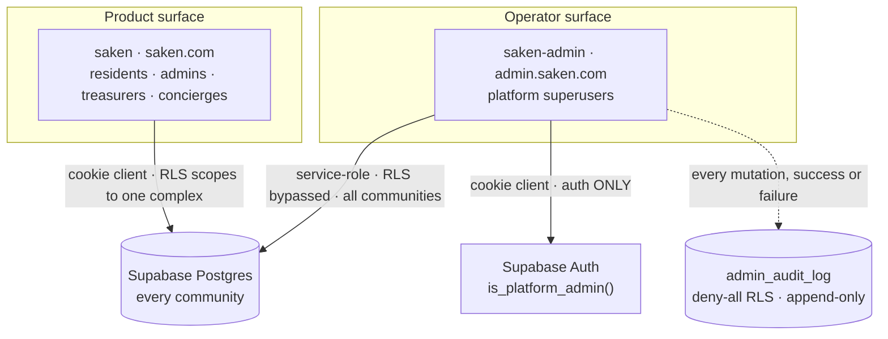

import { Callout } from 'nextra/components'

# Admin console

`saken-admin` is the **internal superuser console** — a separate Next.js app that gives Saken
platform operators cross-tenant read *and* write access to the same Supabase database the
product runs on. It is the tool an operator opens when a community needs something the
product deliberately cannot do for itself: undelete a community, rotate a leaked resident
link, correct a mis-entered payment, or hand an admin role to someone who lost theirs.

It is **not** part of the product. There is no sign-up, no marketing page, and no path from
`saken.com` into it.

<Callout type="warning">
This app holds the **service-role key**. Every read and every write it performs bypasses
Row-Level Security and sees every community at once. That is deliberate — see
[Security & audit](/admin-console/security-and-audit) for the authorization model and the
audit contract that makes the power accountable.
</Callout>

## Why it is a separate app

The obvious alternative was an `/admin` area inside the main `saken` app. It was rejected on
**blast radius**: the product app's whole security story is that it holds the caller's JWT
and lets Postgres RLS decide what they may touch (see [Auth & RLS wiring](/architecture/auth-rls)).
Adding an RLS-bypassing surface to that app would mean the service-role key sits one routing
mistake away from every resident-facing route.

| | `saken` (product) | `saken-admin` (console) |
| --- | --- | --- |
| Audience | Residents, admins, treasurers, concierges | Saken platform operators only |
| Tenancy | One complex at a time, server-resolved | **All complexes at once** |
| Data access | `@supabase/ssr` cookie client → RLS applies | **Service-role client → RLS bypassed** |
| Authorization | Roles in `public.roles`, per complex | `public.platform_admins` / env allowlist |
| Writes | Server actions + `SECURITY DEFINER` RPCs | Direct table writes through one choke point |
| Reachability | Public internet | Internal; optional IP allowlist |
| Deploy target | `saken.com` | `admin.saken.com` / `admindev.saken.com` |

Keeping them apart means the service-role key lives in a codebase with **no public routes at
all** — every path except `/login`, `/denied`, and `/auth/*` is gated in middleware — and a
bug in the product app cannot reach it.

## Where it runs

| Environment | URL | Branch | Supabase project |
| --- | --- | --- | --- |
| Local | `http://localhost:3001` | — | dev |
| Dev | `admindev.saken.com` | `dev` | dev |
| Production | `admin.saken.com` | `main` | prod |

Hosting is a **separate Vercel project** (`saken-admin`) from the web app, with environment
variables scoped per environment. Port `3001` is chosen so the console can run locally
alongside the main app on `:3000`.

Stack: **Next.js 16** (App Router, the renamed `proxy` middleware), **React 19**,
**Tailwind 4**, `@supabase/ssr` + `@supabase/supabase-js`. Every page is
`export const dynamic = 'force-dynamic'` — service-role reads happen at request time, never
at build time.

### Environment variables

| Var | Role |
| --- | --- |
| `NEXT_PUBLIC_SUPABASE_URL` | Supabase project URL |
| `NEXT_PUBLIC_SUPABASE_ANON_KEY` | Used **only** by the login flow |
| `SUPABASE_SERVICE_ROLE_KEY` | Server-only. Full cross-tenant DB access — never `NEXT_PUBLIC_` |
| `SAKEN_ADMIN_ALLOWLIST` | Bootstrap / break-glass operator emails |
| `NEXT_PUBLIC_SITE_URL` | Origin used for the OAuth redirect |
| `SAKEN_ADMIN_READONLY` | Optional global write kill-switch |
| `SAKEN_ADMIN_IP_ALLOWLIST` | Optional IP restriction, enforced in middleware |

The service-role module imports `server-only`, so any accidental client-side import becomes a
**build error** rather than a leaked key.

<Callout type="info">
**OAuth redirect gotcha.** Google sign-in calls `signInWithOAuth` with
`redirectTo: ${window.location.origin}/auth/callback`. That origin must be listed in the
Supabase project's **Authentication → URL Configuration → Redirect URLs**
(`http://localhost:3001/**`, `https://admin.saken.com/**`, `https://admindev.saken.com/**`).
Until `https://admin.saken.com/**` was added on **2026-07-24**, production logins silently
bounced to the main app's origin instead of returning to the console.
</Callout>

## The `platform_admins` tier

The console sits on top of a platform-superuser tier that lives **in the shared database**,
added by migration `0051`:

- `public.platform_admins` — `(id, email, is_superuser, note, created_at)`, unique on
  `lower(email)`. RLS **enabled with zero policies** (deny-by-default); nothing but
  service-role and the helper function reads it.
- `public.is_platform_admin()` — `SECURITY DEFINER`, `STABLE`, `search_path = ''`, **owned by
  `service_role`**, granted to `authenticated`. It reads the *current session's*
  `auth.email()` internally, so the caller passes nothing and cannot spoof it.

Because the check is a function call on the cookie client, an app can authorize a superuser
**without holding a service-role key** — which is exactly how this documentation site gates
itself. The console additionally holds service-role, but for data access, not for
authorization.

Migration `0052`, owned by the admin repo, completes the foundation:

1. creates `public.admin_audit_log` (9 columns, three indexes, RLS enabled with **no
   policies**, and `GRANT SELECT, INSERT` — *not* UPDATE or DELETE — to `service_role`, which
   is what makes it append-only in practice), and
2. grants `service_role` `INSERT, UPDATE, DELETE` on the **17 editable public tables** the
   console mutates. `service_role` had been SELECT-mostly since `0008`, so direct table writes
   would otherwise fail with `42501`.

<Callout type="info">
`0052` originates in the **admin** repo but continues the shared project's single migration
history and is applied to the same dev/prod database. It has since been mirrored into the web
repo's `supabase/migrations/`, which holds the canonical `0001`–`0056` sequence. See
[Migration history](/database/migrations).
</Callout>

## Design rules

Three constraints shape everything in the console:

1. **Curated surfaces only.** There is no raw SQL box and no generic table editor. Every
   write is a domain-specific server action with validation, a confirmation prompt where it
   is destructive, and a stable action key.
2. **One choke point.** No page or action ever calls `db.from(...).update()` directly — they
   all call `adminMutate()`, which re-checks authorization, enforces the read-only switch,
   and writes an audit row on **every** exit path.
3. **A superuser is not a community admin.** Writes deliberately do *not* go through the
   `SECURITY DEFINER` RPCs (`assign_role`, `delete_community`, …), because those authorize the
   caller *as an admin of that complex* — which an operator is not. Tables are written
   directly via service-role instead.

The reasoning behind rules 2 and 3, and the guarantees they buy, are on
[Security & audit](/admin-console/security-and-audit). The page-by-page tour of what an
operator can actually do is on [Surfaces & operations](/admin-console/surfaces).
