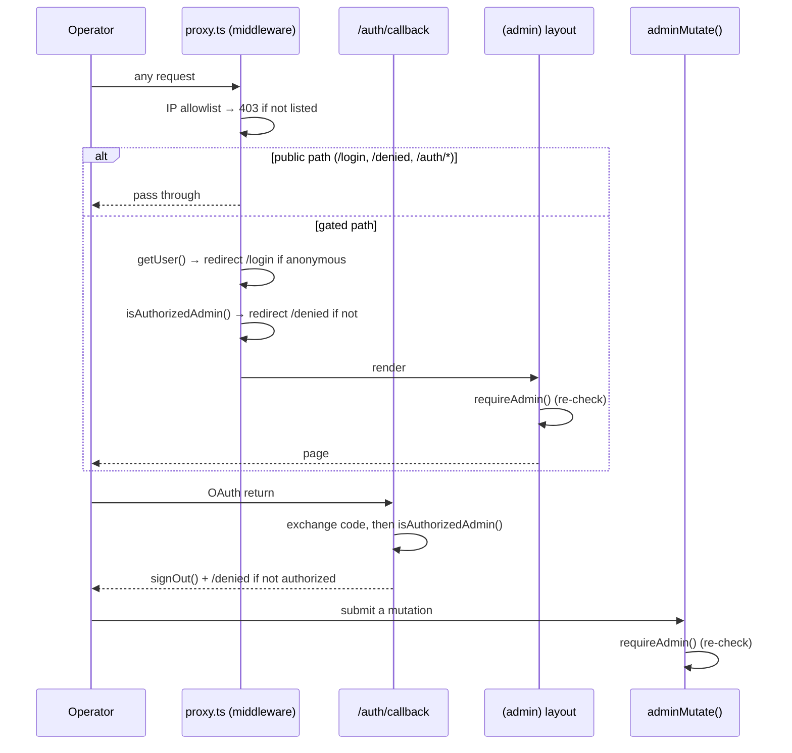
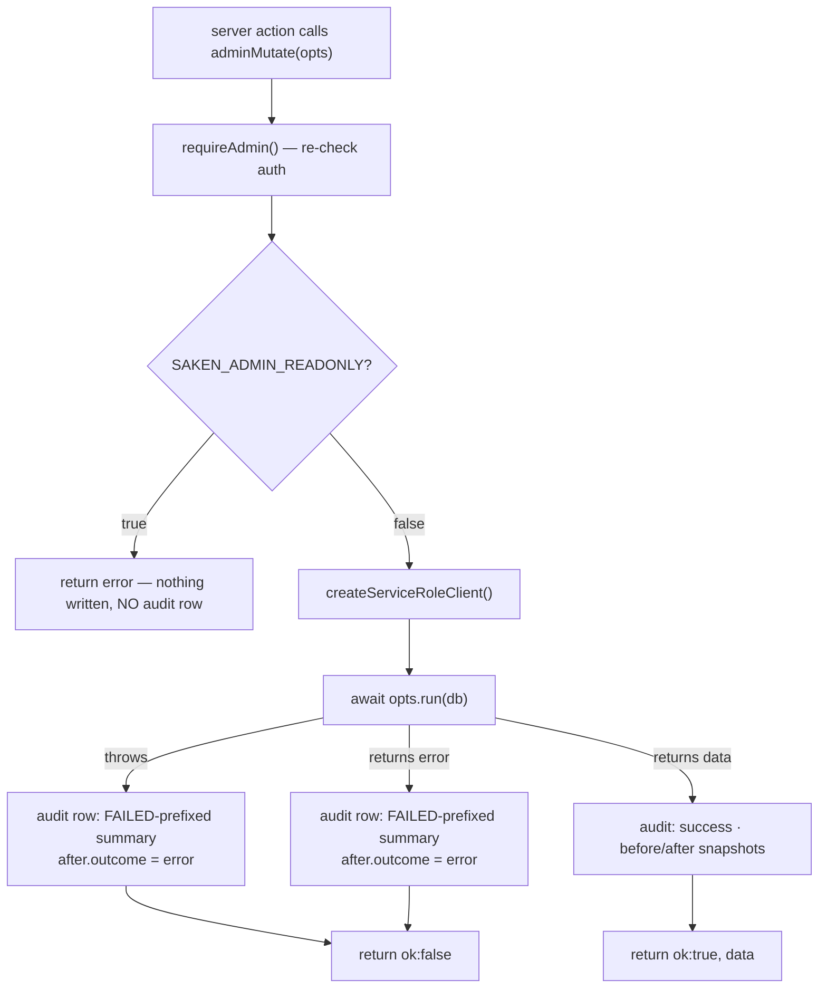

import { Callout } from 'nextra/components'

# Security & audit

The console is **god-mode by design**. That is not a slip — it is the requirement. This page
is the argument for why that is safe enough, and the machinery that makes it accountable.

## Authorization: two sources, one answer

A caller is authorized if **either**:

1. their email is in `SAKEN_ADMIN_ALLOWLIST` (comma/space/newline-separated, compared
   lower-cased), **or**
2. `public.is_platform_admin()` returns true — i.e. they have an active row in
   `public.platform_admins`.

| Source | Role | Changing it |
| --- | --- | --- |
| `SAKEN_ADMIN_ALLOWLIST` (env) | Bootstrap and **break-glass** | Vercel env var; no redeploy of code |
| `public.platform_admins` (DB) | The **durable** source of truth | Managed from `/superusers` |

The env check runs **first** — it is both the fast path and the fallback. A `platform_admins`
table that is missing, mis-migrated, or accidentally emptied can never lock the bootstrap
operators out of the tool they would need to fix it.

The DB check is what makes authorization identity-based rather than method-based: the same
person is authorized whether they sign in with Google or with email + password.
`is_platform_admin()` reads the current session's `auth.email()` internally, so the client
passes nothing and cannot spoof it; being `SECURITY DEFINER` and owned by `service_role`, it
can read the deny-all `platform_admins` table without the caller holding service-role and
without ever exposing the superuser list to the browser.

### Where it is enforced

Four independent gates, on purpose:

- **Middleware** (`src/proxy.ts` — Next 16's renamed `middleware`) blocks every request that
  is not a public auth path or a static asset.
- **The OAuth callback** re-checks *after* exchanging the code and calls `signOut()` on a
  non-authorized account, so an unauthorized Google user never holds a usable session. It also
  pins the `?next=` parameter to a local path (must start with a single `/`, no `\`) —
  the same open-redirect defence as the main app's callback.
- **The `(admin)` layout** calls `requireAdmin()`, so a routing mistake that skipped the
  matcher still cannot render data.
- **`adminMutate()`** calls `requireAdmin()` again before touching anything.

## Why service-role, and why not the RPCs

Every read and write the console performs goes through a service-role client
(`src/lib/supabase/service-role.ts`, `import 'server-only'`). The cookie client exists in this
codebase **only** to establish who is signed in.

That is the opposite of the product app's discipline, where
[service-role is used sparingly](/architecture/overview). It is unavoidable here: the console's
entire purpose is the cross-tenant view, and RLS by construction scopes a caller to one
complex.

The subtler decision is that writes **deliberately bypass the `SECURITY DEFINER` RPCs**
(`assign_role`, `delete_community`, and friends). Those RPCs authorize the caller *as an admin
of that complex* — and a platform superuser is not, and must not need to be, a member of the
community they are repairing. Routing through them would either fail authorization or require
granting operators fake community memberships, which is exactly the audit trail you do not
want. So the console writes tables directly, and migration `0052` grants `service_role`
`INSERT, UPDATE, DELETE` on the 17 editable public tables to make that possible (it had been
SELECT-mostly since `0008`).

<Callout type="warning">
The cost of bypassing the RPCs is that the console gives up their **transactionality**. An RPC
is one Postgres transaction; a multi-write server action is several independent round trips.
The failure-auditing rule below exists precisely to cover that gap.
</Callout>

## The choke point: `adminMutate()`

`src/lib/data/admin-mutate.ts` is the single funnel every write passes through. No page and no
action ever calls `db.from(...).update()` directly. That is what makes "curated surfaces only"
safe by construction rather than by convention: the set of things the console can do is the
set of `adminMutate` call sites.

An `adminMutate` call declares a stable machine `action` key, a human-readable `summary`, an
optional `targetTable` / `targetId`, and a `run(db)` function that performs the actual work.

### Three exit paths, three audit rows

This is the part that changed most recently and matters most:

| Exit path | Audit row | `summary` | `after` |
| --- | --- | --- | --- |
| `run()` returns `{ data }` | ✅ written | as declared | `run()`'s snapshot, else the static option, else `null` |
| `run()` returns `{ error }` | ✅ written | `[FAILED] 
 — <error>` | `{ outcome: 'error', error }` |
| `run()` **throws** | ✅ written | `[FAILED] 
 — <message>` | `{ outcome: 'error', error }` |
| Read-only mode | ❌ not written | — | — |

The reason failures are audited at all: **the multi-write actions have no transaction**. A
later write can fail after earlier writes have already committed — the dual-row reconcile is
the clearest case, where apartments and roles may be re-pointed before the placeholder delete
fails. If only successes were logged, that half-applied mutation would be invisible in the
record. Auditing the attempt guarantees that anything which touched the database left a trace.

Note the asymmetry: on a failure path only the **static** `before` option is available (the
snapshot `run()` would have returned never made it back), so failure rows may have a thinner
`before` than success rows. The read-only refusal writes nothing because nothing was attempted
— it is rejected before the service-role client is even created.

### `before` / `after` snapshots

Snapshots exist for reversibility: an operator reading `/audit` should be able to see the
exact prior row and put it back by hand.

They may be supplied two ways — as static `before` / `after` options at the call site, or
returned from inside `run()`. **`run()` wins.** The prior row is usually only knowable at
request time (you have to `SELECT` it just before the `UPDATE`), so the pattern most actions
use is: read the row, return it as `before`, and return the `.select()`-ed post-update row as
`after`. The static options remain useful for coarse markers such as
`before: { deleted: true } → after: { deleted: false }`.

### The audit table

`public.admin_audit_log`, created by migration `0052`:

| Column | Notes |
| --- | --- |
| `id` | `uuid`, default `gen_random_uuid()` |
| `actor_email` | The signed-in operator, taken from `requireAdmin()` — never from the form |
| `action` | Stable machine key, e.g. `role.assign` |
| `target_table` / `target_id` | Nullable; `target_id` is a `uuid` |
| `summary` | The human-readable line the log viewer shows |
| `before` / `after` | `jsonb` snapshots |
| `created_at` | `timestamptz`, default `now()` |

Indexed on `created_at DESC`, on `(target_table, target_id)`, and on `actor_email`.

Two properties make it trustworthy:

- **Deny-all RLS.** RLS is enabled with **zero policies**, mirroring the `platform_admins`
  pattern from `0051`. Nothing reachable by `anon` or `authenticated` can read it; only
  service-role does.
- **Append-only by grant.** `service_role` is granted `SELECT, INSERT` on this table and
  *nothing else* — no `UPDATE`, no `DELETE`. The console literally cannot rewrite or erase its
  own history through its own credentials.

If the audit insert itself fails, the failure is logged loudly to `console.error` and the
mutation result is still returned — the code deliberately does not pretend the write did not
happen.

## Hardening switches

Both are read from the environment, so they can be flipped in Vercel without shipping code,
and both are reflected live on `/security`.

| Switch | Effect | Where enforced |
| --- | --- | --- |
| `SAKEN_ADMIN_READONLY=true` | Global write kill-switch — **every** mutation is refused with an explanatory message; all reads still work | `adminMutate()` |
| `SAKEN_ADMIN_IP_ALLOWLIST` | Comma/space-separated IPs; any other client IP gets a bare `403`. Unset = no IP restriction | `proxy.ts` middleware |

Read-only is the intended resting state for the production deployment: leave writes off until
an operator is actively making a change, and flip it on again during an incident.

The IP check runs **before** the public-path bypass, so it covers `/login` and `/auth/*` too,
and returns `403` rather than a redirect so it cannot loop. Client IP is read from
`x-real-ip` **first**, falling back to the first `x-forwarded-for` entry — that order is
load-bearing and commented as such in the source: Vercel's edge sets `x-real-ip`
authoritatively and a client cannot supply it, whereas a client-supplied `x-forwarded-for` is
appendable in general. Do not reorder it.

## Lockout guards

The most dangerous thing an operator can do to the console is remove their own access to it.
Two guards on `/superusers` prevent that:

- **Last-superuser protection** — disabling or removing a `platform_admins` row counts the
  *other* rows with `is_superuser = true`; if that count is zero, the action refuses with
  "Cannot remove the last superuser". Applied to both `superuser.toggle` (when turning off)
  and `superuser.remove`.
- **Self-lockout guard** — an operator may not disable or remove *their own* row.

<Callout type="info">
The self-guard is keyed on **email**, comparing the target row's email to
`requireAdmin().email`, not on any `platform_admins.id`. That is deliberate: a break-glass
operator authorized purely through `SAKEN_ADMIN_ALLOWLIST` has **no `platform_admins` row at
all**, so an id-based comparison would silently never match. Email is the only identifier both
authorization sources share.
</Callout>

Note what the guards do *not* cover: they protect the DB tier, not the env tier. Emptying
`SAKEN_ADMIN_ALLOWLIST` while `platform_admins` is also empty is still a way to lock everyone
out — which is why the two-source model, and the "env first" ordering, exist in the first
place.

## Residual risk

Being honest about what this model does and does not buy:

- **The service-role key is the crown jewel.** Anyone who obtains it has everything the console
  has, *without* passing through `adminMutate` and therefore without leaving an audit trail.
  Rotate it if the admin deployment is ever suspected of compromise.
- **The audit log records intent and outcome, not a transaction.** A `[FAILED]` row tells you a
  multi-write action aborted part-way; it does not tell you exactly which writes committed. The
  `before` snapshots plus the target ids are what you reconstruct from.
- **Destructive actions are guarded by a UI confirm, not by a second operator.** There is no
  four-eyes approval flow.
- **`role.remove` and `user.reconcile` hard-delete rows.** Everything else in the console
  prefers soft-delete; those two do not, and cannot be undone from the console.
