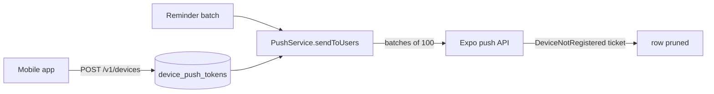

import { Callout } from 'nextra/components'

# Delivery: email, push & WhatsApp

Saken has to get invite links, payment reminders, and PDF reports to people. There are now
**three live channels and one stub**. This page is the honest state of each.

| Channel | Status | Where it lives |
| --- | --- | --- |
| **Transactional email** (invites, reminders) | ✅ **Live** via Resend | `saken-api` `src/mail/` |
| **Push notifications** (reminders) | ✅ **Live** via Expo | `saken-api` `src/push/` + `src/devices/` |
| **PDF share to WhatsApp** (reports, receipts) | ✅ **Live**, client-side | web `src/components/share-via-whatsapp.tsx` |
| **Automated WhatsApp messaging** (invite delivery) | 🔴 **Stub** | web + backend both log-and-skip |

<Callout type="warning">
**Delivery lives in the backend, not the web app**

The web tier has **no mail credentials by design** — `src/lib/invitations/delivery/email.ts`
is still the Phase-A1 stub. When `SAKEN_API_URL` is set (which it is, in production), the
invitation actions delegate to `saken-api`, which owns the Resend key and actually sends.
So *"the web module is a stub"* and *"email delivery is live"* are both true; the sending
just doesn't happen in the Next.js process.
</Callout>

## Transactional email — Resend

`MailService` (`saken-api/src/mail/mail.service.ts`) is a thin sender over the **Resend HTTP
API** — plain `fetch`, no SDK dependency.

| Config | Default / notes |
| --- | --- |
| `RESEND_API_KEY` | bearer for `api.resend.com`. **Unset ⇒ dev-friendly no-op** + a log line; the invitation row is still created and `delivery_status` stays `pending`. |
| `MAIL_FROM` | `Saken <hello@saken.com>` — the verified `saken.com` Resend domain (SPF/DKIM in place since 2026-05-30). |
| `PUBLIC_WEB_URL` | `https://saken.com`. The invite link is always `${PUBLIC_WEB_URL}/invite/${token}` — mail points at the **web app**, never at the API. |

Two message families ship today:

- **Invite emails** (`invite-email.ts`) — bilingual (EN/AR), rendered per invited role, with
  the community name and the `/invite/{token}` link.
- **Payment reminders** (`reminder-email.ts`) — one personalised message per behind-schedule
  apartment.

### `delivery_status` transitions

The invitation row carries the outcome so it stays auditable:

```
pending ──(Resend accepted)──> sent
   │
   ├──(send failed)──────────> failed
   └──(no API key / whatsapp)─> stays pending
```

The distinction matters: *"not configured"* is deliberately **not** `failed`, so a dev
environment without a Resend key doesn't litter rows with false failures.

## Push notifications — Expo

Shipped with the mobile app. `PushService` (`saken-api/src/push/push.service.ts`) posts to
`https://exp.host/--/api/v2/push/send` — again plain `fetch`, no SDK.



- **Registration** — `POST /v1/devices` / `DELETE /v1/devices` (`DevicesController`). Any
  authenticated user; **no capability gate**, because registering *your* device for *your*
  notifications isn't role-scoped. Identity is server-derived, so the service only ever
  writes or deletes rows the caller owns.
- **Storage** — `device_push_tokens` (migration `0055`), a **deny-all RLS** table reached
  only by the service-role client.
- **Fan-out** — `sendToUsers` resolves every device a user has registered, batches at
  Expo's documented **100 messages per request** limit, and **never throws into callers**:
  every path returns `{ sent, failed }` counts so a push hiccup can't fail a reminder batch.
- **Self-healing** — a `DeviceNotRegistered` ticket prunes the offending token row, so dead
  devices stop consuming batch slots.
- **Kill switch** — `EXPO_PUSH_ENABLED` (default **on**) is operational, not a
  "not configured" state; Expo's push API needs no credential.

<Callout type="info">
**Receipts are a documented follow-up**

Expo reports some failures only in the **receipts** fetched later from `/getReceipts`. The
MVP handles the ticket-level `DeviceNotRegistered` that Expo also surfaces synchronously; a
receipt poller lands with scheduled sending.
</Callout>

## Payment reminders

The reminder subsystem that used to be listed as *entirely missing* now exists — as an
**admin-triggered batch**, not a scheduler.

```
POST /v1/reminders/payments   (capability: record_collections → admin + treasurer)
```

- **Who counts as behind** — the summary's full-year `remaining > 0` (`dueThisYear −
  paidYtd + carryover`). Read through `SummaryService`, so it is **the same money math as
  every dashboard surface** — nothing re-implemented.
- **Both channels fire** — an email per behind-schedule resident *and* an Expo push, fully
  independent: the result is `{ sent, skipped, details[], pushSent, pushFailed }` and push
  failures never affect the email outcomes.
- **Per-outcome detail** — each apartment reports `sent` / `no_resident_email` /
  `skipped_not_configured` / `failed`.
- **Cooldown** — a **20-hour** minimum between batches per complex, on top of the global
  120/min throttle.
- **Web wiring** — `sendPaymentReminders` (`src/lib/reminders/actions.ts`) is the one
  **backend-only vertical**: because the web tier has no mail credentials, there is
  deliberately **no direct-Supabase fallback**. With the backend disabled it returns a
  localised *"backend required"* error rather than silently doing nothing.

<Callout type="warning">
**Two known gaps in reminders**

1. **No cron / scheduled sending** — an admin taps the button. Scheduling is the follow-up.
2. **The cooldown is an in-memory `Map`**, so it resets on restart and is per-instance —
   bypassable across multiple Render instances. A durable `reminder_batches` table keyed by
   `complex_id` is the tracked fix (deferred from the [2026-07-23 audit](/roadmap/missing-features)).
</Callout>

## WhatsApp: what is and isn't built

Three different things get conflated under "WhatsApp." Be precise:

1. **Phone / WhatsApp sign-in OTP** — one-time codes through **Supabase Auth + an SMS
   provider** and a `send-otp` edge function. It works, behind
   `NEXT_PUBLIC_PHONE_AUTH_ENABLED` (off by default). It is **phone OTP**, not a WhatsApp
   Business integration. See [Authentication](/features/authentication).
2. **Sharing a PDF to WhatsApp** — ✅ **shipped** (issue #31). `<ShareViaWhatsApp>` is a
   client island on the report menu and on collection receipts, with a three-step path:
   (a) Web Share API level 2 with file support → the native share sheet, so the **actual
   PDF** lands in the chat; (b) no file support but a public URL → a `wa.me` text-share link
   carrying a localised message + the magic-link URL; (c) neither → download the PDF and
   show an inline hint to attach it manually. A cancelled share sheet (`AbortError`) is a
   non-event — no fallback fires.
3. **Automated WhatsApp *delivery* of invitations** — 🔴 still a stub, on **both** tiers.

### The invitation delivery orchestrator

Invitation delivery is built around a pluggable orchestrator
(`src/lib/invitations/delivery/orchestrator.ts`) that routes by the row's `delivery_method`:

```ts filename="orchestrator.ts"
export async function deliverInvitation(invitation: InvitationRow): Promise<DeliveryResult> {
  switch (invitation.deliveryMethod) {
    case 'email':    return deliverByEmail(invitation)
    case 'whatsapp': return deliverByWhatsApp(invitation)
    // exhaustiveness guard — a new method that isn't routed is a compile error
  }
}
```

The channel is **chosen at invite-creation time** (`email` when an email is present, else
`whatsapp` for a phone-only invite), and the orchestrator just routes — the choice stays
auditable on the row. The backend mirrors the same decision in
`InvitationsService.deliver()`.

For a `whatsapp` invite, **both** tiers log *"WhatsApp delivery not yet implemented"* and
leave `delivery_status = 'pending'`. In practice the admin copies the invite link and pastes
it into the building's WhatsApp group — which is exactly the design's intended hand-off.

A real implementation is a **WhatsApp Business / Meta Cloud API** module plus one switch
arm; the orchestrator never changes. A broader WhatsApp bot (`saken-whatsapp-bot`, issues
#5/#23/#24/#25) is on the [backlog](/roadmap/project-board), not in flight.
