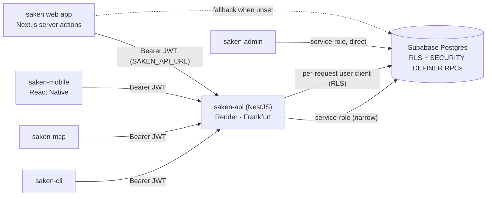
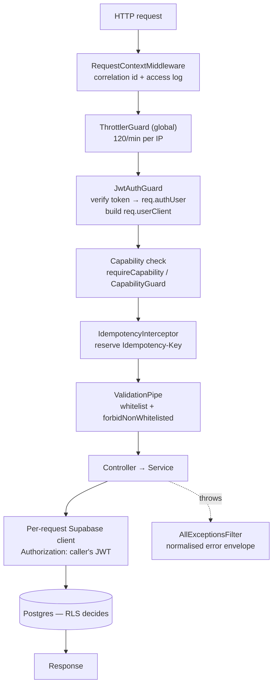

import { Callout } from 'nextra/components'

# Backend & MCP

The **`saken-backend`** repo (GitHub `saken-api`) is a NestJS service that has been **live
in production since the 2026-07-24 cutover**. It is the shared API tier: the web app calls
it for its data work, the React Native app talks to nothing else, and `saken-mcp` and
`saken-cli` are thin clients of it.

Its load-bearing property is that it **did not become a second authorization system**.
Every authenticated request carries the caller's own JWT down to Postgres, so the ~57 RLS
policies stay the hard boundary and the backend adds a capability check on top.

## What runs where

Two always-on Docker services on **Render**, both in **Frankfurt** next to Supabase:

| Service | Branch | Supabase project | URL |
| --- | --- | --- | --- |
| `saken-api` | `main` | prod | `https://saken-api.onrender.com` |
| `saken-api-dev` | `dev` | dev | `https://saken-api-dev.onrender.com` |

- Everything is served under **`/v1`**; `GET /health` deliberately stays at the **root**
  (`main.ts` sets the global prefix with `exclude: ['health']`) so an infra probe never
  depends on an API version.
- The image is **`node:22-slim`**. Node 20 crashes on boot — `@supabase/supabase-js`'s
  realtime client requires a native `WebSocket`, which Node 20 doesn't have. Debian slim
  rather than alpine so `sharp`'s prebuilt glibc binaries install cleanly.
- `app.set('trust proxy', 1)` — behind Render's edge, the rate limiter would otherwise
  bucket every caller under the proxy's address instead of the real client IP.

Full platform detail — plans, gotchas, secrets — lives in
[Deployment](/operations/deployment).

## How the clients reach it



The web app's integration is a **strangler migration**, not a rewrite: server actions keep
the Next.js concerns (`revalidatePath`, redirects, form-result shapes) and delegate the
data work over HTTP. `src/lib/api/client.ts` reads `SAKEN_API_URL`; when it is unset,
`isBackendEnabled()` is false and every wired action falls back to its original
direct-Supabase path. Requests carry a 6-second `AbortSignal.timeout`, and a network error
returns a `network_error` envelope rather than throwing — so a backend wobble degrades
reads to the direct path instead of erroring the page.

<Callout type="info">
**The admin console is not a client of this API.** `saken-admin` holds the service-role key
and queries Supabase directly, because its whole job is cross-tenant visibility that RLS
exists to prevent. See [Admin console](/admin-console/overview).
</Callout>

## The request pipeline



Read it as five gates, each doing one job:

1. **Correlation** — `RequestContextMiddleware` accepts an inbound `x-correlation-id` (or
   `x-request-id`) or mints a UUID, echoes it on the response, logs one line per request on
   `finish`, and the exception filter stamps it into error bodies. One id traces a click
   from the web app through the backend logs.
2. **Rate limit** — a global `ThrottlerGuard` at 120 req/min per IP, tightened per-route
   where tokens are guessable (see below).
3. **Authentication** — `JwtAuthGuard` pulls the bearer token, verifies it, and attaches
   **two** things to the request: the principal (`req.authUser`) and a Supabase client bound
   to that exact token (`req.userClient`).
4. **Authorization** — the capability check resolves the caller's app-user row, their role
   set in the active community, and the complex they are acting in.
5. **Idempotency** — on `@Idempotent()` routes only, and only when the client sent an
   `Idempotency-Key`.

### Token verification

`SupabaseService.verifyAccessToken` verifies **locally against the project's JWKS** with
`jose`, pinning issuer (`<SUPABASE_URL>/auth/v1`), audience (`authenticated`) and
algorithms (`RS256`/`ES256`). That removes a network hop from every request. Anything that
fails locally — a legacy HS256 token, an unknown `kid`, a wrong-project token — falls
through to the authoritative `auth.getUser(token)` network call, so no key type is lost.
Both an `email` and a `phone` claim are read, because Saken identity resolves by
**email OR phone** (migration 0046).

### Why RLS is preserved

A backend that connected with the service-role key would bypass every policy and force a
perfect re-implementation of each rule — a bad trade for a money app. Instead
`SupabaseService.createUserClient(accessToken)` builds a client whose every request carries
`Authorization: Bearer <caller token>`. PostgREST sees the user's token, so RLS policies and
`auth.email()` / `auth.jwt()->>'phone'` fire **exactly** as they do for the web app's cookie
client, and the `SECURITY DEFINER` RPCs resolve the caller correctly when invoked through it.

The service-role client is reserved for the same narrow set the web app already uses it for:

| Use | Why RLS can't do it |
| --- | --- |
| Resident magic-link reads + PDFs | Residents are not Supabase auth users |
| Concierge pre-write validation reads | Concierge has no RLS read on the budget tables |
| `users` writes (language, active complex) | RLS UPDATE on `users` is service-role only |
| Resident / invitation token validation | The row is read *before* any identity exists |
| Cross-community membership + role reads | Must not be confined to the active community |
| `device_push_tokens`, `idempotency_keys` | Deny-all RLS tables, service-role only |

In every one of those, containment is an explicit server-derived filter (a `user_id`, a
token-derived `complexId`, an apartment-id list that itself came from an RLS-scoped read).

## Modules

```
src/
  main.ts        bootstrap: /v1 prefix, trust proxy, CORS, ValidationPipe, filter, Swagger
  config/        zod env contract — the app refuses to boot on a missing credential
  supabase/      client factory: per-request user (RLS) · service-role · anon · JWKS verify
  auth/          JwtAuthGuard · ResidentTokenGuard · CapabilityGuard · AuthContextService · TokensService
  domain/        roles, the capability matrix, the 10 category keys, shared types
  common/        error envelope + Postgrest mapping · idempotency · correlation id · api shaping · money helpers
  i18n/          locale resolution (?lang → Accept-Language → users.language) + AR error dictionary
  account/ setup/ roles/                       identity, structure, team
  payments/ expenses/ budget/ fiscal/ summary/ money
  concierge/ admin-submissions/ special-projects/ invitations/   workflow
  reports/ resident/                            PDFs + the public magic-link surface
  mail/ push/ reminders/ devices/               delivery
  health/                                       the root probe
```

## Authorization: a capability matrix over stackable roles

Since migration 0049 a user may hold **several roles in one community**, and their
permissions are the **union**. `AuthContextService` implements the gate:

- `resolveAppUserId` maps the Supabase auth uid to the app `users.id` by **email OR phone**,
  filtered `auth_provider IS NOT NULL` with a deterministic `ORDER BY id` — the same rule as
  `public.current_user_id()`, so the app and the database never disagree about who you are.
- `requireCapability(client, user, capability)` looks the capability up in
  `CAPABILITY_MATRIX` and passes the whole allowed-role set to `requireUser`, which resolves
  the community the caller is acting in.
- The **active-pointer rule is filter-not-fallback**: if `users.active_complex_id` is set but
  the caller has no matching role there, the answer is *no* — never a silent hop to another
  community. With no pointer set, the first match wins.
- `resident` is not a `roles` row — residency is an `apartments.current_user_id` match — so
  `requireUser` resolves it through apartment occupancy.

Most controllers gate **imperatively** (`await this.auth.requireCapability(...)` at the top
of the handler) because they need the resolved `complexId` to build the query. New handlers
that don't need to branch before the gate can use the declarative
`@RequireCapability('manage_roles')` + `CapabilityGuard` + `@AuthCtx()` trio; both paths read
the same matrix. Widening a capability to another role is a one-line edit in
`src/domain/capabilities.ts`.

The matrix itself is tabulated on [Backend endpoints](/api/backend-endpoints#capabilities).

### Money writes scope twice

RLS is the hard boundary, but every id in a request body arrives from a client, so the
money paths add an explicit check before writing:

- `payments` has no `complex_id` column — scope resolves apartment → building → complex — so
  `PaymentsService` runs `assertApartmentInComplex` **and** `assertPaymentInComplex` on the
  edit and delete paths, comparing the resolved complex in JS rather than relying on deep
  PostgREST embedded-filter syntax.
- `expenses`, `admin-submissions` and `special-projects` carry `complex_id` directly and
  filter `.eq('complex_id', ctx.complexId)` on every read and write.
- Both reads go through the caller's RLS client, so a cross-complex id is invisible rather
  than merely rejected — the caller gets an indistinguishable 404.

Without this, a bad apartment id surfaced as the receipt-number trigger's raw exception
("Cannot resolve complex_id for apartment") and a 500 instead of a clean 404.

## Errors: one envelope, no Postgres text

`AllExceptionsFilter` normalises **every** thrown error to:

```json
{ "error": { "code": "already_member", "message": "…", "details": { }, "correlationId": "…" } }
```

`code` is the stable machine token clients branch and localise on; `message` is only ever a
fallback (design decision D-08 — the server is not the source of user-facing copy). For
Arabic callers the message of common codes is served from the AR dictionary, keyed off
`?lang=` or `Accept-Language`.

Two rules keep server internals server-side:

- **5xx bodies are forced generic.** Whatever was thrown, the client sees
  `internal_error` / "Internal server error"; the real message and stack are logged with the
  correlation id.
- **`throwForPostgrestError` maps SQLSTATE to stable messages** and logs the raw detail
  rather than forwarding it:

| SQLSTATE | HTTP | Client message |
| --- | --- | --- |
| `23505` unique violation | 409 | That record already exists |
| `23503` FK violation | 400 | A referenced record is missing or in use |
| `23514` check violation | 400 | That value is not allowed |
| `42501` insufficient privilege (RLS) | 403 | Not permitted |
| `PGRST116` no rows | 404 | *(empty)* |
| anything else | 500 | Database error |

Business outcomes are **not** errors. The seven `SECURITY DEFINER` RPCs each return a
discriminated `{ outcome }` jsonb; `assertOutcome` / `DomainException` surface the outcome
token as the envelope's `code` (`already_member`, `identity_mismatch`, `expired`,
`last_admin`, …) so a client can tell *why* something failed. Where the outcome is a normal
flow — fiscal-year rollover blocked by pending submissions — it comes back as a **200 with
an `outcome` field**, not an error at all.

## Idempotency

A phone on flaky connectivity retries POSTs. For money writes that must not mean two rows.
Three routes are marked `@Idempotent()`: `POST /v1/payments`, `POST /v1/expenses`, and
`POST /v1/special-projects/:id/contributions`.

The contract, as implemented in `src/common/idempotency.interceptor.ts`:

- The `Idempotency-Key` header is **optional**. No key (or an unauthenticated route) means
  ordinary behaviour — nothing is stored.
- The key is **reserved before the handler runs**. A `PENDING` placeholder row is INSERTed
  into `public.idempotency_keys` with `ON CONFLICT DO NOTHING`, arbitrated by the primary
  key. Winning that insert *is* the exclusive right to execute.
- The winner runs the handler, then UPDATEs the row with the real status and body.
- A concurrent duplicate that **loses** the insert polls for up to 8 s and replays the
  winner's response — so two in-flight duplicates never both execute.
- If the handler **throws**, the reservation is released, leaving the key retryable: a
  failed attempt must never persist as a success.
- A retry within the **24 h TTL** replays the stored status and body verbatim.
- The same key reused by a **different user** or on a **different endpoint** is a **409**.
- Availability is biased over strictness: if the store is unreachable, the mutation still
  executes, degrading to a per-instance in-memory cache rather than failing.

The store is `public.idempotency_keys` (migrations 0053 + 0056), a deny-all-RLS
service-role-only table, so replay works across horizontally-scaled instances. An in-memory
map fronts it as a read-through cache; the database stays authoritative. Expired rows are
purged at boot and opportunistically about once per 100 keyed requests.

## Rate limiting

| Scope | Limit | Why |
| --- | --- | --- |
| Global default | 120 / min per IP | Baseline |
| `GET /v1/invitations/validate` · `/context` | 20 / min | Public, token in the query string — blunt probing |
| `/v1/r/:apartmentId/:token/*` | 30 / min | Public magic link, guessable-shaped URL |
| `POST /v1/reminders/payments` | 20 h per complex | Not a limiter — a courtesy floor so residents aren't spammed |

The reminder cooldown is in-memory and per-instance, and is only stamped when at least one
notification actually went out; a fully-skipped batch doesn't lock an admin out for a day. A
durable `reminder_batches` table is the documented follow-up.

## Mail, push, and reminders

**Mail** is a thin `fetch` against the Resend HTTP API — no SDK. When `RESEND_API_KEY` is
unset the service **no-ops with a log line** and returns `notConfigured: true`; the
invitation row is still created and its `delivery_status` stays `pending`, mirroring the web
app's "delivery deferred" semantics. Invite links point at the **web app**
(`${PUBLIC_WEB_URL}/invite/<token>`), never at the API.

**Push** is the same shape against Expo's push API, with three deliberate rules: it never
throws into callers (a reminder batch must not fail because push hiccuped — every path
returns `{ sent, failed }`), it batches at Expo's documented 100-message limit, and a
`DeviceNotRegistered` ticket **prunes the offending row** from `device_push_tokens` so dead
devices stop consuming batch slots. `EXPO_PUSH_ENABLED` (default on) is an operational
kill-switch rather than a "not configured" state — Expo needs no credential.

**Device registration** (`POST`/`DELETE /v1/devices`) needs no capability: registering *your*
device for *your* notifications isn't role-scoped. Identity is resolved server-side; register
is an UPSERT keyed on the Expo token, so a handset that changes owners re-points its single
row instead of leaking the previous owner's notifications, and unregister filters on
`user_id` so you cannot evict someone else's device by guessing their token.

**Reminders** read behind-schedule apartments from `SummaryService` — the same money math as
every dashboard surface, nothing re-implemented — then send email and push independently, so
a resident with no email on file but a registered device still gets nudged.

## Response conventions

The DB layer speaks snake_case rows; the HTTP contract is **camelCase**, with named list
wrappers (`{ members: [...] }`, `{ submissions: [...] }`, `{ fiscalYears: [...] }`). Both
clients used to compensate for raw-row leakage on their side; `src/common/api-shape.ts`
(`toCamel`, `wrapList`) makes it uniform at the source. Money is decimal strings in and out —
never floats — against `NUMERIC(12,2)` columns.

## Configuration

Validated once at boot by a zod schema; a missing credential is a refusal to start, not a
runtime surprise.

| Var | Required | Purpose |
| --- | --- | --- |
| `SUPABASE_URL` | yes | Project URL; also the JWKS + issuer base |
| `SUPABASE_ANON_KEY` | yes | Per-request RLS client + token validation |
| `SUPABASE_SERVICE_ROLE_KEY` | yes | The narrow service-role operations above |
| `PORT` | no (default `4000`) | **Never set on Render** — the platform injects it |
| `CORS_ORIGINS` | effectively yes | **Deny-by-default**: unset blocks every cross-origin browser call. Comma-separated, or `*` |
| `PUBLIC_API_URL` | no | Absolute-link base in responses |
| `SWAGGER_ENABLED` | no (default `false`) | Gates `/v1/docs` |
| `RESEND_API_KEY` | no | Unset ⇒ mail no-ops |
| `MAIL_FROM` | no | Default `Saken <hello@saken.com>` |
| `PUBLIC_WEB_URL` | no | Base for invite/reminder links into the web app |
| `EXPO_PUSH_ENABLED` | no (default on) | Push kill-switch |

<Callout type="warning">
**Two hardening defaults worth not undoing**

`CORS_ORIGINS` is deny-by-default — an unset value reflects *no* origin rather than any
origin. And **`/v1/docs` is off in production**: the interactive Swagger UI and the OpenAPI
spec are only served when `SWAGGER_ENABLED=true`, which is set on `saken-api-dev` and not on
`saken-api`. Regenerate typed clients against dev or a local run with the flag on.
</Callout>

## `saken-mcp` — the MCP server

`saken-mcp` exposes Saken as **tools an LLM client can call** (Claude Desktop, Claude Code).
It speaks MCP over stdio and is a **client of this API**, not a database connection:

```
LLM client ──(MCP/stdio)──> saken-mcp ──(HTTPS + Bearer JWT)──> saken-api ──> Supabase
```

That indirection is the whole point: the backend stays the single source of business logic,
so the MCP server inherits RLS, the capability matrix, and the atomic RPCs for free — no
service-role key, no schema duplication, no second copy of the money math. The token it
carries scopes everything; it has exactly the access of the user whose token it holds.
`saken-cli` sits in the same position. See [saken-mcp tools](/api/mcp-tools).
