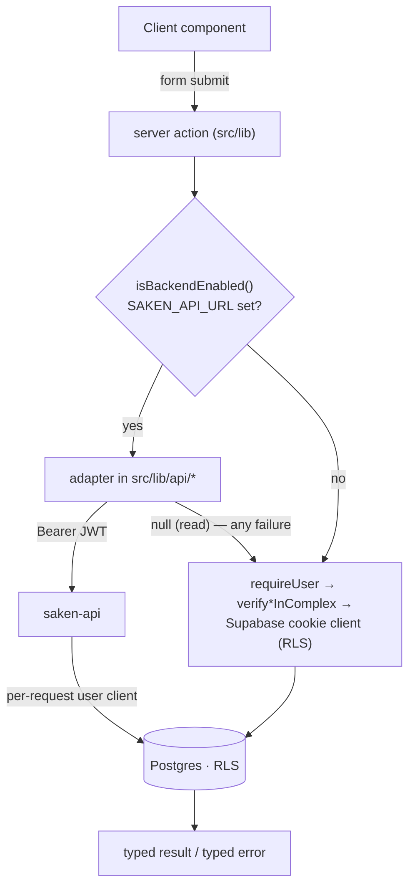

import { Callout } from 'nextra/components'

# Frontend (Next.js 16)

The web app is a **Next.js 16 App Router** project (React 19, TypeScript `strict`,
Tailwind CSS 4, next-intl 4). It is mobile-first and installs-to-home-screen in spirit,
though a real PWA manifest is still missing — the native surface is now
[saken-mobile](/mobile/overview) rather than a service worker.

## App Router structure

Routes live under `src/app/`, grouped by surface:

| Route group | Surface |
| --- | --- |
| `/`, `/auth`, `/auth/whatsapp`, `/auth/callback` | public + sign-in (Google, email+password, magic link, phone OTP) |
| `/setup/*` | the first-run setup wizard (6 steps) |
| `/dashboard/*` | the admin surface — `community`, `team`, `budget`, `cash`, `collections` (+ `schedule`), `expenses`, `apartments`, `residents`, `special-projects`, `fiscal-year`, `concierge-submissions` |
| `/payments/*`, `/expenses/*` | record/edit money flows (+ `pre-saken`) |
| `/resident/*` | the authenticated resident **and treasurer** mirror |
| `/r/[apartmentId]/[token]/*` | the magic-link resident surface (no login) |
| `/concierge/*` | the Arabic RTL concierge surface |
| `/invite/[token]` | invitation acceptance |
| `/welcome`, `/no-community`, `/community-removed` | membership-state landings |
| `/privacy` | the public privacy policy (required by the mobile store listing) |
| `/api/*` | route handlers for PDFs (receipts + YTD reports) |

## Server actions are still the entry point — the data work moved

Saken puts its business logic in **server actions** (`'use server'`) under `src/lib`. That
did not change when the backend shipped. What changed is *where the data work happens*:
each action now calls a backend adapter first and keeps its original direct-Supabase body
as the fallback.

The action keeps every Next.js concern that can't move over HTTP — `revalidatePath`,
redirects, form-result shapes, `router.refresh()` sequencing. The adapter carries the
caller's Supabase access token as a `Bearer` header, so the backend's per-request client
and capability matrix enforce exactly what the cookie client did. See
[Architecture overview](/architecture/overview#the-strangler-wiring) for the full contract
and [Server actions](/api/server-actions).

<Callout type="info">
**Reads and writes behave differently on failure — on purpose**

A failed **read** returns `null` and the direct path serves the page, so a degraded backend
never blanks a screen. A failed **write** surfaces the backend's error to the form; retrying
through the direct path could double-write money rows. `backendFetch` never throws, and
carries a **6-second** `AbortSignal.timeout` so a *hung* backend falls back too.
</Callout>

## Supabase clients

Three factories in `src/lib/supabase/`:

| Factory | Used by | RLS |
| --- | --- | --- |
| `client.ts` | browser/client components | ✅ enforced |
| `server.ts` | server components, route handlers, server actions (cookie-based) | ✅ enforced |
| `service-role.ts` | the narrow set of RLS-bypass operations | ⚠️ bypasses RLS |

They are parameterised with a generated `Database` type (`database.types.ts`), so
`.select()` results are structurally typed — retiring the ~558 hand-casts the 2026-06-14
audit flagged (H-C2).

## Permissions in the UI

Role gating reads the **capability matrix**, not a single role string.
`getEffectiveRoles()` collects every active role the caller holds in the active complex
(plus `resident` if they occupy an apartment), and `can(roles, capability)`
(`src/lib/auth/capabilities.ts`) answers the union question. `primaryRole()` is used only
to pick a landing surface, never for a permission check. See
[Auth & RLS wiring](/architecture/auth-rls#stackable-roles-and-the-capability-matrix).

## Internationalisation

Full EN/AR localisation via **next-intl 4**, with a **cookie-based locale and no URL
routing** — there is no `[locale]` segment, so every route path in this documentation is
the real one in both languages. `src/i18n/request.ts` reads the cookie and loads
`messages/{en,ar}/*.json` (~20 namespaces); `src/app/layout.tsx` sets `<html lang dir>`;
`set-locale-action.ts` (pre-login) and `update-my-language-action.ts` (persists to
`users.language`) flip it. Arabic strings are AI-generated and still carry an
`_status: ai-pending-native-review` marker.

## Design language

From `ARCHITECTURE.md`, sourced from the prototype: a 360 px phone-frame on desktop,
full-bleed on phones; every screen has a status bar, a navbar, scrollable content, and a
**fixed bottom action bar** holding the primary CTA. System font stack; weights stay at
400/500 (no heavy headings); hairline `0.5px` borders; 8 px / 12 px radii. CSS custom
properties define the colour tokens (semantic info/success/warning/danger surfaces). The
primary button is near-black, not brand-blue — no gradients. Every amount renders with a
`$` prefix.

## Tooling & quality

- **TypeScript `strict`**, zero `any`/`@ts-ignore`; `noUncheckedIndexedAccess` is still off.
- **Vitest** unit suite covering the pure functions (dues math, anchor math, month-weight
  proration, budget diff, Arabic formatting, currency/date formatting) plus the capability
  matrix and component render/behaviour tests.
- **Playwright** for end-to-end runs (`npm run test:e2e`).
- **ESLint** (`eslint-config-next`).
- A well-factored `useAutosave` state machine powers the wizard's autosave-everything
  convention (monotonic stale-resolution guard, unmount safety, bounded retry).
