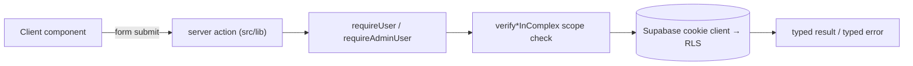

# Frontend (Next.js 16)

The web app is a **Next.js 16 App Router** project (React 19, TypeScript `strict`,
Tailwind CSS 4). It is a mobile-first PWA-style experience, though a real PWA manifest is
still missing (Feature Audit item 9).

## App Router structure

Routes live under `src/app/`, grouped by surface:

| Route group | Surface |
| --- | --- |
| `/`, `/auth`, `/auth/whatsapp`, `/auth/callback` | public + sign-in |
| `/setup/*` | the first-run setup wizard |
| `/dashboard/*` | the admin surface |
| `/payments/*`, `/expenses/*` | record/edit money flows (+ `pre-saken`) |
| `/resident/*` | the authenticated resident mirror |
| `/r/[apartmentId]/[token]/*` | the magic-link resident surface (no login) |
| `/concierge/*` | the Arabic RTL concierge surface |
| `/invite/[token]` | invitation acceptance |
| `/api/*` | route handlers for PDFs (receipts + YTD reports) |

## Server actions are the backend

Saken puts its business logic in **server actions** (`'use server'`) under `src/lib`, not
in a separate API. A typical action: authenticate and resolve the caller's role/complex
server-side, scope-check any client-supplied IDs, perform the write through the RLS-aware
client, and return a typed result or a typed error. See
[Server actions](/api/server-actions).

## Supabase clients

Three factories in `src/lib/supabase/`:

| Factory | Used by | RLS |
| --- | --- | --- |
| `client.ts` | browser/client components | ✅ enforced |
| `server.ts` | server components, route handlers, server actions (cookie-based) | ✅ enforced |
| `service-role.ts` | the narrow set of RLS-bypass operations | ⚠️ bypasses RLS |

Since the 2026-06-15 typing work (PR #11), these are parameterised with a generated
`Database` type (`database.types.ts`), so `.select()` results are structurally typed —
retiring the ~558 hand-casts the audit flagged (H-C2).

## Design language

From `ARCHITECTURE.md`, sourced from the prototype: a 360 px phone-frame on desktop,
full-bleed on phones; every screen has a status bar, a navbar, scrollable content, and a
**fixed bottom action bar** holding the primary CTA. System font stack; weights stay at
400/500 (no heavy headings); hairline `0.5px` borders; 8 px / 12 px radii. CSS custom
properties define the colour tokens (semantic info/success/warning/danger surfaces). The
primary button is near-black, not brand-blue — no gradients. Every amount renders with a
`$` prefix.

## Tooling & quality

- **TypeScript `strict`**, zero `any`/`@ts-ignore` (audit §6 baseline);
  `noUncheckedIndexedAccess` is still off (audit M-C6).
- **Vitest** unit suite covering the pure functions (dues math, anchor math, budget diff,
  Arabic formatting, currency/date formatting) — added 2026-06-15.
- **ESLint** (`eslint-config-next`).
- A well-factored `useAutosave` state machine powers the wizard's autosave-everything
  convention (monotonic stale-resolution guard, unmount safety, bounded retry).
