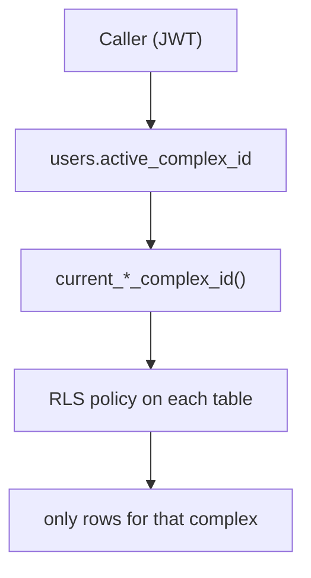

import { Callout } from 'nextra/components'

# Multi-tenant isolation

Saken is multi-tenant: many communities share one database — and now four surfaces share
that database. The **complex** is the tenant boundary, and isolation is enforced by
`complex_id` scoping plus RLS, at every layer that could get it wrong.

## The boundary

Every tenant-owned row reaches a complex, and every query scopes to **one** complex —
the caller's active community:

- **Directly scoped** tables carry `complex_id` (`expenses`, `special_collections`,
  `invitations`, `roles`, `fiscal_years`, …).
- **Indirectly scoped** tables reach the complex by join: `payments` →
  `apartment → building → complex` (a 2-hop join; `payments` still lacks a denormalised
  `complex_id`, which makes scoping cheaper to forget there). `collection_month_weights`
  (migration `0054`) is a 1-hop case: `fiscal_year_id → fiscal_years.complex_id`.

<Callout type="warning">
**The missing `complex_id` on `payments` cost a finding**

The 2026-07-23 audit found the backend's `expenses` update/remove path missing the explicit
`.eq('complex_id', …)` filter its siblings had, and `payments` unscoped for the same
reason — that table has no column to filter on, so it needs an explicit
apartment→building→complex assertion instead. Both are fixed. RLS would have refused a
cross-tenant row regardless; the filter is the layer that makes the *intent* visible in
the code.
</Callout>

## The "active complex" pointer

A user can belong to multiple communities ([Multi-community](/concepts/multi-community)).
`users.active_complex_id` picks which one is in scope. Switching communities updates the
pointer; every subsequent read/write re-scopes automatically.

The rule everywhere is **filter, not fallback**:

- pointer **set** and the caller has a matching role there → that complex;
- pointer **set** and the caller has *no* matching role there → **`NULL`**, not "some other
  community they happen to be an admin of";
- pointer **`NULL`** → first-match (the pre-multi-community behaviour, still correct for a
  sole-membership user).

Falling back would quietly defeat containment: a treasurer of A who is a resident of B
would keep treasurer powers while acting in B. This rule is implemented four times over,
and all four must agree.

## The four enforcement layers

| Layer | Where | What it does |
| --- | --- | --- |
| **1. RLS helpers** | `current_*_complex_id()` (migrations `0034`, `0036`, `0038`, `0043`, `0046`) | Resolve the caller's complex, active-aware, dual-row-safe, `deleted_at`-aware |
| **2. RLS policies** | ~55 policies across 16 tables | Refuse cross-complex rows even if app code slips. They invoke the helpers, so a helper fix propagates without touching a policy |
| **3. TypeScript resolvers** | `src/lib/auth/resolve-*-complex-id.ts`, `requireUser` | Resolve the complex server-side and scope-check client-supplied IDs (`verify*InComplex`) *before* the DB |
| **4. Routing** | `routeAfterSignIn`, `requireSetupComplete` | Read the pointer and route by the caller's role **in that complex**; handle dangling pointers to deleted communities |

`saken-api` adds a fifth implementation of layer 3 rather than a new boundary:
`AuthContextService` re-derives the app user id (the `current_user_id` rule — authenticated
row only, email *or* phone, deterministic order) and applies the same filter-not-fallback
resolution, then hands the request a **per-request Supabase client carrying the caller's
JWT**. So layers 1 and 2 still fire underneath it, unchanged. The mobile app and the
tooling clients introduce no isolation logic of their own at all — they hold a token and
call the API.

The **admin console is outside this model on purpose**: it uses the service-role key, sees
every community at once, and is governed by a different tier entirely
([platform superusers + an audit log](/admin-console/security-and-audit)).

## Soft-delete vs. hard-cascade

This is the sharpest edge in the isolation model:

<Callout type="error">
**Complexes must never be hard-deleted**

`complexes` are **soft**-deleted (`deleted_at`, set only by the `delete_community` RPC),
but their children — `buildings`, `apartments`, `payments`, `expenses`, `fiscal_years`,
… — all `ON DELETE CASCADE` from the complex. A stray hard `DELETE FROM complexes` would
**cascade-wipe an entire community's ledger** with no guard. The two models coexist safely
*only because* every read filters `deleted_at IS NULL`. The standing recommendation:
switch the child FKs to `ON DELETE RESTRICT` so an accidental hard delete fails loudly
instead of destroying data.
</Callout>

<Callout type="warning">
**`service_role` now *does* hold `DELETE` — this changed**

Earlier versions of this page recorded that no `DELETE` was granted to `service_role`
anywhere, consistent with the soft-delete-only design. Migration **`0052`** changed that:
it grants `INSERT, UPDATE, DELETE` to `service_role` on 17 tables (`complexes`,
`buildings`, `apartments`, `users`, `roles`, `invitations`, `fiscal_years`, `budgets`,
`budget_categories`, `budget_lines`, `budget_versions`, `payments`, `expenses`,
`special_collections`, `special_collection_shares`, `fiscal_year_apartment_carries`,
`platform_admins`) so the **admin console's** curated surfaces can write directly.

The console prefers soft-delete wherever a `deleted_at` column exists and reserves hard
delete for genuine cases (bad invitation rows, removing a superuser, dual-row
reconciliation) — but the *grant* is now broad, and the guard against `DELETE FROM
complexes` is the console's UI plus its audit log, not the absence of a privilege. Treat
the console as a loaded tool.
</Callout>

## What keeps tenants apart, in practice

1. **RLS** refuses cross-complex rows even if app code slips — on the direct path and
   behind the API alike.
2. **Server-side scope checks** (`verify*InComplex`, and the backend's explicit
   `.eq('complex_id', …)` filters) reject client-supplied IDs from another complex *before*
   the DB.
3. **Indistinguishable 404s** — anonymous resident/magic-link routes return identical 404s
   for "not found" and "not yours," so you can't probe for another complex's data.
4. **256-bit tokens** — resident `view_token`s and invite tokens are unguessable, and since
   migration `0048` an invitation can only be accepted by the identity it was addressed to.

The 2026-07-23 cross-repo audit specifically probed for cross-tenant reads and writes
across all five surfaces and **found none** — RLS and the capability matrix agreed
everywhere they were checked. The residual risks remain operational (the hard-cascade
asymmetry above, the console's breadth, and the single-admin delete model) rather than a
way for one tenant to read another's data.
