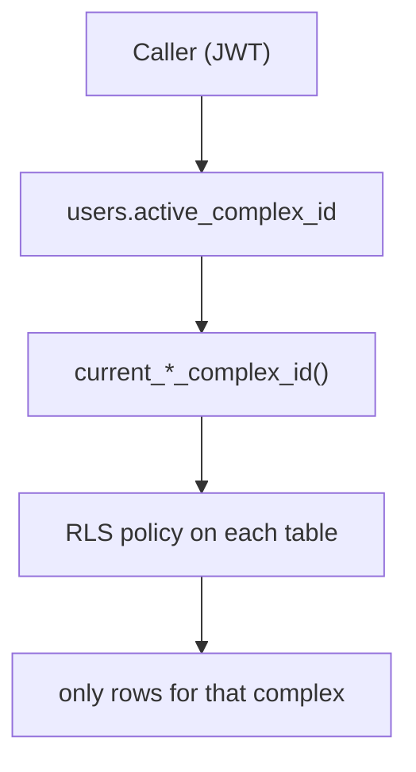

import { Callout } from 'nextra/components'

# Multi-tenant isolation

Saken is multi-tenant: many communities share one database. The **complex** is the tenant
boundary, and isolation is enforced by `complex_id` scoping plus RLS.

## The boundary

Every tenant-owned row reaches a complex, and every query scopes to **one** complex —
the caller's active community:

- **Directly scoped** tables carry `complex_id` (`expenses`, `special_collections`,
  `invitations`, `roles`, `fiscal_years`, …).
- **Indirectly scoped** tables reach the complex by join: `payments` →
  `apartment → building → complex` (a 2-hop join; the audit M-S1 notes `payments` lacks a
  denormalised `complex_id`, which makes scoping cheaper to forget there).

## The "active complex" pointer

A user can belong to multiple communities ([Multi-community](/concepts/multi-community)).
`users.active_complex_id` picks which one is in scope; the active-aware RLS helpers and
TypeScript resolvers both read it. Switching communities updates the pointer; every
subsequent read/write re-scopes automatically.

## Soft-delete vs. hard-cascade

This is the sharpest edge in the isolation model:

<Callout type="error">
**Complexes must never be hard-deleted**

`complexes` are **soft**-deleted (`deleted_at`, set only by the `delete_community` RPC),
but their children — `buildings`, `apartments`, `payments`, `expenses`, `fiscal_years`,
… — all `ON DELETE CASCADE` from the complex. A stray hard `DELETE FROM complexes` would
**cascade-wipe an entire community's ledger** with no guard (audit H-S2). The two models
coexist safely *only because* every read filters `deleted_at IS NULL`. The audit's
recommendation: switch the child FKs to `ON DELETE RESTRICT` so an accidental hard delete
fails loudly instead of destroying data.
</Callout>

Also note: **no `DELETE` is granted to `service_role` anywhere** (verified in the
live-DB reconciliation), consistent with the soft-delete-only design.

## What keeps tenants apart, in practice

1. **RLS** refuses cross-complex rows even if app code slips.
2. **Server-side scope checks** (`verify*InComplex`) reject client-supplied IDs from
   another complex *before* the DB.
3. **Indistinguishable 404s** — anonymous resident/magic-link routes return identical 404s
   for "not found" and "not yours," so you can't probe for another complex's data.
4. **256-bit tokens** — resident `view_token`s and invite tokens are unguessable.

The audit rated this isolation model as having **zero application-layer security holes**.
The residual risks are operational (the hard-cascade asymmetry above, and the single-admin
delete model) rather than a way for one tenant to read another's data.
