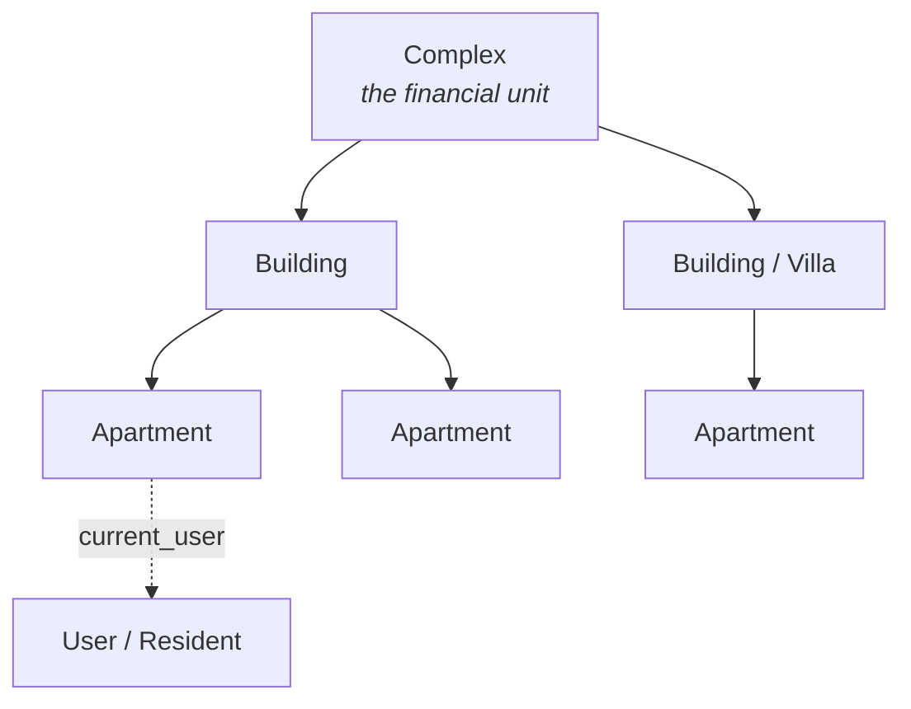
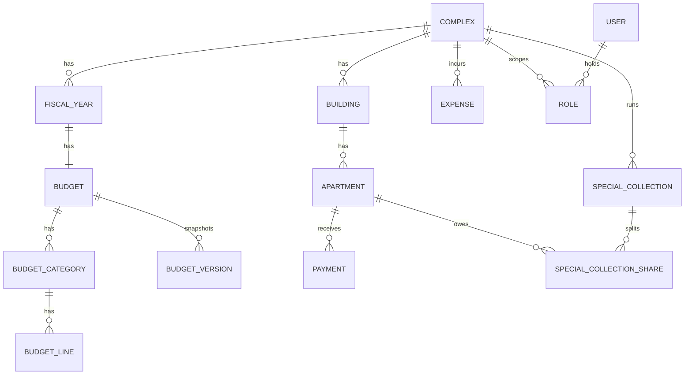

import { Callout } from 'nextra/components'

# Complex, building, apartment

The spine of Saken's data model is a three-level hierarchy. Understanding it is the key
to understanding everything else.

## The complex is the financial unit

A **complex** contains one or more **buildings**; a building contains one or more
**apartments**. A villa is modelled as a building of `kind = 'villa'` with a single
apartment.

Crucially, the **complex** — not the building — is the financial unit:

> A complex has **one shared budget, one cash pot, and one set of apartment shares** that
> sum to (nominally) 1000, across all its buildings and villas.

This is why the schema hangs the budget, fiscal years, expenses, and special collections
off `complex_id`, while payments hang off an apartment (and reach the complex via
`apartment → building → complex`).

## Single building vs. multi-building

Most pilot communities are a single building. Saken **collapses the middle layer** for
them: the complex equals the building, and the user never sees the extra level in the UI.

Multi-building complexes show building names alongside apartment labels — e.g.
*"Building A — Apt 3B"*. The setup wizard's structure step (`/setup/structure`) is where
this branch is chosen.

## Apartments and shares

Each apartment carries a **share** — a proportional weight used to split the budget. In
the live schema (`public.apartments`):

| Field | Meaning |
| --- | --- |
| `label` | admin-defined, unique within its building |
| `share` | `NUMERIC(10,2)`, a proportional weight (see [The money model](/concepts/money-model)) |
| `opening_carryover_balance` | carryover owed/ahead from before Saken (signed) |
| `current_user_id` | the resident currently assigned (FK → `users`, `ON DELETE SET NULL`) |
| `view_token` | the resident's magic-link credential (`UUID`) |
| `opening_paid_amount` | **legacy / zeroed** — present but unused since migration `0012` |

<Callout type="info">
**Residency is a pointer, not a role**

A resident's link to an apartment is the `apartments.current_user_id` pointer — **not** a
row in the `roles` table. The `roles` table only holds `admin`, `concierge`, and
`treasurer`. This separation is what makes [role stacking](/concepts/roles) possible.
</Callout>

## The 15 entities

The design spec models the domain as **15 entities**. The shipped schema realises them as
Postgres tables (a few were superseded — see [Schema overview](/database/schema)):

For the full column-level schema (verified against production), see
[Database → Schema overview](/database/schema).
