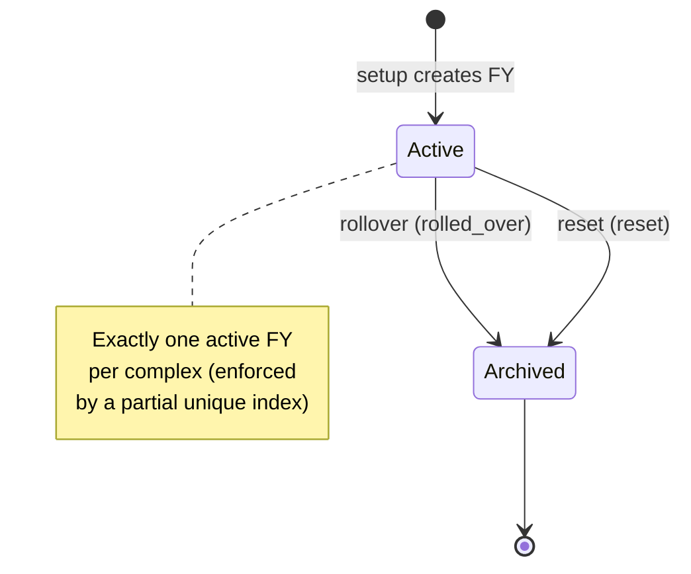

import { Callout } from 'nextra/components'

# Fiscal year & rollover

Everything financial in Saken is scoped to a **fiscal year (FY)**. Budgets, payments, and
expenses are all tagged to one. This page covers the FY lifecycle and the year-end
rollover.

## Fiscal years are first-class

A `fiscal_years` row belongs to a complex and has a `start_date`, an `end_date`
(12 months later), and a `status` of `active` or `archived`. A partial unique index —
`uniq_active_fiscal_year_per_complex` — enforces **at most one active FY per complex**.

The admin picks the fiscal-year **start month** during setup. Once budget data exists,
that month **locks** (see the DECISIONS log entry of 2026-05-18): changing it would shift
the computed FY's `start_date` and orphan the existing budget. The lock is the
conservative v1 answer rather than building cascade-update logic.

## Annual dues are calculated once

An apartment's **annual contribution** is computed at year start as
`FY budget total × (share / Σ shares)` — and is **not pro-rated** to today. A resident who
joins mid-year still owes the full annual amount. See [The money model](/concepts/money-model).

## Year-end rollover

The rollover is a manual, admin-only action (`/dashboard/fiscal-year/rollover`) backed by
the atomic `rollover_fiscal_year(p_complex_id)` RPC. In one transaction it:

1. **Closes** the active FY (`status = archived`, `closure_reason = rolled_over`),
   freezing its `closing_cash`.
2. **Opens** a new FY for the next period (dates pinned to the rollover day — "Path C",
   migrations `0030`/`0031`).
3. **Snapshots** each apartment's carryover into `fiscal_year_apartment_carries`
   (signed: owes `+`, ahead `−`).
4. **Copies** the prior budget forward as the new FY's starting budget (editable).

The admin can enter an amount of **prior-year surplus to apply** to next year, reducing
what residents must collect (`fiscal_years.surplus_applied_from_prior_year`). Cash carries
forward across years.

<Callout type="warning">
**Rollover is irreversible and gated**

The rollover cannot be undone, and it is **blocked while concierge submissions are
pending** — pending expenses must be resolved first so the closing books are complete.
</Callout>

## Reset fiscal year

A separate, **destructive** action archives the current FY (`closure_reason = reset`) and
creates a fresh FY for the *same* period with a blank budget — for when an admin wants to
discard a botched setup and start over. It sits behind a **type-the-community-name**
confirmation gate.

## Viewing past years

After a rollover, admins, treasurers, and residents can view archived years via a `?fy=`
query parameter that flows through the read pages (commits tagged `fiscal-year rollover
F7`). Write pages strip `?fy=` so you can never record a payment into a closed year.

<Callout type="info">
**Multi-year setup is deferred**

The v1 wizard supports **one** fiscal year. Year-2 setup mechanics beyond the rollover
(designing the year-2 onboarding flow) were deferred to post-pilot, to be designed with
real admin behaviour as input (DECISIONS log, 2026-05-19).
</Callout>
