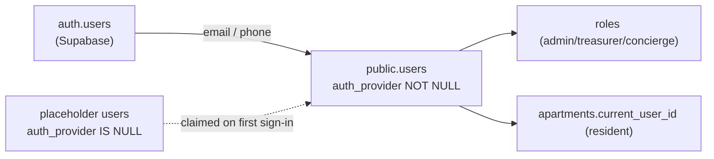

import { Callout } from 'nextra/components'

# Identity model

Identity is the trickiest part of Saken, and the source of several hard-won lessons. The
core idea: **a Supabase auth user is not the same thing as a Saken app user**, and the two
are bridged carefully.

## Auth user vs. app user

- **Auth user** — a row in Supabase's `auth.users`, created when someone signs in with
  Google, email, or phone. Its UID (`req.authUser.authId` in the backend) is a Supabase
  concept.
- **App user** — a row in `public.users`, the Saken-domain identity that owns roles,
  apartments, payments, etc.

These are **bridged by email** (and, for phone logins, by phone) — never by the auth UID.
Every RLS helper and server resolver re-derives the app user from `auth.email()` /
`auth.jwt()->>'phone'`, filtered to *authenticated* rows (`auth_provider IS NOT NULL`).

## Placeholder vs. authenticated users

During setup, an admin types residents' names — creating **placeholder** `users` rows
with `auth_provider IS NULL`. These represent people who have not (yet) signed in. When
such a person later authenticates (e.g. accepts a treasurer invite), the system
**claims** the placeholder row rather than creating a duplicate.

The `auth_provider` column is the discriminator:

| `auth_provider` | Meaning |
| --- | --- |
| `NULL` | placeholder — created by an admin, never signed in |
| `google` / `email` / `phone` | an authenticated identity |

## The "dual-row" hazard (and its fixes)

The bridge-by-email design has a subtle failure mode: if **two** rows match an identity
(say a placeholder and an authenticated row, or two authenticated rows sharing an email),
a `LIMIT 1` lookup can silently bind to the wrong account. Saken hit this and hardened
against it across several migrations:

- **`0036`** — dual-row-safe user lookup inside the RPCs and the five RLS helpers.
- **Claim-on-first-sign-in** (commit `db708a1`) — the placeholder is claimed at first
  authentication, removing the dual row at its source.
- **`uniq_authenticated_email`** (migration `0019`) — unique email *among authenticated
  rows*.
- **`uniq_authenticated_phone`** (migration `0044`) — the phone equivalent, added to
  close the audit's H-S1 finding before phone auth ships.
- **`0045`** — forbids empty-string email/phone, which would otherwise collide across
  identities.
- **`0046`** — deterministic identity resolvers, so a lookup never depends on row order.

<Callout type="info">
**Why email, not the auth UID?**

Anchoring to email lets an admin sign in with Google today and email tomorrow and remain
*the same* Saken user. The auth UID differs per provider; the email is the stable anchor.
Phone-first signup also captures an email at first use to keep this anchor intact.
</Callout>

## Residents & concierges have no auth identity

Residents and concierges **never sign in**. They reach Saken through a **magic link**
(`/r/{apartmentId}/{token}` for residents; the concierge surface similarly). The token in
the URL *is* the credential — validated server-side by `validate-token.ts` against
`apartments.view_token`, with any failure returning an indistinguishable 404. See
[Authentication](/features/authentication).
