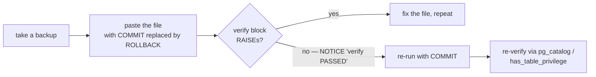

import { Callout } from 'nextra/components'

# Migration history

The schema is built by **56 ordered SQL migrations** (`0001` → `0056`). The files are the
source of truth for the schema's *shape*; the **live database is the source of truth for
reality** — a distinction Saken learned the hard way (see the bottom of this page).

Since `0052` the history is no longer produced by one repo. Three repos now write to the
**same shared Supabase project**, and each new migration is numbered to continue the shared
sequence regardless of which repo authored it.

## Where the migrations live

| Range | Authored in | Notes |
| --- | --- | --- |
| `0001`–`0051` | **`saken`** (web) | The original, canonical history |
| `0052` | **`saken-admin`** | `admin_audit_log` + the console's `service_role` write grants |
| `0053`–`0056` | **`saken-backend`** | Idempotency store, collection weights, push tokens, the `0056` grant |
| `0001`–`0056` | **`saken`** (web) | Mirrors *everything* — the one place with a complete history |

Browse the complete set at
[`saken/supabase/migrations/`](https://github.com/Saken-Community-Management/saken/tree/main/supabase/migrations).
Every file follows the same house style: `BEGIN; … COMMIT;` wrapping the change, plus a
self-verifying `DO $$ … RAISE EXCEPTION … $$` block that aborts if the post-state is wrong.

<Callout type="info">
**The cross-repo numbering convention**

There is exactly one shared dev database and one shared prod database. A repo that needs a
schema change reads the highest number already applied and takes the next one — it does
**not** restart at `0001` in its own namespace. Every such file carries a header stating
which repo owns it and which repos it continues from (`0053`'s header says *"this repo
continues the shared DB's 0001→0052 history (0052_admin_audit_log lives in the saken-admin
repo)"*).

The web repo then **mirrors** `0052`–`0056` byte-for-byte into
`saken/supabase/migrations/`, so a single directory can still replay the whole schema.
Verified 2026-07-24: the mirrored copies of `0052`–`0056` are byte-identical to their
originating repos'.
</Callout>

## The arc, by theme

| Range | Theme |
| --- | --- |
| `0001` | Initial schema — the 15 entities, RLS enabled with permissive stubs |
| `0002`–`0008` | Data-API grants, setup wizard, budget setup, editable payments/expenses + storage, view tokens, service-role grants |
| `0009`–`0015` | Category overhaul (ENUM → 10 TEXT keys), YTD-snapshot migration, opening-cash date anchor, prior-period flags, expense line-tagging |
| `0016`–`0024` | **Invitations + role system** — invitations table, language, the `roles` table + apartment tokens, dropping old `users` columns, `accept_invitation`, real **admin/resident RLS policies** |
| `0025`–`0026` | **Treasurer role** + storage policies for treasurer/concierge |
| `0027`–`0031` | **Fiscal-year rollover** — groundwork, the `rollover_fiscal_year` RPC, "Path C" date pinning |
| `0032`–`0042` | Multi-community: `active_complex_id`, active-aware helpers, `create_complex_with_admin`, dual-row-safe lookups, soft-delete (`deleted_at`), `exit_community` / `delete_community` RPCs, service-role grants |
| `0043` | **Phone identity** — email-OR-phone branch in all 5 RLS helpers + 5 RPCs |
| `0044`–`0047` | **Hardening** — `uniq_authenticated_phone`, forbid empty identity strings, deterministic identity resolvers, **drop the `roles_readable` leak** |
| `0048`–`0051` | **Permissions redesign + platform tier** — bind invitations to the invitee, stackable roles, `assign_role`/`revoke_role`, `platform_admins` |
| `0052`–`0056` | **The cross-repo era** — admin console audit log, backend idempotency store, collection weights, push tokens, the `0056` grant |

## The hardening tail (0044–0047)

These four migrations close the highest-priority findings from the 2026-06-14 audit and
live-DB reconciliation:

| Migration | What it fixes |
| --- | --- |
| `0044_uniq_authenticated_phone` | Adds the missing phone-uniqueness guard (audit **H-S1**) before phone auth ships |
| `0045_forbid_empty_identity_strings` | Prevents empty-string email/phone collisions across identities |
| `0046_deterministic_identity_resolvers` | Makes identity lookups order-independent (no `LIMIT 1` ambiguity) |
| `0047_drop_roles_readable_view` | Removes the critical PII-leaking view (see below) |

## Permissions redesign + platform tier (0048–0051)

| Migration | What it does |
| --- | --- |
| `0048_accept_invitation_bind_to_invitee_identity` | **Security hotfix.** `accept_invitation` checked only that a token was pending + unexpired, then attached the role to *whoever* accepted — a leaked treasurer link was a bearer credential for the role. Now the accepter's verified email/phone must match `invitee_email`/`invitee_phone`; new outcome `identity_mismatch`. |
| `0049_stackable_roles` | Drops `roles_user_complex_unique (user_id, complex_id)` for `roles_user_complex_role_unique (user_id, complex_id, role)`, adds `assigned_by` / `assigned_at`. A person can now hold *several* roles in one community. Load-bearing side-effect: `accept_invitation`'s two upserts are reworked to `ON CONFLICT (user_id, complex_id, role)` **in the same transaction**, because the old conflict target ceases to exist the moment the constraint is dropped. |
| `0050_assign_revoke_role_rpcs` | `assign_role` / `revoke_role` — admins grant elevated roles directly, no invite token. `revoke_role` refuses to remove a complex's **last active admin**. |
| `0051_platform_admins` | The superuser tier for `saken-admin` and `saken-docs`: a `platform_admins` table (RLS on, **zero policies**) plus `is_platform_admin()`, so the internal tools authorize by *identity* rather than by sign-in method or an env allowlist. |

## The cross-repo era (0052–0056)

| Migration | Repo | What it does |
| --- | --- | --- |
| `0052_admin_audit_log` | `saken-admin` | Adds `admin_audit_log` (`actor_email`, `action`, `target_table`, `target_id`, `summary`, `before`/`after` `jsonb`, `created_at`) — RLS on, zero policies, and only `SELECT, INSERT` granted, so it is append-only *by grant*. Also loops over **17 editable tables** granting `service_role` `INSERT, UPDATE, DELETE`; the console is cross-tenant god-mode and cannot use the per-community `SECURITY DEFINER` RPCs, which authorize the caller as a community admin. |
| `0053_idempotency_keys` | `saken-backend` | A durable idempotency store for the backend's money-writes (`POST /payments`, `/expenses`, `/special-projects/:id/contributions`). The interceptor's store had been **in-memory**, i.e. broken the moment the API runs more than one instance. `key text PRIMARY KEY` is the race arbiter; `user_id` and `endpoint` make a mismatched replay a 409; rows expire after 24 h. RLS on, zero policies, `service_role` granted `SELECT/INSERT/DELETE`. |
| `0054_collection_month_weights` | `saken-backend` | Non-uniform monthly collection (issue #32). `PRIMARY KEY (fiscal_year_id, month)` + `weight numeric(6,2) DEFAULT 1 CHECK (weight >= 0)`. A month's share of the annual total is `weight / Σ weights`, so boosting July to `2.0` makes July owe 2/13 and every other month 1/13 — **the annual total never changes**. The table is *sparse*: absent rows mean weight 1, and the app deletes a row when its weight returns to exactly 1, so a complex that never touches the schedule has zero rows. The only one of the five new tables with real RLS policies (see [RLS policies](/database/rls)). |
| `0055_device_push_tokens` | `saken-backend` | Expo push registry for the React Native app: `user_id` → `public.users(id)` (CASCADE), `expo_push_token` **UNIQUE** (the upsert arbiter — a device that changes owners re-points its row instead of duplicating), `platform` (`ios`/`android`), `created_at`, `last_seen_at`. RLS on, zero policies. |
| `0056_idempotency_keys_update_grant` | `saken-backend` | One statement: `GRANT UPDATE ON public.idempotency_keys TO service_role`. See below — it is the most instructive migration in the set. |

## The `0056` story — the fifth time the same trap sprang

<Callout type="error">
**"`service_role` write grants are not in the migration history"**

`0053` shipped with an explicit design statement in its header:

> *UPDATE is deliberately NOT granted — rows are write-once + delete-on-expiry.*

That was true of the interceptor **as written at the time**: it executed the handler first
and stored the response afterwards. But that ordering was itself a race — two concurrent
requests carrying the same `Idempotency-Key` both missed the cache, both executed the
mutation, and the primary-key conflict afterwards only decided whose response got
remembered. A double-tapped "Record collection" could insert two payments.

The fix was to **reserve the key before executing**: `INSERT` a PENDING placeholder
(`status = 0`, `ON CONFLICT DO NOTHING`, arbitrated by the PK); winning that insert is the
exclusive right to run the handler, and the loser waits and replays. On completion the
winner **`UPDATE`s** the placeholder with the real status and response.

Rows are now written **twice by design** — and `0053`'s sentence became stale. Without the
`UPDATE` grant the finalize step fails `42501`, the interceptor silently degrades to
per-instance memory, and durable cross-instance replay *never works* while looking fine in
a single-instance dev environment.

This was the **fifth** instance of the same trap — after `0029`, `0032`, `0035` and
`0042` — and the **first one caught by reading the migration before it could fail in
production**, rather than by debugging a `42501` afterwards. The rule that came out of it:
**every migration that introduces a table the service-role client will write must grant
those writes in the same file, and assert them in its verify block.** Note that `0056`
needs no schema change at all: `status int NOT NULL` has no `CHECK` (so the `0` sentinel is
legal) and `response jsonb` is already nullable, so the PENDING placeholder fits the `0053`
table as-is.
</Callout>

## How migrations are actually applied

<Callout type="warning">
**Not `supabase db push`**

The Supabase CLI's migration-tracking table is **out of sync** with reality and has been
since `0001` — the early migrations were applied by hand, so the CLI believes almost
nothing has been applied. Running `db push` against the shared project would be a very bad
day. Migrations are applied **by hand**, one of two ways:

1. **Supabase Dashboard → SQL Editor** (the usual path for prod), or
2. the **Management API**:
   `POST https://api.supabase.com/v1/projects/{ref}/database/query` with an `sbp_`
   personal-access token in the `Authorization` header.
</Callout>

The discipline around each apply:



1. **Take a backup** before anything that touches data.
2. **ROLLBACK-first inspect** — run the whole migration inside a transaction that ends in
   `ROLLBACK` instead of `COMMIT`. The self-verifying `DO $$ … RAISE EXCEPTION … $$` block
   every migration carries runs against the *post-state* inside that transaction, so a
   failed assertion aborts harmlessly and a `RAISE NOTICE '… verify PASSED'` means the real
   run will succeed.
3. **Then `COMMIT`** — re-run the file unmodified.
4. **Re-verify against the deployed database**, not the file.

<Callout type="info">
**Yes, ROLLBACK-first really works through the Management API**

This is a natural thing to doubt — the endpoint is a one-shot HTTP query executor, and it
is reasonable to worry that it auto-commits or that DDL escapes the transaction.
**Verified 2026-07-24**: a `BEGIN; GRANT …; ROLLBACK;` sent to
`POST /v1/projects/{ref}/database/query` left the privilege **unchanged** afterwards. The
whole payload runs in one transaction and the `ROLLBACK` is honoured, including for DDL —
Postgres has transactional DDL, and the endpoint does not defeat it. The rehearsal step is
therefore genuinely free.
</Callout>

<Callout type="error">
**The canonical rule: the database is ground truth**

Not the migration files, not this page. Grants, ownership, and hand-made Dashboard objects
all live *outside* the migration text unless a statement explicitly asserts them. Before
relying on a file as the base for a `CREATE OR REPLACE`, confirm the **deployed** body:

```sql
SELECT pg_get_functiondef('public.accept_invitation(text)'::regprocedure);
SELECT relrowsecurity FROM pg_class WHERE oid = 'public.idempotency_keys'::regclass;
SELECT has_table_privilege('service_role', 'public.idempotency_keys', 'UPDATE');
SELECT count(*) FROM pg_policies WHERE schemaname = 'public' AND tablename = 'device_push_tokens';
```
</Callout>

## "Repair the database, the docs lag" — the lessons

<Callout type="error">
**The `roles_readable` leak**

A view `public.roles_readable` existed in production that **no migration created** —
almost certainly hand-made during a Dashboard debugging session. It was *not*
`security_invoker`, so it bypassed RLS, and `SELECT` was granted to **`anon`** — the public
key shipped to every browser. Anyone on the internet could `curl` it and receive **every
admin/treasurer/concierge's name + email + role + community**, no login required. It was
**invisible from the repository**. Found by introspecting the live DB on 2026-06-14, it was
dropped in migration `0047` (commit `fe25f53`). This single finding is why the team treats
**the live DB as ground truth**.
</Callout>

<Callout type="warning">
**The repo can't fully reproduce the live DB (improving)**

Migrations `0001`–`0043` were applied by hand with no tracking, so a few objects (grants,
ownership, a couple of Dashboard-created objects) drifted from the files. The service-role
write grants were *"bitten 5×"* (`0029` / `0032` / `0035` / `0042` / `0056`). The fixes in
progress: a **CI migration-replay** job that replays `0001`→latest from scratch on every PR
(catching drift automatically) plus a baseline step, and the newer house rule that every
migration grants and *asserts* its own `service_role` privileges. See
[CI/CD](/operations/ci-cd) and [Migrations workflow](/operations/migrations-workflow).
</Callout>

## Applying migrations to a fresh project

Apply `0001` → `0056` **in order** from the web repo's mirror (the only complete copy).
Corrections are always *new* migrations — nothing already applied is ever edited or
reverted. See [Database migrations workflow](/operations/migrations-workflow).
