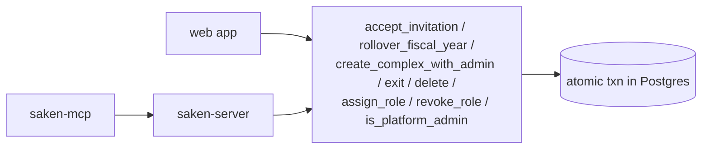

import { Callout } from 'nextra/components'

# Views & RPCs

Saken's multi-step, must-be-atomic operations are **Postgres `SECURITY DEFINER` RPCs**, not
application transactions. This keeps the critical money/identity flows atomic and lets every
client (web, backend, MCP, admin console, CLI) reuse the exact same battle-tested logic.

The full `SECURITY DEFINER` inventory is **13 functions**: 8 callable RPCs and 5 RLS helper
resolvers. Two further functions (`set_updated_at`, `assign_payment_receipt_number`) are
plain trigger functions — *not* `SECURITY DEFINER`.

## The RPCs

All are `service_role`-owned, `SECURITY DEFINER`, `search_path=''`, with `EXECUTE` granted
to `authenticated` (and `REVOKE ALL … FROM public` first). They resolve identity from
`auth.email()` / `auth.jwt()->>'phone'` internally, so calling them through a user-scoped
client makes the caller the subject — nothing about the caller is passed as an argument.

| RPC | Since | Purpose |
| --- | --- | --- |
| **`accept_invitation(p_token text) → jsonb`** | `0021` | Atomic invite accept — resident reuse/convert/split/fresh, plus concierge/treasurer role UPSERT (escalation-safe). Identity from email OR phone. **Bound to the invitee since `0048`** and **stackable since `0049`** — see below. |
| **`rollover_fiscal_year(p_complex_id uuid) → jsonb`** | `0028` | Atomic FY close + open: archives the active year, opens the next (Path C dates), snapshots apartment carries, copies the budget forward. Blocked while submissions are pending. |
| **`create_complex_with_admin(p_name text, p_fiscal_year_start_month int) → uuid`** | `0035` | Atomic complex creation + the admin's `roles` row + active pointer. |
| **`exit_community(p_complex_id uuid) → jsonb`** | `0039` | A non-admin's self-exit from a community. |
| **`delete_community(p_complex_id uuid) → jsonb`** | `0041` | An active admin's soft-delete: sets `complexes.deleted_at` and cascades deactivation in-app. |
| **`assign_role(p_complex_id uuid, p_user_id uuid, p_role text) → jsonb`** | `0050` | An admin grants an elevated role **directly**, no invite token. Outcomes: `not_authenticated`, `not_authorized`, `invalid_role`, `invalid_target`, `assigned`. |
| **`revoke_role(p_complex_id uuid, p_user_id uuid, p_role text) → jsonb`** | `0050` | Soft-deactivates one specific role. Outcomes add `last_admin` and `not_found`. |
| **`is_platform_admin() → boolean`** | `0051` | `true` iff the current session's `auth.email()` is an active row in `platform_admins`. Takes **no arguments** — it cannot be spoofed. |

### `accept_invitation` — two corrections worth knowing

<Callout type="error">
**`0048`: a token was a bearer credential for a role**

Until `0048`, `accept_invitation` validated only that the token was *pending* and
*unexpired*, then attached the role to **whoever** accepted it. A treasurer invite
forwarded into a WhatsApp group could be claimed by any signed-in user — a resident could
self-escalate to treasurer. `0048` adds one check right after the pending/unexpired gates:
the accepter's verified email or phone (from the JWT) must match the invitation's recorded
`invitee_email` / `invitee_phone`, otherwise the outcome is `identity_mismatch`. Everything
else in the function is byte-identical to `0043`.
</Callout>

`0049` then made roles stackable, which forced a change *inside the same transaction*: the
function's two role upserts used `ON CONFLICT (user_id, complex_id)`, and that constraint
ceases to exist the moment `0049` drops it. Both branches now use
`ON CONFLICT (user_id, complex_id, role)` — so a re-invite to the **same** role reactivates
it, while a **different** role now stacks alongside the existing one. The verify block
asserts the old conflict target is gone from the deployed body and the new one is present.

### `assign_role` / `revoke_role` — the authorization shape

Both follow an identical four-step guard, and the shape is worth copying:

```sql
v_caller := public.current_user_id();          -- from the JWT, unspoofable
IF v_caller IS NULL THEN RETURN 'not_authenticated'; END IF;

SELECT EXISTS (                                 -- caller is an ACTIVE admin *here*
  SELECT 1 FROM public.roles r
  WHERE r.user_id = v_caller AND r.complex_id = p_complex_id
    AND r.role = 'admin' AND r.deactivated_at IS NULL
) INTO v_is_admin;
IF NOT v_is_admin THEN RETURN 'not_authorized'; END IF;
```

`revoke_role` adds a **last-admin guard**: if the target holds an active `admin` role and
the complex has exactly one active admin, it returns `last_admin` and changes nothing — a
community can never be orphaned. Revocation is a soft `deactivated_at = now()`, never a
`DELETE`, so the audit trail (`assigned_by`, `assigned_at`) survives.

Identity *resolution* stays in the app: `assignRole(complexId, target, role)` maps an
email/phone to a `user_id` (creating a placeholder for someone not yet registered) and then
calls the RPC with that id, reusing the existing `lookupAuthenticatedUserByEmail` +
placeholder-creation path rather than duplicating it in SQL.

## Trigger helpers

| Function | Role |
| --- | --- |
| `set_updated_at()` | bumps `updated_at` on update (most tables) |
| `assign_payment_receipt_number()` | BEFORE INSERT on `payments` — advisory-lock-serialized sequential `receipt_number` per complex |

Neither is `SECURITY DEFINER`; both run as the invoking role.

## RLS helper functions

Five identity/scope resolvers used inside policies — `current_user_id()`,
`current_admin_complex_id()`, `current_treasurer_complex_id()`,
`current_concierge_complex_id()`, `current_resident_complex_id()`. Same `SECURITY DEFINER`
discipline; final bodies set by migration `0043` (email-or-phone, dual-row-safe,
`deleted_at`-aware, active-aware), refined by `0046`. See
[Auth & RLS wiring](/architecture/auth-rls).

## Why RPCs instead of app transactions



- **Atomicity** — multi-table writes (create a complex *and* its admin role; close one FY
  *and* open the next *and* snapshot carries *and* copy the budget) can't half-complete.
- **One implementation** — the web app, the NestJS backend, and the MCP server all call
  the same RPC; there is no second copy of the rules to drift.
- **Identity inside the boundary** — the RPC re-derives the caller from the JWT, so it
  can't be tricked by a client-supplied id.

The **admin console is the deliberate exception.** A platform superuser is not a
per-community admin, so `assign_role`'s "caller must hold an active admin role in this
complex" check would reject it every time. The console therefore writes cross-tenant
through the service-role client instead — which is exactly why migration `0052` had to
grant those writes, and why it pairs them with `admin_audit_log`. See
[RLS policies](/database/rls).

## Ownership is load-bearing

<Callout type="error">
**`SECURITY DEFINER` alone is not enough in this project's role configuration**

A `SECURITY DEFINER` function runs as its **owner**. If the owner is a role that does not
bypass RLS — or lacks the table grants the body needs — the function fails or silently
returns nothing, no matter how correct the SQL is. Every RPC and helper here must be owned
by **`service_role`**.

This has bitten twice in ways worth remembering:

- `accept_invitation` originally ran as `postgres` until migration `0041` flipped its owner
  to `service_role`. Function *ownership* lives entirely outside the migration text unless
  an explicit `ALTER FUNCTION … OWNER TO` runs — a `CREATE OR REPLACE` preserves whatever
  owner is already deployed, including a wrong one.
- `is_platform_admin()` reads `platform_admins`, a table with RLS on and **zero policies**.
  `0051`'s comment is blunt about it: *"service_role ownership so the function effectively
  BYPASSRLS to read platform_admins. `SECURITY DEFINER` alone is NOT enough in this
  project's role config."*

The house pattern, visible in `0050` and `0051`, is:

```sql
GRANT CREATE ON SCHEMA public TO service_role;      -- temporarily, to allow the reassign
ALTER FUNCTION public.assign_role(uuid, uuid, text) OWNER TO service_role;
REVOKE CREATE ON SCHEMA public FROM service_role;   -- put it back

REVOKE ALL ON FUNCTION public.assign_role(uuid, uuid, text) FROM public;
GRANT EXECUTE ON FUNCTION public.assign_role(uuid, uuid, text) TO authenticated;
```

…followed by a verify block asserting `prosecdef`, `pg_get_userbyid(proowner) =
'service_role'`, a pinned `search_path`, and `has_function_privilege('authenticated', …,
'EXECUTE')`. `0049` re-asserts the owner on `accept_invitation` even though
`CREATE OR REPLACE` preserves it — cheap insurance, because the failure mode is silent.

One subtlety the verify blocks handle: the *encoding* of an empty `search_path` in
`pg_proc.proconfig` is Postgres-version-sensitive, so the assertions check for the
**key** (`c LIKE 'search_path=%'`) rather than an exact string.
</Callout>

## Views

<Callout type="info">
**No application views should exist**

By design, the only view that ever lived in `public` was the rogue `roles_readable` leak,
now **dropped** (migration `0047`). A periodic sweep (in the live-DB reconciliation doc)
checks `information_schema.views` for anything not created by a migration — part of the
"live DB is ground truth" hygiene. See [Migration history](/database/migrations).
</Callout>
