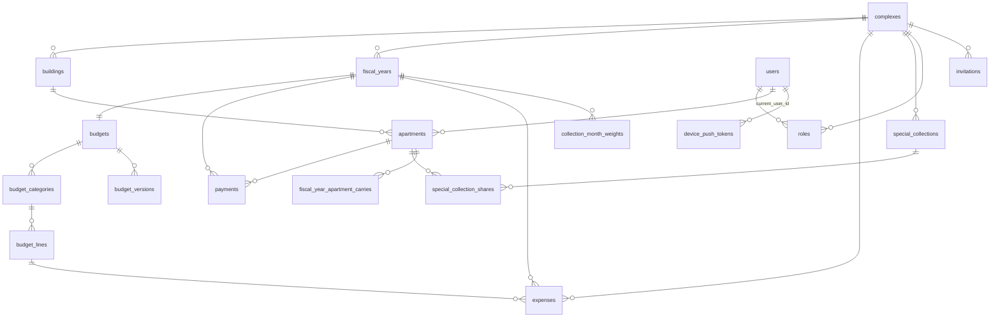

import { Callout } from 'nextra/components'

# Schema overview

The database is the heart of Saken. This overview groups the **23 tables** by domain and
links out to the migration history.

The `0001`–`0047` shape reflects `docs/SCHEMA-current-state.md`, which was **verified
against the live production DB on 2026-06-14** (introspected via the Supabase Management
API) — tables, columns, types, CHECKs, FK delete-rules, ENUMs, and all `SECURITY DEFINER`
functions matched production. Everything added since (`0049`'s `roles` reshape, and the
five tables from `0051`–`0055`) is documented from the migration files, which each carry a
self-verifying block asserting the exact shape described here.

## Entity-relationship map

`platform_admins`, `admin_audit_log` and `idempotency_keys` are deliberately **unconnected**
— they carry no foreign keys into the tenant graph, because they are platform/infrastructure
concerns rather than community data.

## Tables by domain

### Structure
- **`complexes`** — `name`, `created_by`, `opening_cash`, `fiscal_year_start_month`
  (`CHECK 1–12`), `opening_cash_date`, `setup_completed_at`, `budget_setup_done_at`,
  `deleted_at` (soft-delete).
- **`buildings`** — `complex_id` (CASCADE), `name`, `kind` (`building` | `villa`).
- **`apartments`** — `building_id` (CASCADE), `label` (`UNIQUE(building_id,label)`),
  `share` `NUMERIC(10,2)` (`CHECK 0–1000`), `opening_carryover_balance`, `current_user_id`
  (SET NULL), `view_token` `UUID`.

### Identity
- **`users`** — identity-only after migration `0020`: `name`, `phone`, `email`,
  `auth_provider` (`NULL` = placeholder; set = authenticated), `language` (`en`/`ar`),
  `active_complex_id` (SET NULL).
- **`roles`** — `user_id` (CASCADE), `complex_id` (CASCADE), `role` (TEXT + CHECK:
  `admin`/`concierge`/`treasurer`), `deactivated_at`, plus `assigned_by` (SET NULL) and
  `assigned_at` since `0049`. **`UNIQUE(user_id, complex_id, role)`** — roles are
  *stackable* per community since `0049`; before that the key was
  `UNIQUE(user_id, complex_id)` and one person could hold only one role per complex.
- **`invitations`** — see [Invitations](/features/invitations).
- **`platform_admins`** (`0051`) — `email` (unique on `lower(email)`), `is_superuser`,
  `note`, `created_at`. The superuser allowlist for the internal `saken-admin` and
  `saken-docs` apps, moved out of an env variable and into the DB so it can change without
  a redeploy and so a superuser is authorized by **identity**, not by sign-in method. No
  public sign-up; rows are provisioned by hand. Read only through `is_platform_admin()`.

### Fiscal & budget
- **`fiscal_years`** — `complex_id` (CASCADE), `start_date`/`end_date`
  (`CHECK end > start`), `status` (`active`/`archived`), `closure_reason`
  (`rolled_over`/`reset`), `surplus_applied_from_prior_year`, frozen `opening_cash` /
  `closing_cash`. Partial unique: **one active FY per complex**.
- **`budgets`** — `fiscal_year_id` (**`UNIQUE`**, CASCADE), `last_amended_at`.
- **`budget_categories`** — `budget_id`, `category_key` (10-key `CHECK`),
  `UNIQUE(budget_id, category_key)`.
- **`budget_lines`** — `budget_category_id`, `rate`, `quantity`, `description`.
- **`budget_versions`** — append-only `snapshot` `JSONB` + `note`.
- **`fiscal_year_apartment_carries`** — PK `(fiscal_year_id, apartment_id)`,
  `opening_carryover` (signed). Rollover snapshot.
- **`collection_month_weights`** (`0054`) — PK `(fiscal_year_id, month)` where `month` is
  `CHECK 1–12`, plus `weight NUMERIC(6,2) NOT NULL DEFAULT 1 CHECK (weight >= 0)`. Lets a
  community collect **non-uniformly** across the year. A month owes
  `weight / Σ weights` of the annual total, so setting July to `2.0` makes July owe 2/13
  and every other month 1/13 — the annual total is unchanged; "recalc the rest" happens by
  normalisation. Owes-to-date becomes weighted too:
  `elapsedFraction = Σ(weights of elapsed months incl. current) / Σ(all 12)`, counting from
  the fiscal year's start month. **Sparse by design**: a missing row means weight `1`, and
  the app *deletes* a row whose weight returns to exactly `1`, so a complex that never
  touches its schedule has zero rows here.

### Money
- **`payments`** — `apartment_id` (RESTRICT), `fiscal_year_id` (RESTRICT), `amount`
  (`CHECK > 0`), `received_on`, `purpose` (`annual_dues`/`special_collection`),
  `special_collection_id`, `recorded_by`, `receipt_number` (trigger-assigned, per complex),
  `payment_method`, `deleted_at`, `is_prior_period`. *No `complex_id` column.*
- **`expenses`** — `complex_id` (RESTRICT), `fiscal_year_id`, `vendor` (nullable since
  `0015`), `category_key` (10-key `CHECK`), `amount` (`CHECK > 0`), `invoice_period_month`
  (`DATE`, `CHECK day = 1`), `spent_on`, `attachment_path`, `status`
  (`pending`/`approved`/`rejected`), `approved_by`/`approved_at`, `rejection_reason`,
  `deleted_at`, `is_prior_period`, `line_id` (NOT NULL, RESTRICT).
- **`special_collections`** / **`special_collection_shares`** — see
  [Special projects](/features/special-projects).

### Platform & infrastructure

These four tables are **service-role only** — RLS is on and none of them has a single
policy (see [RLS policies](/database/rls)). They are not part of the tenant graph and no
browser client ever touches them.

| Table | Migration | Shape | Why |
| --- | --- | --- | --- |
| `platform_admins` | `0051` | `id`, `email`, `is_superuser`, `note`, `created_at` | Superuser allowlist (listed under Identity above) |
| `admin_audit_log` | `0052` | `id`, `actor_email`, `action`, `target_table`, `target_id`, `summary`, `before` `jsonb`, `after` `jsonb`, `created_at` | Append-only record of every write the admin console makes. `before`/`after` row snapshots make a mutation reversible. Indexed on `created_at DESC`, `(target_table, target_id)`, and `actor_email`. Append-only is enforced **by grant**: `service_role` gets only `SELECT, INSERT` |
| `idempotency_keys` | `0053`, `0056` | `key text PRIMARY KEY`, `user_id`, `endpoint`, `status int`, `response jsonb`, `created_at` | Durable, cross-instance idempotency for the backend's money-writes. `key` is the race arbiter; a replay from a different `user_id` or a different `endpoint` is a 409. Rows are purged after 24 h via the `created_at` index |
| `device_push_tokens` | `0055` | `id`, `user_id` → `users(id)` CASCADE, `expo_push_token text UNIQUE`, `platform` (`CHECK ios/android`), `created_at`, `last_seen_at` | Expo push registry for the React Native app, one row per **device**. `expo_push_token` being UNIQUE is the upsert arbiter: a device whose owner signs out and someone else signs in *re-points* its row instead of duplicating it. `last_seen_at` is bumped on every re-registration so a future janitor can purge stale tokens |

<Callout type="info">
**Why `idempotency_keys.status` has no `CHECK`**

The backend's interceptor **reserves the key before executing** — it inserts a placeholder
row with `status = 0` and a `NULL` response, then updates it with the real status and body
once the handler completes. `status int NOT NULL` with no `CHECK` and a nullable `response`
is exactly what makes that two-phase write fit the `0053` table without a schema change.
See [the `0056` story](/database/migrations).
</Callout>

## ENUM types

| ENUM | Values |
| --- | --- |
| `building_kind` | `building`, `villa` |
| `user_role` | `admin`, `resident`, `concierge`, `treasurer` (`treasurer` added by `0025`) |
| `auth_provider` | `google`, `email`, `phone` |
| `language_code` | `en`, `ar` |
| `fiscal_year_status` | `active`, `archived` |
| `fiscal_year_closure_reason` | `rolled_over`, `reset` |
| `payment_purpose` | `annual_dues`, `special_collection` |
| `expense_status` | `pending`, `approved`, `rejected` |
| `special_collection_status` | `active`, `closed` |
| `magic_link_target` | `apartment`, `concierge_user` (dead — belongs to `magic_links`) |
| category keys (TEXT + CHECK) | `concierge`, `utilities`, `maintenance_repair`, `facility_services`, `property_insurance`, `property_tax`, `security`, `administrative`, `contingency`, `miscellaneous` |

> The old 12-value `budget_category_key` ENUM was replaced in migration `0009` by
> `TEXT + CHECK` for the 10 keys above.

<Callout type="warning">
**`roles.role` is *not* the `user_role` ENUM**

`roles.role` is `TEXT` with `CHECK (role IN ('admin','concierge','treasurer'))`. This was
deliberate in `0018`: `user_role` contains `resident` (meaningless in an elevated-role
table) and is entangled with `invitations.role`, so widening the role set is a `CHECK`
rewrite rather than an `ALTER TYPE`.
</Callout>

## Foreign-key delete rules

- **CASCADE** (child dies with parent): all structure/budget children, `roles`,
  `invitations`, `special_collection_shares`, `fiscal_year_apartment_carries`,
  `collection_month_weights` (via `fiscal_year_id`), `device_push_tokens` (via `user_id`).
- **RESTRICT** (block parent delete): `payments.*`, `expenses.*`,
  `special_collections.created_by`, `budget_versions.created_by`, `complexes.created_by`.
- **SET NULL**: `users.active_complex_id`, `apartments.current_user_id`,
  `invitations.accepted_user_id`, `roles.assigned_by`.

## Dead tables & legacy columns

<Callout type="info">
**Cruft to know about**

**Dead tables** (RLS-enabled, zero policies = deny-by-default): `magic_links` (superseded
by `apartments.view_token`), `apartment_closing_balances` (superseded by
`fiscal_year_apartment_carries`).

**Dead/zeroed columns**: `apartments.opening_paid_amount` (zeroed since `0012`),
`budget_categories.ytd_spent_amount` (zeroed since `0010`),
`complexes.closing_cash_setup_input`, `budget_lines.period_note`,
`expenses.category_specify`. A single cleanup migration to drop these is on the audit's
post-pilot list.

Note that "RLS on, zero policies" now means two different things — dead tables nobody
should reach, *and* live service-role-only tables (`platform_admins`, `admin_audit_log`,
`idempotency_keys`, `device_push_tokens`). Don't read an empty policy list as evidence a
table is abandoned.
</Callout>

For the full column-by-column reference, see `docs/SCHEMA-current-state.md` in the
`saken` repo. For how the schema got here, see [Migration history](/database/migrations).
