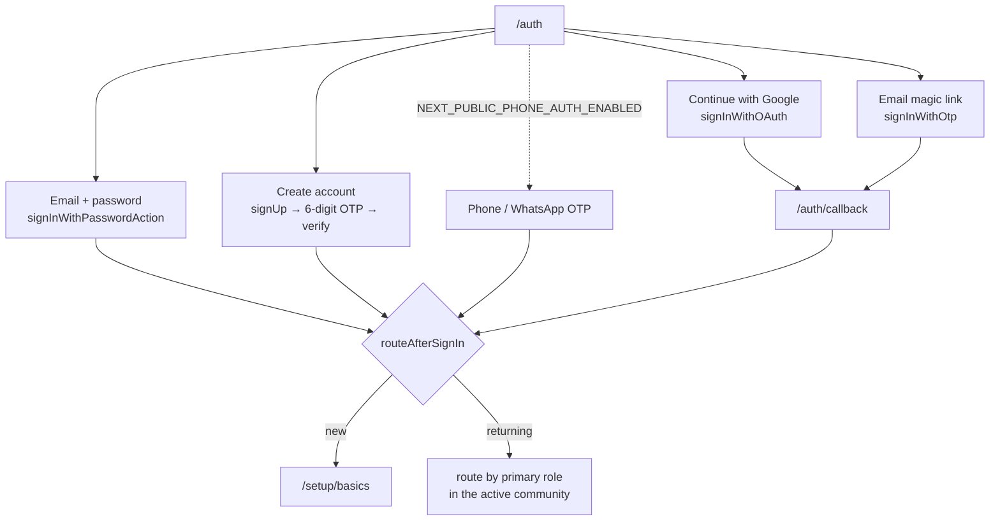

import { Callout } from 'nextra/components'

# Authentication

Saken has two completely different access models: **members sign in** (admins, treasurers,
concierges, and residents who accepted an invite), while **residents who never signed up
use magic links**. The same model backs the web app, the mobile app, and the admin console —
they are three clients of one Supabase Auth project.

## Member sign-in

A unified `/auth` screen offers Google and an inline email form; the phone option sits
behind a flag.

1. **Google** — `supabase.auth.signInWithOAuth({ provider: 'google' })`, returning to
   `/auth/callback`.
2. **Email + password** — the default. `signInWithPasswordAction`
   (`src/lib/auth/password-actions.ts`).
3. **Create account** — `signUp` with email confirmation on, which dispatches a **6-digit
   OTP**; `verifySignupOtpAction` confirms it. Password reset is
   `resetPasswordForEmail(redirectTo: /auth/reset)`.
4. **Email magic link** — `signInWithOtp({ email })` with an `emailRedirectTo`, still
   available from the same form.
5. **Phone / WhatsApp OTP** — a phone-number entry then a 6-digit code
   (`signInWithOtp({ phone })` / `verifyOtp`), at `/auth/whatsapp`.

All of them resolve to one identity row, then `routeAfterSignIn` decides new-vs-returning
and which surface to land on (see [First admin account](/getting-started/first-admin)).

<Callout type="info">
**Why password sign-in is a server action**

A client-side `signInWithPassword` writes the `@supabase/ssr` session cookie a tick *after*
the call resolves, so an immediate navigation races the cookie write and the server
re-renders the sign-in form. Doing the sign-in in a **server action** sets the cookie and
issues the `redirect()` on one response, so the next request already carries the session.
The same reasoning applies to the signup-OTP verify.
</Callout>

### Identity: email **or** phone

The database resolves a signed-in user from `auth.email()` **or** `auth.jwt() ->> 'phone'`,
so a phone-only account works everywhere without an email anchor. Three hard-won rules,
from the 2026-06-15 identity-collision incident (migrations `0043`–`0046`):

- **Empty strings are forbidden** — an empty-string phone once matched across identities
  inside the RLS helpers and cross-wired two users (`0045` adds CHECKs).
- **One authenticated account per email and per phone** (`uniq_authenticated_email`,
  `uniq_authenticated_phone`).
- **Resolvers order deterministically** before `LIMIT 1` (`0046`) — a bare `LIMIT 1` made
  the pick non-deterministic for dual-row identities.

See [Identity model](/concepts/identity) for the placeholder-vs-authenticated split.

### Phone / WhatsApp OTP — still partial

<Callout type="warning">
**There is no WhatsApp Business API**

The *"Continue with WhatsApp"* path is **phone OTP** delivered through Supabase Auth (with a
`channel="whatsapp"` option and a `/auth/whatsapp` form). It is **not** a Meta / WhatsApp
Business Cloud API integration — it's a generic phone-OTP button wearing a WhatsApp label.
The whole phone path is **hidden behind `NEXT_PUBLIC_PHONE_AUTH_ENABLED`** and is off by
default. Google + email cover the great majority of members. (Sharing a *PDF* to WhatsApp is
a separate, shipped feature — see [Delivery](/api/delivery).)
</Callout>

The OTP send is handled by a Supabase **edge function** (`supabase/functions/send-otp`).

<Callout type="error">
**`send-otp` still has an open audit finding**

The edge function falls back to an **unverified** JWT decode on signature-verification
failure, and skips verification entirely when `SEND_OTP_HOOK_SECRET` is unset (audit L-S1) —
still true in the tree today. That is an SMS-pump / toll-fraud vector. The guidance stands:
**fail closed** and remove the "keeps the flow working while we debug" fallback **before**
enabling phone auth for real.
</Callout>

## Redirect allowlists are per Supabase project

Every client that completes an OAuth or magic-link round-trip must have its callback in
**Authentication → URL Configuration → Redirect URLs** of the *same* Supabase project it
signs into. Miss one and the exchange lands somewhere else — usually the main app — with no
error message.

| Client | Redirect target |
| --- | --- |
| Web app | `https://saken.com/**` (+ `https://dev.saken.com/**` on the dev project) |
| Admin console | `https://admin.saken.com/**` (+ `http://localhost:3001/**` locally) |
| Mobile app | the custom scheme `sakenmobile://auth/callback` — plus `sakenmobile-dev://` and `sakenmobile-preview://`, since each build variant registers its own scheme |

<Callout type="warning">
**A concrete example of why this matters**

`admin.saken.com` was missing from the prod project's allowlist, so superuser Google
sign-ins completed the exchange and then **bounced to the main app** instead of the console.
Nothing was broken in the console's code — the allowlist was the whole bug. Treat "add the
new host to the allowlist" as part of standing up any new client, and note that dev and prod
are **separate projects with separate lists**.
</Callout>

The mobile app deliberately uses the **custom `sakenmobile://` scheme** rather than an https
universal link, even though it claims `https://saken.com/invite` via `associatedDomains` /
`intentFilters`. A universal link can fall back to the browser (long-press, mail-client
webviews, unverified domains), which would strand the one-time PKCE code; the custom scheme
lands in-app deterministically. Once AASA/assetlinks are verified in production, the
documented upgrade path is to allowlist `https://saken.com/auth/callback`, serve a small web
fallback there, and switch.

## Resident & concierge magic links

Residents who never accepted an invite **never sign up**. The admin generates a link and
shares it. The token in the URL is the credential.

- **Resident:** `/r/{apartmentId}/{token}` — validated against `apartments.view_token`
  (a `UUID`) by `src/lib/resident/validate-token.ts`. Any mismatch returns an
  **indistinguishable 404**, so you can't probe for valid apartments.
- The validated path uses the **service-role** client (these residents aren't auth users)
  but is always scoped to the validated `complexId`, with cross-complex IDs returning 404s.

<Callout type="warning">
**Resident tokens are permanent in v1**

A resident's `view_token` is permanent for the life of the row — there is **no UI to rotate
or revoke** it, and reassigning an apartment to a new resident does **not** invalidate the
old link (DECISIONS log, 2026-05-22). If a token leaks, an admin rotates it with a direct DB
`UPDATE`. Acceptable for a small, trust-based pilot; account-based resident auth makes it
moot.
</Callout>

## Security posture

Authorization remains Saken's strongest dimension. The **2026-07-23 cross-repo audit**, run
across all five deployed surfaces immediately after the production cutover, found **no
authentication or authorization bypass on any surface** and **no cross-tenant read or
write** — RLS and the capability matrix agreed everywhere they were probed.

- Identity is **re-derived server-side everywhere**; client-passed
  `complexId`/`userId`/`apartmentId` are never trusted for authorization.
- Service-role (RLS-bypassing) queries in anonymous resident routes are **every one gated on
  token validation first**, then strictly complex-scoped.
- Invite tokens are 256-bit (`randomBytes(32)`), and since migration `0048` acceptance is
  **bound to the invited identity** — a signed-in user can no longer redeem someone else's
  pending token.
- The admin console's `adminMutate` choke point genuinely is its only write path;
  service-role use there is deliberate and confined.

One deferred hardening item is worth knowing: the backend does not yet send `helmet`
security headers. It is on the [roadmap](/roadmap/missing-features).

Token verification itself is **JWKS-first with pinned claims**: `verifyAccessToken` runs a
local `jose` verify pinning `issuer` (`${SUPABASE_URL}/auth/v1`), `audience`
(`authenticated`), and `algorithms` (`RS256`/`ES256`). Any local failure — a legacy HS256
token, an unknown `kid` — falls through to an authoritative `auth.getUser(token)` network
check rather than being rejected outright. That fallback, not an absence of issuer checking,
is what made the Supabase ref → vanity-domain switch seamless.

Sessions persist ~30 days on the device; sign-out lives in settings. On mobile, an optional
**biometric app lock** gates the session. For how all this binds to the database, see
[Auth & RLS wiring](/architecture/auth-rls).
