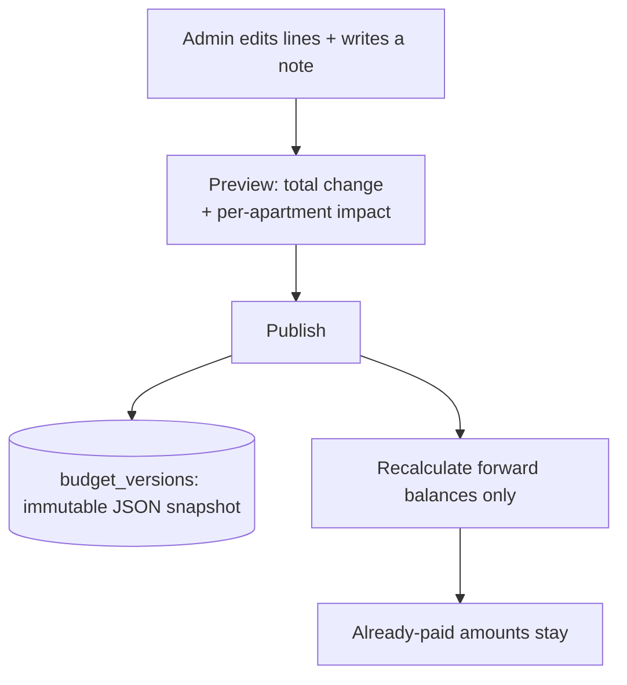

import { Callout } from 'nextra/components'

# Budget & expense tracking

The budget is the plan; expenses are the actuals. Both hang off categories, and the
dashboard compares them.

## The annual budget

A budget belongs to a fiscal year (`UNIQUE(fiscal_year_id)`). It is a tree:

```
Budget
└── BudgetCategory (one per category_key used)
    └── BudgetLine (rate × quantity, + optional description)
```

Each **line** is `rate × quantity`; the category subtotal is the sum of its lines, and the
annual total is the sum of all categories. The setup wizard's budget step renders
categories as accordions and computes the total live.

### Categories: 12 labels → 10 keys

<Callout type="info">
**The category model changed during the build**

The design spec listed **12 fixed category labels** (Concierge salary, Concierge license
renewal, Electricity – generator, Electricity – EDL, Municipality fees, Elevator
maintenance, Cleaning, Building generator maintenance, Building maintenance, Building
services, Contingency, Other).

The shipped app **consolidated these into 10 universal `category_key` values** (migration
`0009`, commit *"D5: budget/expense category overhaul"*, 2026-05-22):

`concierge` · `utilities` · `maintenance_repair` · `facility_services` ·
`property_insurance` · `property_tax` · `security` · `administrative` · `contingency` ·
`miscellaneous`

The same 10 keys are used on both `budget_categories.category_key` and
`expenses.category_key`, enforced by a `CHECK`. (The old `Other` key was renamed to
`miscellaneous` in migration `0015`.)
</Callout>

## Amending the budget

The admin can amend the budget at any time (`/dashboard/budget`). Amendments are
**forward-going only** and **versioned**:



- Every amendment writes an **immutable `budget_versions`** row (a full JSON snapshot +
  an auto-generated diff note) — append-only, so the history is intact.
- The confirmation screen shows the **per-apartment impact** (*Apt 1: $1,600 → $1,624*)
  before publishing.
- **Already-paid amounts stay**; only going-forward balances change.

Budget history (`/dashboard/budget/history`) lists every version, current at top, each
viewable read-only. The diff logic is unit-tested
(`src/lib/budget-versions/compute-diff.test.ts`).

<Callout type="warning">
**Audit-write swallow**

A failed `budget_versions` snapshot write is logged and swallowed client-side (audit
M-C7), so a budget change can persist while its audit trail silently doesn't. The audit
recommends surfacing a non-blocking "history entry failed" indicator.
</Callout>

## Logging expenses

`createExpense` (`src/lib/expenses/actions.ts`) is gated on the `record_expenses`
capability — admin or treasurer, resolved from the union of the caller's stacked roles:

```ts
createExpense(input: ExpenseFormValues): Promise<ExpenseFormSaveResult>
// if (isBackendEnabled()) return createExpenseViaApi(input)
// requireCapability(supabase, 'record_expenses')
```

<Callout type="info">
**Two code paths, one behaviour**

Expense and budget writes each have both a **direct-Supabase** body and a **backend-API**
body (`POST/PATCH/DELETE /v1/expenses`, `/v1/budget/lines`, …), selected by
`isBackendEnabled()` / `SAKEN_API_URL` and kept behaviour-identical down to the result
shape; the API path falls back to direct-Supabase on any failure. The budget-editor and
budget-history **reads** carry the same guard. Details in
[Backend architecture](/architecture/backend).

One deliberate divergence found by the 2026-07-23 audit and fixed there: the backend's
`expenses` update/remove lacked the explicit `.eq('complex_id', …)` filter its siblings had
(#90). It now has it.
</Callout>

An expense carries a vendor, a `category_key`, an amount, an **invoice period** (the
month the cost applies to), an optional `spent_on` date, an optional receipt photo, and a
`line_id` tagging it to a specific budget line.

<Callout type="info">
**v1 posts expenses as `approved` directly**

The schema has a full `pending → approved → rejected` workflow with consistency CHECKs,
but **admin/treasurer-recorded expenses post as `approved` immediately**
(`status='approved'`, `approved_by`, `approved_at` set at insert; DECISIONS log,
2026-05-20). The pending path is reserved for **concierge** submissions
([Concierge submissions](/features/concierge)). The dashboard math defensively filters
`status='approved' AND deleted_at IS NULL` regardless.
</Callout>

### One "Date" field, auto-derived period

The form exposes a single **Date** that maps to `spent_on`; `invoice_period_month` (a
first-of-month `DATE`) is **auto-derived** from it (DECISIONS log, 2026-05-20). The schema's
two-date concept is collapsed for v1 simplicity.

### Receipt photos are downscaled client-side

Every receipt photo runs through `downscaleImage` before upload to the
`expense-receipts` Storage bucket: capped at **2048px** longest axis, re-encoded to JPEG
at quality 0.85 (DECISIONS log, 2026-05-21). This brings typical iPhone photos from 3 MB+
down to 200–500 KB — roughly 10× more headroom under Supabase's 1 GB free-tier cap. Side
effects (all accepted): EXIF/GPS stripped, orientation normalised, colour space → sRGB.

## Budget vs. actual

The dashboard (`/dashboard/budget`, `/dashboard/expenses`) renders, per category, the
`Σ approved expenses` against the `Σ budget-line subtotals`, with progress bars. Expenses
are soft-deletable (`deleted_at`); deletes use a race guard (`.is('deleted_at', null)` +
rowcount check) so concurrent edit-vs-delete is explicit rather than silent.
