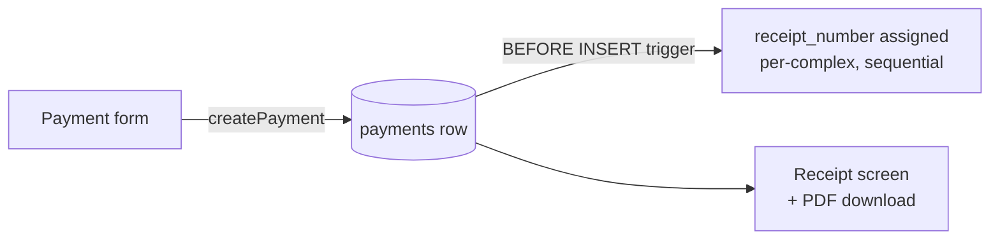

import { Callout } from 'nextra/components'

# Collections & cash flow

"Collections" is the user-facing name for money coming **in** — payments residents make
against their dues. In the code and database these are `payments`.

<Callout type="info">
**Payments vs. Collections**

The UI says **Collections**; the routes, tables, and code say **payments**
(`/payments/*`, `public.payments`, `createPayment`). This naming split (audit M-C4) is a
known piece of debt — ~535 "payment" references under "Collections"-titled pages. When
reading the code, treat the two words as synonyms.
</Callout>

## Recording a payment

`createPayment` (`src/lib/payments/actions.ts`) is gated on the `record_collections`
capability — admin **or** treasurer, resolved through the capability matrix rather than a
hard-coded role list:

```ts
createPayment(input: PaymentFormValues): Promise<PaymentFormSaveResult>
// if (isBackendEnabled()) return createPaymentViaApi(input)
// requireCapability(supabase, 'record_collections')
// → verifyApartmentInComplex(...) scope check
```

<Callout type="info">
**Two code paths, one behaviour**

Every collections action has both the original **direct-Supabase** body and a
**backend-API** body (`createPaymentViaApi`, `POST /v1/payments`), selected by
`isBackendEnabled()` / `SAKEN_API_URL`. The two are kept behaviour-identical down to the
result shape, and the API path **falls back to direct-Supabase on any failure** — including
a hung backend, which aborts after 6 s. Details in
[Backend architecture](/architecture/backend).
</Callout>

The flow (`/payments/new`): pick an apartment (search-as-you-type, showing its current
balance), choose a **purpose** (annual dues, or any active special collection), enter the
amount and date, add optional notes. Saving:

1. Inserts the `payments` row.
2. A **BEFORE INSERT trigger** assigns the next sequential `receipt_number`, scoped per
   complex and **never reset across years**.
3. Opens the **digital receipt** (`/payments/[id]`) with *Share* and *Done*.

## The receipt

Each receipt shows the complex name, apartment label, payer name, amount, date received,
the sequential receipt number, the admin who recorded it, and the **running balance after
the payment**. It can be downloaded as an **official PDF** (commit `00ac522`,
2026-06-15) via `/api/payments/[id]/receipt`.



## Payments are editable (soft-delete)

The `payments` table was relaxed from append-only (DECISIONS log, 2026-05-19): migration
`0005` added `payment_method`, `updated_at`, and `deleted_at`. Admins can edit or delete a
payment in place (delete = soft-delete). Trade-offs accepted: no version history,
last-edit-wins, and `receipt_number` gaps where rows were soft-deleted (gaps are
preserved, not back-filled). Every read filters `deleted_at IS NULL`, and mutations use a
race guard.

## Cash on hand

The complex's cash is **derived, not stored**:

```
cash_on_hand = opening_cash + Σ approved payments − Σ approved expenses
```

across all fiscal years, anchored at `opening_cash_date`. It surfaces on the dashboard
tile and `/dashboard/cash`. See [The money model](/concepts/money-model) for the full set
of formulas.

## Owes YTD vs. full-year remaining

Alongside the full-year `remaining`, each apartment carries a **time-prorated** pair:

```
dueToDate  = dueThisYear × elapsedFraction
owesToDate = dueToDate − paidYtd + carryover   // > 0 behind schedule, < 0 ahead
```

`elapsedFraction` counts **whole months elapsed with the current month counted as due**
(buildings bill each month's dues from the 1st), clamped to `[1/12, 1]` so an archived or
past-viewed year collapses to the full year. Contribution rows read *"Owes YTD $X"* /
*"Ahead"* / *"On track"* / *"Paid up"*, with the full-year figure as a *"$X left"* secondary.

## Monthly collection schedule

<Callout type="info">
**Monthly targets shipped** (issues #29 + #32)

The old "annual-only" gap is closed. `/dashboard/collections/schedule` lets an admin give
each month of the active fiscal year a **weight** (default `1`). A month's share of the
annual total is `weight ÷ Σ weights`, so boosting one month for a one-time cost — a fuel
delivery, an elevator repair — automatically shrinks every other month's share and **the
annual total never changes**. The weights feed the owes-YTD proration above via
`weightedElapsedFraction`.
</Callout>

Storage is deliberately **sparse**: `collection_month_weights` (migration `0054`) only
carries rows for months that differ from the default, so saving a weight of exactly `1`
DELETEs the row rather than writing a redundant one. Writes always target the **active**
fiscal year — the client never sends a fiscal-year id, and a stray `?fy=` on the edit page
redirects to the paramless URL.

## Payment reminders

<Callout type="info">
**Reminders shipped, on demand rather than on a schedule**

An admin or treasurer can send a reminder batch from the collections surface. Every
behind-schedule apartment's resident gets a personalised **email** (Resend) and an **Expo
push**, using the same money math as every dashboard surface. A 20-hour per-complex cooldown
prevents spamming.

Still missing: **cron / scheduled sending** (someone has to tap the button) and
**per-resident opt-in**. The cooldown is also in-memory and per-instance. See
[Delivery](/api/delivery) and the [roadmap](/roadmap/missing-features).
</Callout>
