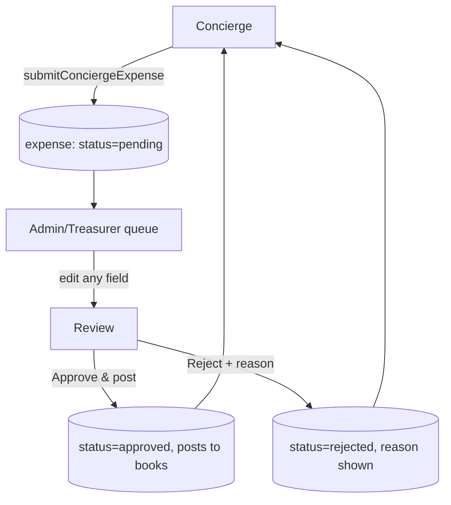

import { Callout } from 'nextra/components'

# Concierge submissions

The **concierge** is a deliberately tiny, locked-down surface: a building's concierge can
**only submit expenses for approval**, typically on an **Arabic, right-to-left** UI. They
never see balances, payments, or the dashboard.

## The concierge surface

An admin grants the concierge role at `/dashboard/team` (by email, which resolves to an
existing user or a placeholder). The concierge then signs in with any of the normal methods
and lands on `/concierge` — a single big *"إضافة مصروف جديد"* (add a new expense) button and
a list of recent submissions with status pills (*قيد المراجعة* = under review, *مقبول* =
approved). A settings gear offers an EN/AR language toggle, the community switcher, and
sign-out.



## Submitting an expense

`submitConciergeExpense` (`src/lib/concierge/actions.ts`) requires the `concierge` role:

```ts
submitConciergeExpense(input: ExpenseFormValues): Promise<ExpenseFormSaveResult>
// requireUser(supabase, 'concierge')
```

The submit form (`/concierge/submit`) has six fields — vendor, category (in Arabic),
amount, invoice month, photo, notes — with the complex auto-populated. Submitting creates
an `expenses` row with `status = pending`. The concierge can **edit while pending**
(`updateConciergeExpense`); the row **locks** after approval or rejection.

<Callout type="info">
**One shared expense form**

The admin and concierge render the **same** underlying form component (`ExpenseFormCore`,
commit `34d433b`) so the two can't drift. The concierge variant is wrapped in Arabic
strings and RTL layout.
</Callout>

## The approval queue (admin / treasurer)

A dashboard banner shows the pending count. `/dashboard/concierge-submissions` lists
submissions; `/dashboard/concierge-submissions/[id]` is the review screen where **every
field is editable** before posting. Two outcomes:

- **`approveConciergeSubmission`** — posts the expense to the books with the
  admin-edited values (`status = approved`).
- **`rejectConciergeSubmission`** — requires a rejection reason, which the concierge then
  sees.

Both are gated on the `review_submissions` capability (admin + treasurer). Approving is also
exposed as an [MCP tool](/api/mcp-tools).

<Callout type="info">
**Two code paths, one behaviour**

Submit, update, approve, and reject each have both a **direct-Supabase** body and a
**backend-API** body (`POST/PATCH /v1/concierge/submissions`,
`POST /v1/admin/submissions/:id/{approve,reject}`), selected by `isBackendEnabled()` and
falling back to direct-Supabase on failure. One known asymmetry from the 2026-07-23 audit:
the backend path **skips the attachment-path complex-prefix re-check** the web path
performs — deferred, not fixed. See [Backend architecture](/architecture/backend).
</Callout>

## Localisation

The concierge surface is no longer a special case. The old typed dictionary
(`src/lib/i18n/concierge-strings.ts`) is **gone**, replaced by the app-wide **next-intl**
setup that shipped with full Arabic i18n (issue #36): a `concierge` message namespace under
`messages/{en,ar}/`, a **cookie-based locale** with no URL routing, and RTL applied via
`<html dir>` at the root layout. Every surface — admin, resident, treasurer, concierge — is
now bilingual through the same mechanism.

<Callout type="warning">
**Arabic strings are AI-generated, still pending native review**

The Arabic message files carry an `_status: ai-pending-native-review` marker, and issue
**#46** ("Native-Lebanese review of Arabic UI strings") is still open — now with Arabic live
in production, not just on the concierge surface. One semantic error (vacation- vs.
license-renewal) already slipped through an earlier pass. TypeScript and the parity test
enforce that keys *exist*, not that their content is *correct*. See the
[roadmap](/roadmap/missing-features) and the
[i18n glossary](/reference/i18n-glossary).
</Callout>
