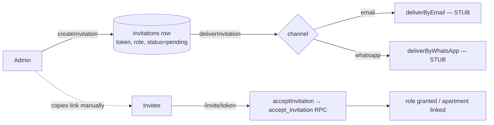

import { Callout } from 'nextra/components'

# Invitations

Invitations are how an admin brings residents, treasurers, and concierges into a
community. The **pipeline is fully built**; only the automated *delivery* of the invite
link is stubbed.

## The pipeline



## Creating an invite

`createInvitation` (`src/lib/invitations/actions.ts`) is an **admin-only** server action:

```ts
createInvitation(input: CreateInvitationInput): Promise<CreateInvitationResult>
// input: { role: 'resident' | 'concierge' | 'treasurer',
//          apartmentId?, inviteeName?, inviteeEmail?, inviteePhone?,
//          language?: 'en' | 'ar' }
```

Rules enforced by the action and the schema:

- **Role must be `resident`, `concierge`, or `treasurer`** — never `admin`.
- **Residents require an `apartmentId`; concierge/treasurer must not have one** (a
  `CHECK` enforces the slot shape).
- A **contact is required** (email or phone).
- The **delivery channel is chosen at creation time**: `email` if an email is present,
  else `whatsapp` if only a phone is present. The choice is recorded on the row so it's
  auditable.
- The token is a **256-bit** random value (`randomBytes(32)`); invites **expire after 30
  days**.
- **Per-slot uniqueness:** partial unique indexes prevent two pending invites for the same
  apartment (resident) or the same complex (concierge/treasurer).

Related actions: `revokeInvitation`, `reinviteInvitation`, `acceptInvitation`.

## Accepting an invite

The invitee opens `/invite/{token}`, which lands them in the acceptance flow. After they
authenticate (or via their identity), `acceptInvitation` calls the atomic
`accept_invitation(p_token)` **RPC**, which handles every case in one transaction:

- **Resident** — reuse an existing user, convert a placeholder, split, or create fresh;
  link the apartment.
- **Concierge / treasurer** — UPSERT the role row (escalation-safe, so an existing
  resident simply *gains* the role).

Identity is resolved from **email OR phone** inside the RPC, so it works regardless of
sign-in method.

## Delivery — both channels are stubs

<Callout type="error">
**Automated delivery is not implemented**

Both delivery channels currently return *"not yet implemented"*:

```ts filename="src/lib/invitations/delivery/whatsapp.ts"
export async function deliverByWhatsApp(_invitation) {
  return { ok: false, reason: 'WhatsApp delivery not yet implemented' }
}
```

`deliverByEmail` is likewise a stub (its header notes a planned Resend integration in
"Phase A5"). The invitation **row and token are still created**, and the
**acceptance flow works** — so in practice the admin **copies the invite link and shares
it manually** (e.g. pastes it into the building's WhatsApp group), which matches the
design's intended hand-off. See [Email & WhatsApp delivery](/api/delivery) for the
orchestrator design and what a real implementation would plug into.
</Callout>

## The `invitations` table

Key columns (`public.invitations`, created in migration `0016`, language added in `0017`):

| Column | Notes |
| --- | --- |
| `role` | `resident` / `concierge` / `treasurer` |
| `apartment_id` | set for residents, NULL for others |
| `token` | `UNIQUE`, 256-bit |
| `delivery_method` | `email` / `whatsapp` |
| `delivery_status` | `pending` → `sent` → `delivered` / `failed` |
| `status` | `pending` → `accepted` / `revoked` / `expired` |
| `expires_at` | `now() + 30 days` |
| `language` | `en` / `ar` (controls a concierge's surface language) |
