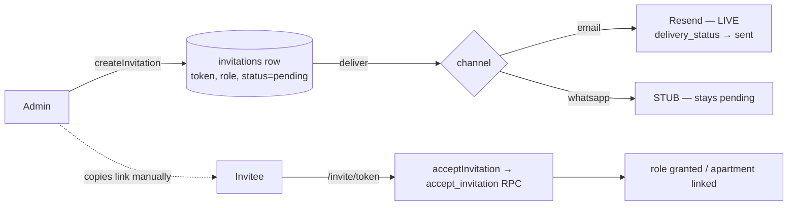

import { Callout } from 'nextra/components'

# Invitations

Invitations are how an admin brings people into a community. The **pipeline is fully
built**, and **email delivery is live**; only the WhatsApp channel is still a stub.

<Callout type="info">
**Elevated roles are now assigned, not invited**

Since the permissions redesign, an admin **assigns** treasurer / concierge / admin roles
directly at `/dashboard/team` (`assignRole` → the `assign_role` RPC), instead of minting a
bearer invite. Invitations remain the path for **residents** into an apartment slot. The
`accept_invitation` RPC still *accepts* treasurer/concierge tokens for back-compat, but no
UI mints them. See [Treasurer tools](/features/treasurer) and
[Roles & role stacking](/concepts/roles).
</Callout>

## The pipeline



## Creating an invite

`createInvitation` (`src/lib/invitations/actions.ts`) is an **admin-only** server action:

```ts
createInvitation(input: CreateInvitationInput): Promise<CreateInvitationResult>
// input: { role: 'resident' | 'concierge' | 'treasurer',
//          apartmentId?, inviteeName?, inviteeEmail?, inviteePhone?,
//          language?: 'en' | 'ar' }
```

Rules enforced by the action and the schema:

- **Role must be `resident`, `concierge`, or `treasurer`** — never `admin`.
- **Residents require an `apartmentId`; concierge/treasurer must not have one** (a
  `CHECK` enforces the slot shape).
- A **contact is required** (email or phone).
- The **delivery channel is chosen at creation time**: `email` if an email is present,
  else `whatsapp` if only a phone is present. The choice is recorded on the row so it's
  auditable.
- The token is a **256-bit** random value (`randomBytes(32)`); invites **expire after 30
  days**.
- **Per-slot uniqueness:** partial unique indexes prevent two pending invites for the same
  apartment (resident) or the same complex (concierge/treasurer).

Related actions: `revokeInvitation`, `reinviteInvitation`, `acceptInvitation`.

<Callout type="info">
**Two code paths, one behaviour**

All four actions have both the original **direct-Supabase** body and a **backend-API** body
(`createInvitationViaApi` → `POST /v1/invitations`, and so on), selected by
`isBackendEnabled()` / `SAKEN_API_URL`, with the API path falling back to direct-Supabase on
failure. The one behavioural difference is *delivery*: only the backend holds the Resend key,
so the direct path creates the row without sending. See
[Backend architecture](/architecture/backend).
</Callout>

## Accepting an invite

The invitee opens `/invite/{token}`, which lands them in the acceptance flow. After they
authenticate (or via their identity), `acceptInvitation` calls the atomic
`accept_invitation(p_token)` **RPC**, which handles every case in one transaction:

- **Resident** — reuse an existing user, convert a placeholder, split, or create fresh;
  link the apartment.
- **Concierge / treasurer** — UPSERT the role row (escalation-safe, so an existing
  resident simply *gains* the role).

Identity is resolved from **email OR phone** inside the RPC, so it works regardless of
sign-in method.

<Callout type="info">
**Acceptance is bound to the invited identity**

Migration `0048` closed a bearer-credential hole: a signed-in user could redeem *someone
else's* pending token to self-grant a role. Acceptance now requires the accepter's
`auth.email()` / phone to **match the invite**, and a mismatch returns the
`identity_mismatch` outcome. Issue #41.
</Callout>

## Delivery — email live, WhatsApp stubbed

<Callout type="info">
**Email invites are sent** (via the backend)

`saken-api` renders a bilingual invite email and sends it through **Resend** from
`hello@saken.com`, carrying the `${PUBLIC_WEB_URL}/invite/${token}` link and flipping
`delivery_status` to `sent`. The web app's own `deliverByEmail` is still the Phase-A1 stub —
it never gained mail credentials, by design — so both statements are true at once: the web
module is a stub *and* invite email works, because the send happens in the backend.

If `RESEND_API_KEY` is unset (dev), the send is a logged **no-op** and `delivery_status`
stays `pending` — deliberately not `failed`.
</Callout>

<Callout type="warning">
**WhatsApp delivery is still not implemented**

A `whatsapp` invite (phone-only invitee) creates the row and logs *"WhatsApp delivery not
yet implemented"* on **both** tiers, leaving `delivery_status = 'pending'`:

```ts filename="src/lib/invitations/delivery/whatsapp.ts"
export async function deliverByWhatsApp(_invitation) {
  return { ok: false, reason: 'WhatsApp delivery not yet implemented' }
}
```

The **row, the token, and the acceptance flow all work** — the admin copies the invite link
and pastes it into the building's WhatsApp group, which matches the design's intended
hand-off. See [Delivery](/api/delivery) for the orchestrator and what a real implementation
plugs into.
</Callout>

## The `invitations` table

Key columns (`public.invitations`, created in migration `0016`, language added in `0017`):

| Column | Notes |
| --- | --- |
| `role` | `resident` / `concierge` / `treasurer` |
| `apartment_id` | set for residents, NULL for others |
| `token` | `UNIQUE`, 256-bit |
| `delivery_method` | `email` / `whatsapp` |
| `delivery_status` | `pending` → `sent` → `delivered` / `failed` |
| `status` | `pending` → `accepted` / `revoked` / `expired` |
| `expires_at` | `now() + 30 days` |
| `language` | `en` / `ar` (controls a concierge's surface language) |
