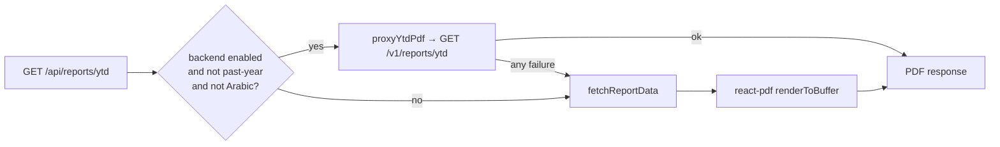

import { Callout } from 'nextra/components'

# Reports (YTD, PDF export)

Saken produces two kinds of PDF: a **payment receipt** and a **year-to-date financial
report** suitable for the building's WhatsApp group. Both are rendered server-side with
`@react-pdf/renderer`.

## The YTD report

The report (`src/lib/reports/render-ytd-pdf.tsx`, served from `/api/reports/ytd` and the
resident/magic-link equivalents) contains:

- **Page 1** — a header with a report number, summary tiles (cash on hand, annual budget,
  collected YTD %, spent YTD %), a *where-the-money-went* table (each category's spent vs.
  budget vs. %), active special collections, and an **amendment footnote** if the budget
  was amended.
- **Page 2+** — apartment balances (labels only, no names, for privacy), the payments
  list, and the expenses list.

The admin taps **Export PDF report** and the browser downloads it — or taps **Share report
on WhatsApp**, which hands the actual PDF file to the native share sheet.

### Past years and Arabic

The two long-standing gaps here are closed:

- **Past-year exports work.** `renderYtdPdf(supabase, complexId, { fyId })` threads the
  fiscal year through `fetchReportData`, and `<ReportsMenuButton>` forwards the current
  `?fy=` from the URL — so exporting from a past-year view produces **that year's** PDF. A
  period dropdown (this month / last quarter / …) is still not built; the unit is the fiscal
  year.
- **Arabic renders.** The locale comes from the same cookie the app uses, and an Arabic
  locale registers the Amiri font before rendering, so AR users get a proper RTL document
  rather than glyph boxes.

## Payment receipts

Each recorded payment can be downloaded as an **official PDF receipt**
(`src/lib/reports/render-receipt-pdf.tsx`, `/api/payments/[id]/receipt`, shipped
2026-06-15). It mirrors the on-screen receipt: complex, apartment, payer, amount, date,
sequential receipt number, recorder, and balance after. Receipts carry the same
**Share on WhatsApp** affordance.

## Rendering path

The shared PDF scaffolding lives in `src/lib/reports/pdf-shared.tsx`; report data is
gathered by `fetch-report-data.ts`.

<Callout type="info">
**Two rendering paths, deliberately asymmetric**

When the backend is enabled, the route **proxies** the backend's PDF through with the
web's own headers and filename (`src/lib/reports/pdf-proxy.ts`), because the backend's
`Content-Disposition` differs — UTC-dated instead of Beirut-dated, and receipts drop the
complex slug. The proxy returns `null` on **any** failure and the direct
`@react-pdf/renderer` path runs, so a PDF download can never break because of the backend.

Two documented skips: **past-year exports** (the backend's `GET /v1/reports/ytd` has no
`?fy=`) and the **Arabic locale** (the backend renders with `pdfkit` and is EN-only). Both
fall through to the web renderer. The accepted consequence is that the two renderers produce
**equivalent content in a different visual layout**.
</Callout>

<Callout type="warning">
**PDF generation is synchronous and unbounded**

`renderToBuffer` is CPU-bound (it blocks the event loop via yoga-layout), renders the
**full, uncapped** payment + expense lists, holds the whole buffer in memory, and runs
against Vercel's function timeout (~2 s for ~500 rows). Fine at pilot scale; structurally
unbounded as years of history accumulate (audit M-P4). The fix is to cap/paginate the PDF
detail tables or offload to a background job before any complex reaches multi-thousand-row
years.
</Callout>

## Resident & magic-link reports

Residents get the same report through their authenticated surface
(`/api/resident/reports/ytd`) and the anonymous magic-link route
(`/api/r/[apartmentId]/[token]/reports/ytd`), each gated on token/identity validation and
scoped to the validated complex. Both carry the same backend-proxy-with-fallback logic as
the admin route.

## On mobile

The React Native app fetches PDFs through the backend and hands them to the OS share sheet
(`File.downloadFileAsync` + `Sharing.shareAsync`), with a post-save *"Share receipt?"*
prompt — the same WhatsApp hand-off as the web, using the platform's native machinery.
