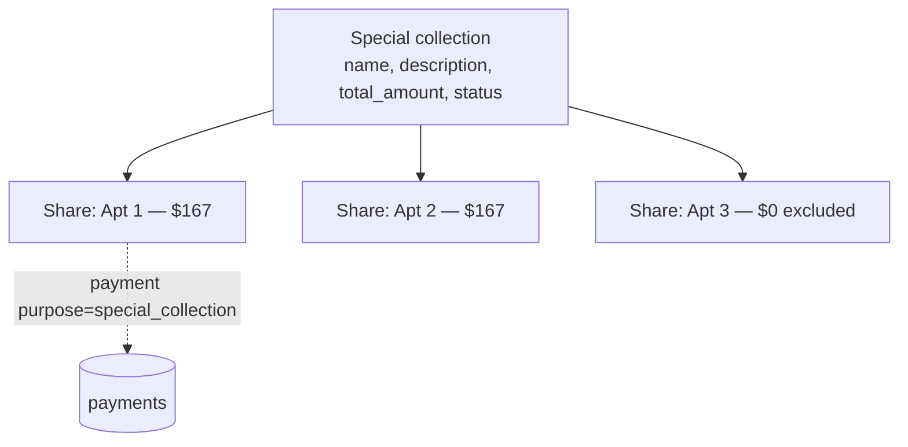

import { Callout } from 'nextra/components'

# Special projects

**Special projects** (a.k.a. special collections) are one-off efforts funded **outside**
the annual budget — a lobby repaint, a boiler replacement, an elevator overhaul. They run
alongside the budget with their own per-apartment shares and contribution tracking. The
feature shipped as commits tagged `batch 11a`–`11e` (2026-05-26).

## The model



- **`special_collections`** — `name`, `description`, `total_amount` (`CHECK > 0`),
  `status` (`active` / `closed`), `created_by`, plus `closed_at` / `closed_by`.
- **`special_collection_shares`** — one row per apartment per project,
  `share_amount` (`0` = excluded), `UNIQUE(special_collection_id, apartment_id)`.
- Contributions are recorded as **payments** with `purpose = 'special_collection'`, tagged
  to the collection.

## Creating and running a project

From `/dashboard/special-projects`, the admin taps **+ New collection**, enters a name,
description, and total, then the per-apartment shares table appears with an **equal-split
default** (editable; set a share to `$0` to exclude an apartment). A mismatch warning
shows if shares don't sum to the target, but it **warns rather than blocks**.

The server actions (`src/lib/special-projects/actions.ts`):

| Action | Who |
| --- | --- |
| `createProject`, `updateProject`, `upsertProjectShare`, `closeProject` | **admin** only |
| `recordProjectContribution(projectId, input)` | **admin or treasurer** (it's a payment write) |

```ts
recordProjectContribution(
  projectId: string,
  input: PaymentFormValues,
): Promise<PaymentFormSaveResult>
// requireUser(supabase, ['admin', 'treasurer'])
```

## Lifecycle

A project is **active** until the admin closes it (`closeProject`), which stamps
`closed_at` / `closed_by` and moves it to the **Closed** section. Past projects are
viewable from a history link on the dashboard. Residents see active collections relevant to
their apartment (their share, and whether they've paid).

<Callout type="info">
**Defense-in-depth note**

An earlier audit worried these two tables ran only the permissive migration-`0001` RLS
stub. The 2026-06-14 **live-DB reconciliation corrected that**: production actually has
proper `admin_all` + `resident_select` + `treasurer_select` policies on both tables — the
boundary *is* DB-enforced. A stale code comment claiming otherwise was the only problem.
</Callout>

<Callout type="warning">
**Non-atomic two-step write**

`createProject` inserts the header and then the shares as two steps; a partial failure
could orphan a header (audit L-C3). The fix is to wrap it in an RPC like the other
multi-write flows.
</Callout>
