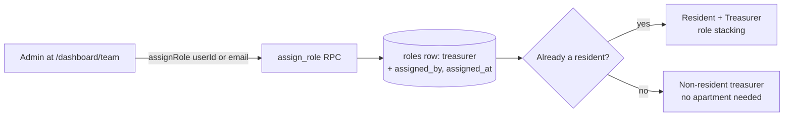

import { Callout } from 'nextra/components'

# Treasurer tools

The **treasurer** is a financial deputy — added after the original three-role design — who
shares the admin's day-to-day money powers without owning the community. It shipped as a
full vertical (commit `3dbb304`, *"treasurer: new role, RLS, routing, UI, invite"*,
2026-06-02).

## What a treasurer can do

| Capability | Treasurer? |
| --- | --- |
| Record payments / log expenses | ✅ Yes (`requireUser(['admin','treasurer'])`) |
| Approve / reject concierge submissions | ✅ Yes |
| Record special-project contributions | ✅ Yes |
| View the dashboard & financials | ✅ Yes |
| Create/edit/close special projects | ❌ No — admin only |
| Set up / amend the budget, manage apartments | ❌ No — admin only |
| Run year-end rollover, reset/delete the community | ❌ No — admin only |
| Manage invitations | ❌ No — admin only |

The split is enforced at the action layer, now via the **capability matrix** rather than
hard-coded role lists: shared write actions call
`requireCapability(supabase, 'record_collections' | 'record_expenses' | …)`, which resolves
the capability against the **union** of the caller's stacked roles; ownership actions call
`requireAdminUser`. RLS gives the treasurer full write on `payments` and `expenses`.

## Where treasurer surfaces appear

- **`/dashboard/team`** — the admin's *Team & roles* page: the single place elevated roles
  are granted and revoked.
- **Treasurer-scoped `/resident/*` routes** carry a treasurer **badge** and expose a
  *Treasurer Tools* section, so a treasurer who is also a resident gets write affordances
  inside the resident surface.
- **`/dashboard/treasurers`** is now a **deprecated redirect stub → `/dashboard/team`**,
  kept only so stale bookmarks land somewhere live. (Same for `/dashboard/concierges`.)

## How someone becomes a treasurer

<Callout type="info">
**Assigned, not invited** (permissions redesign, migrations `0049`/`0050`)

The bearer-invite flow for elevated roles was retired on 2026-07-01. An admin now **assigns**
the role directly.
</Callout>

A treasurer is a `roles` row (`role = 'treasurer'`, added to the enum in migration `0025`),
scoped to one complex. They **do not need an apartment** — a hired bookkeeper fits cleanly.
Since `0049` the uniqueness key is `(user_id, complex_id, role)`, so roles **stack**: a
resident who is granted treasurer simply *gains* it ([role stacking](/concepts/roles)).

`assignRole` takes either a `userId` or an **email**, which resolves to an existing
authenticated user or a reused/created placeholder row — so the grant can be made before the
person has ever signed in, and applies on their first sign-in. Both RPCs are `SECURITY
DEFINER`, admin-scoped, and audited via `assigned_by` / `assigned_at`; `revoke_role` removes
one specific role and never disturbs the others.

<Callout type="warning">
**Assign/revoke exists; an explicit *transfer* flow does not**

An admin can now grant and revoke admin and treasurer roles from `/dashboard/team`, so
"moving" a role is two deliberate steps rather than a revoke-and-re-invite dance. What's
still missing is a **guided hand-off** — promote-then-demote as one confirmed operation,
with the guardrails that implies. Tracked as issue **#26**, still on the
[backlog](/roadmap/missing-features).
</Callout>
