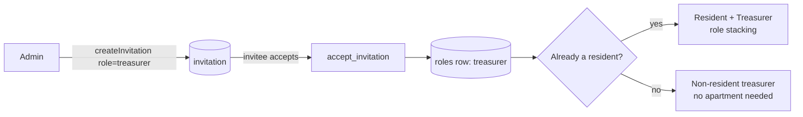

import { Callout } from 'nextra/components'

# Treasurer tools

The **treasurer** is a financial deputy — added after the original three-role design — who
shares the admin's day-to-day money powers without owning the community. It shipped as a
full vertical (commit `3dbb304`, *"treasurer: new role, RLS, routing, UI, invite"*,
2026-06-02).

## What a treasurer can do

| Capability | Treasurer? |
| --- | --- |
| Record payments / log expenses | ✅ Yes (`requireUser(['admin','treasurer'])`) |
| Approve / reject concierge submissions | ✅ Yes |
| Record special-project contributions | ✅ Yes |
| View the dashboard & financials | ✅ Yes |
| Create/edit/close special projects | ❌ No — admin only |
| Set up / amend the budget, manage apartments | ❌ No — admin only |
| Run year-end rollover, reset/delete the community | ❌ No — admin only |
| Manage invitations | ❌ No — admin only |

The split is enforced at the action layer: write actions that a treasurer shares call
`requireUser(supabase, ['admin', 'treasurer'])`, while ownership actions call
`requireAdminUser`. RLS gives the treasurer full write on `payments` and `expenses`.

## Where treasurer surfaces appear

- **`/dashboard/treasurers`** — the admin's management page to invite/list treasurers.
- **`/dashboard/treasurers/invite`** — create a treasurer invitation.
- **Treasurer-scoped `/resident/*` routes** carry a treasurer **badge** and expose a
  *Treasurer Tools* section, so a treasurer who is also a resident gets write affordances
  inside the resident surface.

## How someone becomes a treasurer

A treasurer is a `roles` row (`role = 'treasurer'`, added to the enum in migration
`0025`), scoped to one complex. They **do not need an apartment** — a hired bookkeeper
fits cleanly — and an existing resident who accepts a treasurer invite simply **gains** the
role ([role stacking](/concepts/roles)).

<Callout type="warning">
**No hand-off / transfer**

You can invite and revoke treasurers, but there is **no transfer or promote/demote
flow** (Feature Audit item 4, *Missing*). To "move" the role you revoke one and invite
another. On the [roadmap](/roadmap/missing-features).
</Callout>
