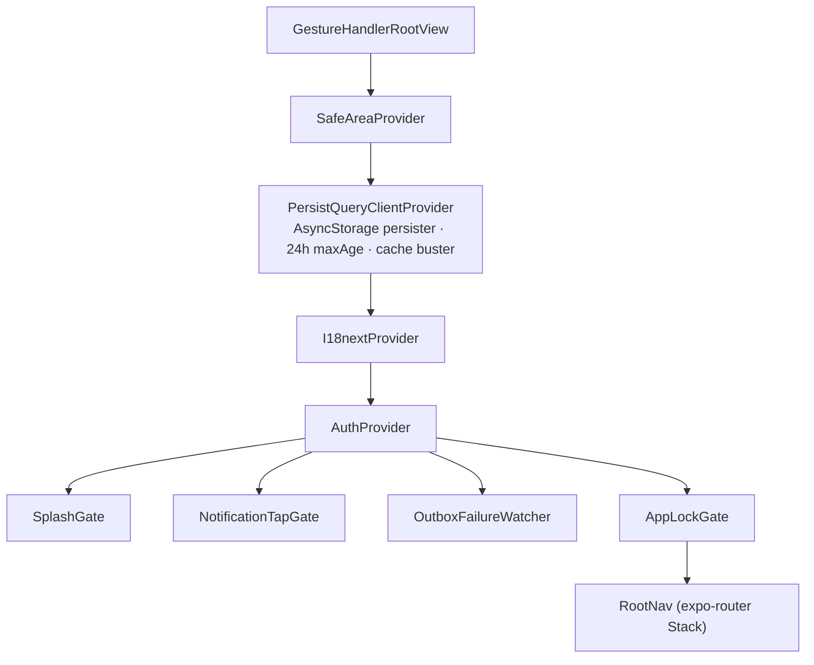
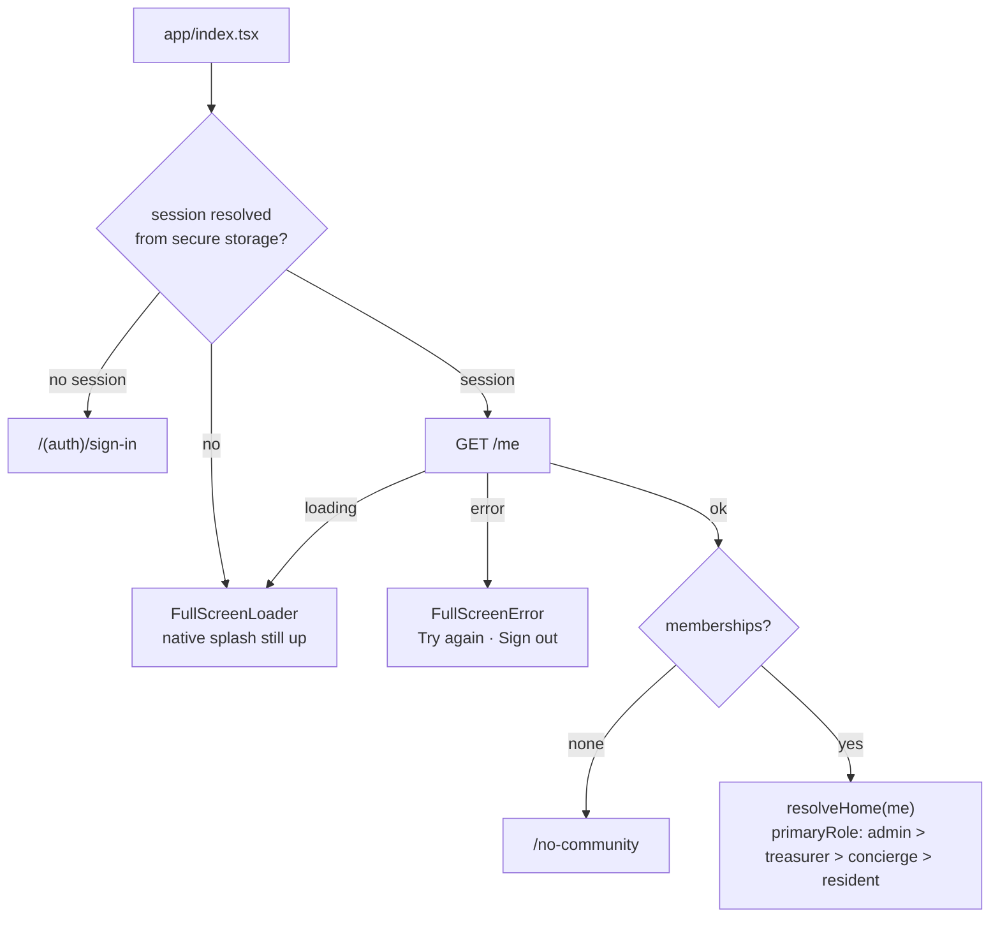
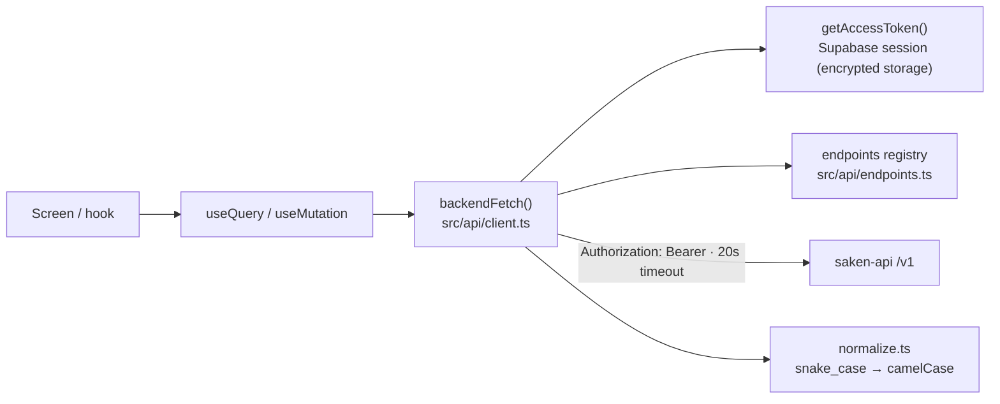
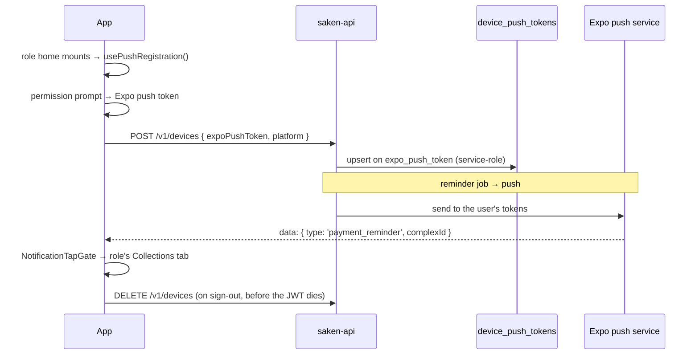

import { Callout } from 'nextra/components'

# Mobile architecture

The app is organized around one idea: **the backend owns truth, the device owns
presentation and resilience**. Everything below follows from that — the routing gate reads
`/me`, the capability matrix only hides buttons, money is never recomputed on-device, and
the only local state that matters is the query cache and the offline outbox.

## The provider stack

`app/_layout.tsx` is the whole composition root. The order is load-bearing:



Three things run at **module scope**, before the first render:

| Call | Why it can't wait for a component |
| --- | --- |
| `SplashScreen.preventAutoHideAsync()` | The native splash is the brand moment; it stays up until the session resolves from storage (with an 8s failsafe so a dead Metro tunnel never strands the user on a logo). |
| `initSentry()` | Crash reporting must cover the first frame. No-op unless `EXPO_PUBLIC_SENTRY_DSN` is set. |
| `setupMutationOutbox()` | Registers `setMutationDefaults` for the three money writes. A mutation restored from AsyncStorage carries only its key + variables — **no closures** — so its `mutationFn` must already be registered when the persister rehydrates. |

## Routing

`expo-router` file-based routes with `typedRoutes` enabled. The tree mirrors roles, not
the web's URL namespace:

```
app/
  _layout.tsx          root Stack + providers
  index.tsx            the "/" gate
  (auth)/sign-in
  (admin)/             Tabs: dashboard · collections · expenses · budget
  (resident)/          Tabs: index · collections · expenses · budget
  (concierge)/         Stack: index + submit (modal)
  settings, cash, community, community-apartments, community-budget,
  budget-history, team/, fiscal-year/, admin-submissions/,
  payments/{new,[id],pre-saken}, expenses/{new,pre-saken},
  special-projects/{index,new,[id]}, apartments/[id],
  setup/               6-step wizard, presented modally
  invite/[token], no-community
```

Conventions the root Stack enforces:

- **Native headers everywhere** (quiet paper style: no shadow, minimal back button). The
  role groups and `(auth)` own their own headers (`headerShown: false` on the group).
- **Transactional creates present modally** with a header Cancel — record collection,
  record expense, new special project, concierge submit, and the setup wizard.
- **Data-dependent titles** (`payments/[id]`, `apartments/[id]`,
  `special-projects/[id]`) start empty and are set inline by the screen.

### The `/` gate



<Callout type="warning">
**A `/me` failure is not a sign-out**

An earlier version redirected to sign-in on *any* `/me` error, dropping a valid session on
a network blip. The gate now shows a retryable error with an explicit **Sign out** — a
transient failure must never destroy the session (and, with the outbox, never destroy
queued writes either).
</Callout>

**In-app re-rooting does not come back through the gate.** Community switch, exit, delete,
and invite-accept all call `fetchFreshMe()` and `router.replace(resolveHome(fresh))`
directly — declarative re-rooting instead of a gate bounce.

## Data layer

TanStack Query replaces the web's RSC fetch + Next Router Cache. Reads are query hooks;
writes are mutations that invalidate keys (the RN analogue of `revalidatePath` +
`router.refresh()`).



| Decision | Detail |
| --- | --- |
| Errors never throw at the transport layer | `backendFetch` returns `{ data } \| { error: { code, message } }`; callers branch on `'error' in res`. Outbox mutations re-throw as `BackendRequestError` so retry policies can read `code`. |
| Request timeout | 20s `AbortController` on every call, including the multipart receipt upload — flaky mobile networks otherwise hang forever. |
| Freshness | `staleTime: 30s`, `refetchOnWindowFocus: true`, with `focusManager` bound to `AppState` — foregrounding refetches cash-on-hand rather than showing mount-time data. |
| Cache persistence | AsyncStorage persister, `maxAge` 24h, `buster: 'saken-cache-v1'` — bump the buster when a response shape changes in a way normalizers can't absorb. |
| Query keys | Centralized in `src/lib/query.ts` (`queryKeys.me`, `summary(fy)`, `members(complexId)`, …) so mutations invalidate precisely. |
| Money | Computed by the backend, displayed rounded. Optimistic updates only bump plain numeric fields; derived shapes (status, post-anchor splits) wait for the settle-time invalidation. |

Feature modules live under `src/features/<domain>/api.ts` (account, expenses, payments,
ledger, fiscal, setup, team, invitations, concierge, admin-submissions, special-projects,
reports, devices, summary) — one file per backend domain, each exporting its hooks.

## Auth

Three methods on the sign-in screen, all Supabase:

| Method | Flow |
| --- | --- |
| **Google OAuth** | `signInWithOAuth({ skipBrowserRedirect: true })` → `WebBrowser.openAuthSessionAsync` → the redirect URL is parsed and the session established in-app |
| **Email magic link** | `signInWithOtp({ emailRedirectTo })` → tapping the email opens the app by custom scheme → PKCE code exchange → `router.replace('/')` re-roots through the gate |
| **Email + password** | `signInWithPassword` → `router.replace('/')` |

<Callout type="warning">
**The redirect scheme is read from the resolved config, never hardcoded**

```ts
const scheme = Constants.expoConfig?.scheme
const appScheme = (Array.isArray(scheme) ? scheme[0] : scheme) ?? 'sakenmobile'
const redirectTo = makeRedirectUri({ scheme: appScheme, path: 'auth/callback' })
```

Each variant has its own scheme (`sakenmobile-dev` / `sakenmobile-preview` /
`sakenmobile`) so builds can coexist on one device. Hardcoding `sakenmobile` would send a
dev build's magic link to a scheme it doesn't register, and the redirect would never come
back. **Every scheme in use must also be in the matching Supabase project's redirect
allowlist** — the dev/preview builds point at `saken-dev.supabase.co`, production at
`saken.supabase.co`.
</Callout>

The redirect deliberately uses the **custom scheme rather than the https universal link**,
even though the app claims `/invite/*` on the web host: the PKCE exchange must land in-app
deterministically, and universal links can fall back to the browser (long-press, mail
webviews, unverified domains), stranding the one-time code. The upgrade path is documented
in `src/auth/actions.ts` — add `https://saken.com/auth/callback` to the Supabase allowlist
and serve a web fallback once AASA/assetlinks are verified in production.

### Session lifecycle

- `AuthProvider` resolves the session once from storage, then subscribes to
  `onAuthStateChange`.
- Supabase auto-refresh is **paused and resumed with `AppState`**, so the refresh timer
  never runs (and fails) while backgrounded.
- Sign-out: warn about queued offline writes → `unregisterPushToken()` (needs the JWT that
  is about to be invalidated) → `supabase.auth.signOut()` → `queryClient.clear()` so the
  next account never sees the previous user's data.

### Authorization on the client

`/me` returns the identity, memberships, and the resolved `capabilities` array for the
active community. `src/auth/capabilities.ts` carries a copy of the matrix as a fallback and
as the role → capability reference:

| Capability group | Roles |
| --- | --- |
| `view_dashboard` | admin, treasurer, resident |
| `record_collections`, `record_expenses`, `review_submissions`, `record_project_contribution` | admin, treasurer |
| `submit_expense` | concierge |
| `edit_community`, `edit_budget`, `manage_special_projects`, `fiscal_rollover`, `manage_roles`, `assign_residents`, `delete_community` | admin |

Effective permissions are the **union of stackable roles**, matching the backend exactly.
This is UI gating only — the backend re-checks every request.

## Device security

| Concern | Implementation |
| --- | --- |
| Session at rest | `LargeSecureStore` — a random 256-bit AES-CTR key per value, key written to `expo-secure-store` (OS keychain/keystore), ciphertext to AsyncStorage. Needed because the iOS keychain rejects values over ~2KB and a Supabase session exceeds that. A corrupt or rotated blob is treated as absent so auth re-initialises cleanly. |
| App lock | Optional, per-device (AsyncStorage, default **off**), only offered where hardware exists *and* a biometric is enrolled. `AppLockGate` overlays an opaque screen over the whole navigator on cold start and after more than 5 minutes in the background. Children keep rendering underneath, so navigation, queries, and the outbox stay alive while locked. |
| Biometrics | Evaluated by the OS via `expo-local-authentication`. No biometric data is read, stored, or transmitted — the app only ever sees a boolean. Device passcode is an accepted fallback (`disableDeviceFallback: false`): this is a convenience lock, not extra crypto. |
| Transport | `src/lib/env.ts` **throws at startup** in a release build if `EXPO_PUBLIC_SAKEN_API_URL` is plaintext `http://` — Bearer tokens must never travel in the clear. |
| Telemetry | Sentry with `sendDefaultPii: false` and `tracesSampleRate: 0` — crashes only, never PII from a finance app. |

### Permissions requested

| Permission | Purpose |
| --- | --- |
| Camera | Photograph a receipt for an expense |
| Photo library | Attach an existing receipt image |
| Notifications | Payment reminders (asked on a **role home**, never on the sign-in screen) |
| Biometrics | Only if the user turns on app lock |

`microphonePermission: false` is set on the `expo-image-picker` plugin, which otherwise
adds `RECORD_AUDIO` on Android by default. Android architectures are pinned to
`arm64-v8a` via `expo-build-properties`.

## Push notifications



`public.device_push_tokens` (migration `0055`, in `saken-backend`) is one row per device,
`expo_push_token` UNIQUE as the upsert arbiter — a device that changes owners re-points to
the new user rather than duplicating. RLS is **enabled with zero policies**
(deny-by-default); only the backend's service-role client touches it.

Registration is fire-and-forget: every failure path is swallowed and retried on a later
mount, because push is an enhancement and must never block sign-in. The tap handler covers
both warm taps and the cold-start launch response, and defers until the session is ready so
it can't race the auth screen.

## Internationalization

`i18next` + `expo-localization`, initialised before first render with the **device
locale**, then reconciled to the user's saved `users.language` from `/me`. The namespaces
are the web's `messages/{en,ar}` JSON copied verbatim (`common`, `dashboard`, `payments`,
`expenses`, `setup`, `team`, `fiscalYear`, `concierge`, `invitations`, and friends), so a
string translated once serves both clients.

RTL: `dirFor('ar') === 'rtl'`, applied through `I18nManager.allowRTL` / `forceRTL`.
Directional chrome uses SVG icons flipped with `scaleX` on `I18nManager.isRTL` rather than
text glyphs like `▸`, which don't mirror.

<Callout type="warning">
**Language switches instantly; layout direction does not**

React Native applies `forceRTL` on the next launch. The app sets it eagerly so a
subsequent reload picks it up, but a user switching to Arabic mid-session sees translated
text in an LTR layout until they relaunch. `expo-updates` is installed, so the documented
fix (`reloadAsync()` when the direction actually changes) is unblocked but not yet wired.
</Callout>

## UI conventions

`src/components/ui/index.tsx` is a small primitive kit encoding the web's tokens:
full-width single column with page padding (the web's 448px `max-w-md` cap is explicitly
gone), press-dip feedback, ink-on-white primary buttons, hairline borders. `Screen` takes
an optional `onRefresh` to get native pull-to-refresh, and its spinner tracks the caller's
promise rather than `isFetching`, so a background refetch never yanks the control down
uninvited. Text caps its font-scale multiplier so fixed line heights don't clip at large
accessibility sizes.

`QueryBoundary` gives every screen the same loading → error-with-retry → data shape.
Destructive actions use native `Alert`s with `style: 'destructive'` plus a haptic warning;
community deletion keeps the type-the-name gate as a small centered modal.
