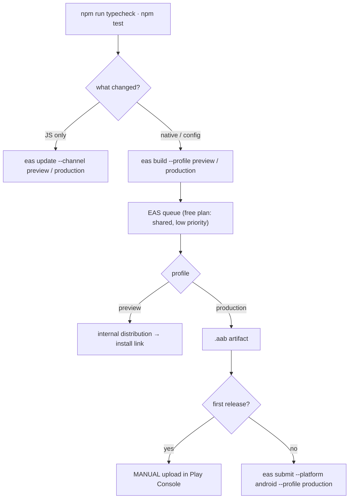

import { Callout } from 'nextra/components'

# Builds & releases

The mobile app builds on **EAS Build**, under the org-owned project
`@saken-community/saken-mobile` (EAS project id `7c93f314-3e7a-499f-8b08-6228f399c1c1`,
declared in `app.json` as `owner` + `extra.eas.projectId`). Managed workflow: `/ios` and
`/android` are gitignored and regenerated from config at build time.

## Three apps, one codebase

`app.json` holds everything shared. `app.config.js` layers the few fields that **must**
differ per environment, keyed on `APP_VARIANT` — which each EAS build profile sets. The
point is not "same app, different backend": it is **three genuinely separate installable
apps**, so a dev build and a production build can sit side by side on one device with
fully separate state.

| | `development` | `preview` | `production` |
| --- | --- | --- | --- |
| Display name | Saken (Dev) | Saken (Preview) | Saken |
| Android package / iOS bundle id | `com.saken.mobile.dev` | `com.saken.mobile.preview` | `com.saken.mobile` |
| URL scheme | `sakenmobile-dev` | `sakenmobile-preview` | `sakenmobile` |
| Verified deep-link host | `dev.saken.com` | `dev.saken.com` | `saken.com` |
| API (`EXPO_PUBLIC_SAKEN_API_URL`) | `saken-api-dev.onrender.com/v1` | `saken-api-dev.onrender.com/v1` | `saken-api.onrender.com/v1` |
| Supabase (`EXPO_PUBLIC_SUPABASE_URL`) | `saken-dev.supabase.co` | `saken-dev.supabase.co` | `saken.supabase.co` |
| Web origin (`EXPO_PUBLIC_WEB_ORIGIN`) | `dev.saken.com` | `dev.saken.com` | `saken.com` |

Why each field has to differ:

- **Application id** — same id means the same app to the OS. Installing production would
  *replace* your dev build, and the two would share SecureStore, the outbox, and the push
  registration. Distinct ids keep the state separate.
- **Name** — so the two are distinguishable on the home screen.
- **Scheme** — so a `sakenmobile://` deep link can't be claimed by the wrong build. This
  is also why `src/auth/actions.ts` reads the scheme from the **resolved config** instead
  of hardcoding it; see [Auth](/mobile/architecture#auth).
- **Deep-link host** — two installed apps auto-verifying the same host compete for it, so
  the Android `intentFilters` are **rebuilt** per variant (not spread from `app.json`),
  making the variant's host the only verified one.

`APP_VARIANT` defaults to `development`, so a bare `npx expo start` can never pick up
production identity by accident, and an unrecognised value throws at config-resolution
time rather than producing a mystery build.

<Callout type="warning">
**`com.saken.mobile` is permanent**

Once the production build is published to Google Play, the `applicationId` can **never**
be changed — a rename means a new listing, a new URL, and zero installs carried over. The
same is true of the iOS bundle identifier on the App Store. `com.saken.mobile` is the real
one; do not rename it, and do not "temporarily" ship the dev id to production.
</Callout>

## EAS build profiles

`eas.json`:

| Profile | Distribution | Channel | EAS environment | Notes |
| --- | --- | --- | --- | --- |
| `development` | internal | — | `development` | `developmentClient: true` — a dev client for Metro |
| `preview` | internal | `preview` | `preview` | Installable release build for testers |
| `production` | store | `production` | `production` | `autoIncrement: true`, Android `buildType: app-bundle` |

`cli.appVersionSource: "remote"` puts EAS in charge of build numbers; combined with
`autoIncrement` on production, version codes advance without touching the repo.
`version` in `app.json` (`1.0.0`) remains the human-facing marketing version.

<Callout type="info">
**Production builds an AAB, not an APK**

Google Play **rejects APKs** for new apps. `android.buildType: "app-bundle"` is what makes
the production artifact an `.aab`. Preview builds stay APK-shaped so testers can sideload
them directly.
</Callout>

## Where configuration lives

`EXPO_PUBLIC_*` variables are **inlined into the bundle at build time**. A release build
gets only what its profile provides — `.env` is a local-development convenience and never
reaches a build.

| Value | Lives in | Why |
| --- | --- | --- |
| `EXPO_PUBLIC_SAKEN_API_URL`, `EXPO_PUBLIC_SUPABASE_URL`, `EXPO_PUBLIC_WEB_ORIGIN`, `APP_VARIANT` | `eas.json` (checked in) | Non-secret; being able to read which stack a profile targets is the point |
| `EXPO_PUBLIC_SUPABASE_ANON_KEY` | **EAS environment variables**, per environment | Not checked into the repo |
| `EXPO_PUBLIC_SENTRY_DSN` | EAS environment variables (optional) | Crash reporting is silently disabled when unset |
| `SENTRY_AUTH_TOKEN` | EAS environment variables (optional) | Enables source-map upload by the `@sentry/react-native/expo` plugin (org `saken`, project `saken-mobile`) |

Two startup guards keep a misconfigured build from shipping quietly:

- Missing Supabase URL/anon key → a startup warning.
- A plaintext `http://` API URL in a **release** build → `src/lib/env.ts` **throws**.
  Bearer tokens must never travel in the clear, and a dead app at launch is a better
  failure than a leaking one.

## OTA updates

`app.json` declares `updates.url` (`https://u.expo.dev/<projectId>`) and
`runtimeVersion: { policy: "fingerprint" }`. The `preview` and `production` channels in
`eas.json` are the targets for `eas update --channel <name>`.

The fingerprint policy means an update only applies to builds whose **native fingerprint is
identical**. JS-only fixes — a response-shape hotfix against a fast-moving API, a
translation correction — ship over the air in minutes. Anything that changes native code
(a new Expo module, a plugin config change, an SDK bump) changes the fingerprint and
requires a new binary. That is a safety property, not a limitation: it makes it impossible
to push JS that assumes native code the installed app doesn't have.

## Build and release workflow



<Callout type="warning">
**Free plan queue times are normal, not a hang**

Builds sit in a **shared low-priority queue**. Anywhere from 30 minutes to 2 hours before a
build even starts is expected behaviour on the free plan. Don't cancel and retry — that
just re-queues at the back.
</Callout>

Local checks before a build (`package.json`): `npm run typecheck` (`tsc --noEmit`),
`npm test` (jest-expo), `npm run lint`.

## The `.npmrc` workaround

```
legacy-peer-deps=true
```

EAS Build installs dependencies with **`npm ci`**, which is strict about peer ranges.
`jest-expo@57` declares a peer of `@react-native/jest-preset@^0.85.0`, while React Native
`0.86` ships (and peer-depends on) `0.86.0`. Local `npm install` tolerates this with an
"overriding peer dependency" warning; `npm ci` hard-fails with `ERESOLVE`. **The first EAS
build died in the Install dependencies phase for exactly this reason.**

It is safe here because the conflict is confined to a **dev** dependency: `jest-expo` is
test tooling, never enters the shipped bundle, and the suite passes against jest-preset
`0.86`. This is upstream lag — the file can be deleted once `jest-expo` widens its peer
range.

## Google Play status

<Callout type="warning">
**Registered, paid, not yet published**

The Google Play developer account is registered as an **individual** and the one-time $25
fee is paid. The app itself is **not published** — there is no listing yet, so there is
nothing for `eas submit` to submit to.
</Callout>

Remaining steps, in order:

1. **Create the app in the Play Console** and complete the listing (store entry, content
   rating, data-safety form, privacy policy, target audience).
2. **Upload the first `.aab` manually.** Google's Publishing API **cannot create a new
   app's first release** — this step has no automated path. Build with
   `eas build --profile production --platform android`, download the artifact, upload it in
   the console.
3. **Wire `eas submit` for every release after that**, which needs two things:
   - a **Google Cloud service account JSON** key with the Play Developer API enabled, and
   - that service account invited under Play Console → **Users and permissions** with
     release permissions.

   The key path then goes into `submit.production` in `eas.json` (currently an empty
   object, `{}` — the placeholder waiting on step 3).

iOS is not set up yet: production builds are configured for Android, and the App Store
path (Apple Developer Program membership, bundle id registration, TestFlight) has not been
started.

## Reference

| File | What it controls |
| --- | --- |
| `app.json` | Shared config: name, slug, owner, version, icons, splash, plugins, updates URL, runtime version policy, `experiments.typedRoutes` |
| `app.config.js` | Per-variant identity resolved from `APP_VARIANT` |
| `eas.json` | Build profiles, channels, environments, inlined public env, submit config |
| `.npmrc` | `legacy-peer-deps` for `npm ci` on EAS |
| `src/lib/env.ts` | Runtime env contract + the HTTPS-only release guard |
