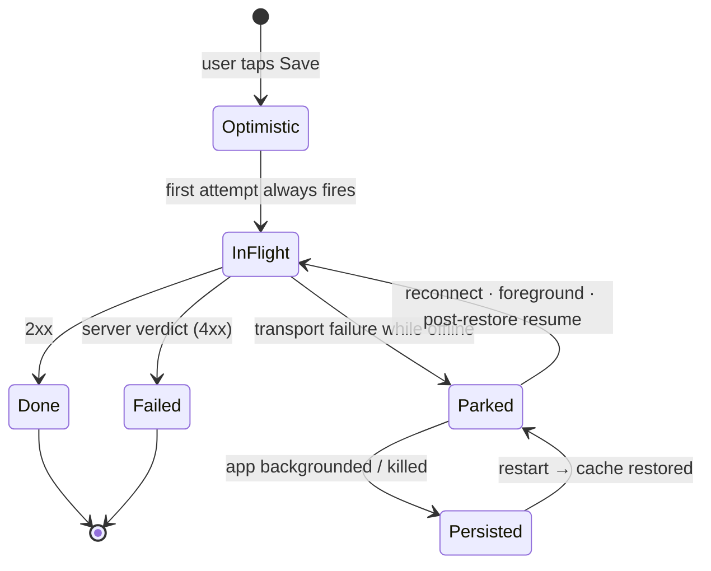

import { Callout } from 'nextra/components'

# Offline & sync

Dues are collected **in cash, in person** — in stairwells, basements, and parking levels,
often on a phone with one bar. An app that loses a recorded collection because the lift
shaft ate the signal is worse than a notebook. The outbox exists for exactly that moment.

The design rides a primitive the API already had: **every money write carries an
`Idempotency-Key`**, so replaying one is provably safe. Retry-safety was built into the
contract first; the retry came second.

## What is in the outbox

Exactly three mutations, identified by mutation key (`src/lib/query.ts`):

| Mutation key | Endpoint | Screen |
| --- | --- | --- |
| `createPayment` | `POST /v1/payments` | Record collection |
| `createExpense` | `POST /v1/expenses` | Record expense |
| `createConciergeSubmission` | `POST /v1/concierge/submissions` | Concierge submit |

Everything else is **out**, deliberately. Updates and deletes have no replay-safety
contract (no idempotency key, and a late replay could clobber a newer edit), so they fail
fast and visibly instead of queueing.

<Callout type="info">
**Reads work offline too, separately**

The whole query cache is persisted to AsyncStorage (`maxAge` 24h, buster
`saken-cache-v1`), so a cold start renders last-known dashboard data instead of a spinner.
That is cache persistence, not the outbox — the outbox is only about **writes**.
</Callout>

## The contract

### 1. The key is minted at enqueue time

```ts
create.mutate(withIdempotencyKey(input), { /* … */ })
// withIdempotencyKey: { ...input, idempotencyKey: Crypto.randomUUID() }
```

The key lives in the mutation **variables**, not in a closure. Variables are what get
serialized to AsyncStorage, so a replay after an app restart — hours later, on a different
network — sends the *same* key and the server dedupes. A resume can never double-record.

### 2. Behavior is registered, not inlined

A restored mutation carries only its key and variables — **no functions**. So
`mutationFn`, the optimistic layer, and the retry policy are registered with
`queryClient.setMutationDefaults()` in `setupMutationOutbox()`, which runs at module scope
in `app/_layout.tsx` **before the first render**, so the persister's rehydration always
finds a `mutationFn` waiting.

### 3. `offlineFirst` plus a retry policy that parks

```ts
function outboxRetry(failureCount: number, error: Error): boolean {
  const code = error instanceof BackendRequestError ? error.code : null
  if (code === 'network_error') return !onlineManager.isOnline() || failureCount < 5
  if (code === 'unauthorized') return !onlineManager.isOnline()
  return false
}
```

| Situation | Outcome |
| --- | --- |
| Transport failure while offline | Keep retrying → the retryer **pauses** the mutation before the next attempt. No retry budget is burned while parked. |
| Transport failure while online | Up to 5 real attempts, then surface the error to the user. |
| `unauthorized` while offline | The access token expired in a dead zone. Park until reconnect, when Supabase can refresh it. |
| Any server verdict (validation, authz, anchor rules) | **Fail fast, never replay.** A 400 will still be a 400 in an hour. |

`networkMode: 'offlineFirst'` means the **first attempt always fires**, even when NetInfo
claims the device is offline — NetInfo lies on captive portals and flaky Android
reachability. Non-outbox mutations share `offlineFirst` but keep the default retry of 0, so
they fail visibly instead of pausing invisibly under a spinner.

### 4. Only parked outbox writes are persisted

```ts
shouldDehydrateMutation: (m) => isOutboxMutation(m) && m.state.isPaused
```

In-flight mutations are never persisted — their request is already on the wire, and
persisting it would risk a duplicate attempt after a crash.

## Lifecycle



Three separate triggers drain the queue, and none of them are hand-rolled:

| Trigger | Wiring |
| --- | --- |
| **Reconnect** | `QueryClient.mount()` (run once by `PersistQueryClientProvider`) subscribes to `onlineManager`, which is fed by NetInfo in `bindReactQueryToNativeLifecycle()` |
| **Foreground** | the same `mount()` subscribes to `focusManager`, fed by `AppState` |
| **After a restart** | `onPersistRestored` → `resumePausedMutations()` → `invalidateQueries()` — drain first, then re-sync server truth |

Only an explicit `isConnected === false` or `isInternetReachable === false` counts as
offline; `isInternetReachable` stays `null` briefly on Android and must not be read as a
disconnection.

## Optimistic updates and rollback

Money writes patch the cached **active fiscal-year** summary immediately, so the numbers
move under the user's thumb:

| Write | Bumped |
| --- | --- |
| Collection | `collectionsYtd` +amount · `cashOnHandNow` +amount · the paying apartment's `paidYtd` +amount / `remaining` −amount |
| Expense | `ytdExpensesTotal` +amount · `cashOnHandNow` −amount |

`patchActiveSummaries` only touches caches keyed `['summary', 'active']` (past-year views
are read-only history) and applies a shape guard before patching. Only plain numeric fields
are bumped — server-derived shapes (status, categories, post-anchor splits) are left for the
settle-time invalidation to reconcile.

<Callout type="warning">
**A restored mutation has no rollback context**

React Query contexts are not persisted. When a mutation restored after a restart fails, its
`onError` receives `ctx === undefined` and there is nothing to restore — the `onSettled`
invalidation is what reconciles the cache back to server truth. This is why the optimistic
layer is deliberately kept to simple additive numbers.
</Callout>

## What the user sees

| State | Surface |
| --- | --- |
| Write parked at save time | An alert on the record screen: *"Saved offline — no connection right now; the collection is saved on this device and will sync automatically when you're back online."* plus a success haptic. It is treated as a **success**, not an error, because the optimistic bump already landed. |
| Writes still waiting | `PendingSyncBanner` on the dashboard: *"N records saved offline — will sync when back online."* Purely observational; resume is automatic. |
| A parked write later fails its server verdict | `OutboxFailureWatcher` (mounted app-wide in the root layout) alerts once: *"Couldn't sync a change — a change you saved offline couldn't be synced and was undone. Please record it again."* |

That last one is the subtle case worth spelling out. By the time a parked write resumes,
the screen that created it has usually unmounted — so its `onError` rolls the optimistic
bump back **silently**. The user was told "saved offline", and then the number just
quietly disappears. The watcher tracks which mutations were ever paused and alerts only for
a *once-parked* write that then errored, so a fresh online failure (whose record screen is
still mounted and owns its own error) never double-alerts.

## Sign-out guards the queue

`queryClient.clear()` on sign-out wipes the mutation cache too, which would silently
destroy parked writes. So `signOut()` checks `hasPausedOutboxMutations()` first and puts up
a destructive confirm — *"You have changes saved on this device that haven't synced yet.
Signing out will lose them."* — and backs out if the user cancels.

## What does not survive

| Not queued | Why |
| --- | --- |
| **Receipt photos** | A multipart body with a device-file URI doesn't serialize into the persisted mutation cache, and the file may be cleaned up before a much-later replay. Uploads are online-only with an interactive retry loop; when the expense itself was queued offline the photo is skipped and the queued alert says so. |
| **Mutations killed mid-flight** (before pausing) | The request had already left the device and most likely landed. The idempotency key means re-entering it manually is safe either way. |
| **Updates, deletes, setup writes** | No replay-safety contract — they fail fast while offline. |
| **Anything older than 24h** | The persisted cache's `maxAge`. A queue that old is a stale-data problem, not a connectivity problem. |

## Files

| Path | Role |
| --- | --- |
| `src/lib/outbox.ts` | Retry policy, dehydrate predicate, `withIdempotencyKey`, `setupMutationOutbox`, `onPersistRestored` |
| `src/lib/query.ts` | QueryClient defaults, persister, `bindReactQueryToNativeLifecycle`, mutation/query keys |
| `src/features/summary/optimistic.ts` | `patchActiveSummaries` / `restoreSummaries` |
| `src/features/payments/api.ts`, `src/features/expenses/api.ts`, `src/features/concierge/api.ts` | The three `*MutationOptions` registered as defaults |
| `app/_layout.tsx` | Persist provider wiring + `OutboxFailureWatcher` |
| `src/components/pending-sync-banner.tsx` | The dashboard banner |
