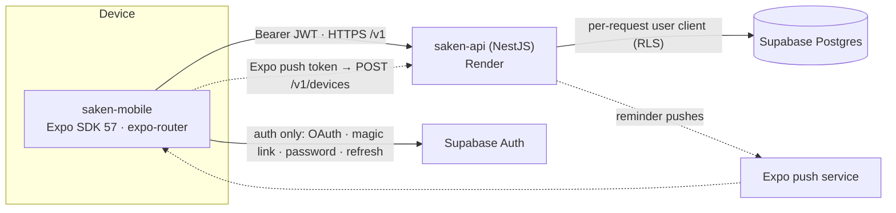

import { Callout } from 'nextra/components'

# Saken Mobile

`saken-mobile` is the **React Native (Expo) app** — a native client for the same
communities, the same money, and the same rules as the web app. It is **built and
running**: the full role surface exists, the EAS project is provisioned, and installable
dev/preview builds come out of the standard build pipeline.

<Callout type="info">
**Not a WebView, not a second backend**

The app is a **thin client over `saken-api`** (the deployed `saken-server` NestJS
backend). Every read and write is an HTTPS call to `/v1`. Supabase appears in exactly
three files (`src/auth/session.tsx`, `src/auth/actions.ts`,
`src/auth/get-access-token.ts`) and is used **only for authentication** — the app never
queries Postgres directly, so RLS, role checks, and the money math stay in one place.
</Callout>

## Where it sits

The web app and the mobile app are **siblings over one API**, not a shared codebase. What
mobile reuses verbatim from web is the *contract*, not the components:

| Reused verbatim | How |
| --- | --- |
| Endpoint registry | `src/api/endpoints.ts` is a straight port of the web's `src/lib/api/endpoints.ts` |
| HTTP client contract | `backendFetch` returns `{ data } \| { error }` and never throws — identical to web |
| Capability matrix | `src/auth/capabilities.ts` mirrors the web + backend matrix (union of stackable roles) |
| Translations | the web's `messages/{en,ar}` namespaces, copied into `src/i18n/messages/` |
| Design tokens | `src/theme/tokens.ts` ports the web's `globals.css @theme` values |

The one deliberate divergence is the token source: web reads the Supabase session from an
SSR cookie, mobile reads it from encrypted device storage (`src/auth/get-access-token.ts`
— its docstring calls itself "the ONE piece that differs from the web wiring").

## The stack

| Layer | Choice | Version |
| --- | --- | --- |
| Runtime | Expo SDK | `~57.0.1` |
| | React Native | `0.86.0` |
| | React | `19.2.3` |
| Routing | `expo-router` (typed routes on) | `~57.0.2` |
| Server state | TanStack Query (+ persist client, AsyncStorage persister) | `^5.101.2` |
| Auth | `@supabase/supabase-js` | `^2.110.0` |
| i18n | `i18next` + `react-i18next` + `expo-localization` | `^26 / ^17` |
| Crash reporting | `@sentry/react-native` (silent without a DSN) | `~7.11.0` |
| Language | TypeScript, `strict`, alias `@/* → src/*` | `~6.0.3` |

Managed workflow (Continuous Native Generation) — `/ios` and `/android` are gitignored and
regenerated from `app.json` + `app.config.js` at build time.

## What it does

Routing is capability-driven: after sign-in the `/` gate fetches `/me` and lands the user
on their **role home** (`resolveHome`), computed from the union of their stackable roles
in the active community.

| Surface | Who lands there | What's on it |
| --- | --- | --- |
| `(admin)` bottom tabs | admin | Home (dashboard) · Collections · Expenses · Budget |
| `(resident)` bottom tabs | resident, treasurer | Home (community summary) · Collections · Expenses · Budget |
| `(concierge)` stack | concierge | Submissions list + a modal submit flow |
| `/no-community` | signed in, zero memberships | Landing with sign-out |

Everything else is a pushed or modally-presented screen off those homes: record a
collection, record an expense, the payment receipt (+ PDF share), per-apartment ledger,
pre-Saken collections/expenses, special projects, team & roles, fiscal year, review
submissions, budget history, the community/apartments/budget editors, the six-step setup
wizard, and invitation acceptance.

Money writes go out with an **`Idempotency-Key`** minted on the device, which is what makes
the offline outbox safe — see [Offline & sync](/mobile/offline-and-sync).

## What makes it a native app, not a transcribed website

These are the capabilities that justify installing it at all. All of them are in the code
today:

- **Offline outbox** — collections, expenses, and concierge submissions recorded without
  signal are queued, survive an app restart, and replay on reconnect.
- **Push notifications** — Expo push tokens registered to `POST /v1/devices`
  (table `public.device_push_tokens`, migration `0055`); a payment-reminder tap deep-links
  to the right Collections tab for the user's role.
- **Biometric app lock** — optional Face ID / fingerprint gate on cold start and after
  5 minutes in the background.
- **Encrypted session at rest** — `LargeSecureStore` (AES key in the OS keychain,
  ciphertext in AsyncStorage).
- **Native share sheet** — YTD reports and payment receipts download as backend-rendered
  PDFs and open the OS share sheet (the WhatsApp-a-receipt flow).
- **Deep links** — `https://<host>/invite/*` claimed via `associatedDomains` /
  Android `intentFilters` with `autoVerify`, plus a per-variant custom scheme for the
  auth redirect.
- **Camera-first receipt capture** with on-device downscaling to a 1600px long edge.
- **Native platform behaviour** — bottom tabs, native headers, modal presentation for
  transactional flows, pull-to-refresh, keyboard insets, haptics on money-saved and
  destructive confirmations, predictive back on Android.

## Deliberate non-features

| Not there | Why |
| --- | --- |
| Direct Supabase data access | One authorization spine. The backend re-checks every request; the client-side capability matrix only hides buttons the API would 403. |
| Dark mode | `userInterfaceStyle: "light"` — a locked brand call, not a half-broken theme. Tokens are centralized if it's ever revisited. |
| Offline receipt **photos** | A multipart body with a device-file URI doesn't serialize into the persisted mutation cache, and the file may be gone by replay time. Photos are online-only, with an interactive retry. |
| Microphone permission | Explicitly blocked (`microphonePermission: false`) — `expo-image-picker` would otherwise add `RECORD_AUDIO`. |
| Phone-OTP sign-in | Behind `EXPO_PUBLIC_PHONE_AUTH_ENABLED`, default `false`; the sign-in screen ships Google, magic link, and email+password. |

## Status

<Callout type="info">
**Built · on EAS · not yet on the Play Store**

Every `/v1` domain the backend exposes has a consuming feature module and a screen, and the
EAS project is provisioned (`@saken-community/saken-mobile`). What remains is
**distribution**: the Google Play listing and the first (manual) release upload. See
[Builds & releases](/mobile/builds-and-releases).
</Callout>

Known open items, all documented in the code rather than hidden:

- **RTL flips only after a reload.** `I18nManager.forceRTL` is set eagerly on a language
  change, but React Native applies native layout direction on next launch. Text switches
  immediately, mirroring does not (`src/i18n/index.ts`).
- **Session storage uses AES-CTR** — confidentiality without integrity. This is the
  canonical Supabase RN pattern; a tampered blob decrypts to garbage and Supabase rejects
  it, so the failure mode is "re-login", not privilege escalation. Upgrading to AEAD needs
  a GCM library (`aes-js` has none).
- **`.npmrc` sets `legacy-peer-deps=true`** to work around an upstream peer-range lag in
  `jest-expo@57`. Revisit when upstream widens the range.

### Reading the in-repo reviews

`REVIEW.md` (2026-07-01) and `MOBILE-NATIVE-REVIEW.md` (2026-07-02) are **pre-fix audits**.
`MOBILE-NATIVE-REVIEW.md` in particular reads as a list of things the app lacks — zero
offline story, no push, no tabs, no universal links, no OTA, a ship-blocking missing
production API URL. Its prioritized roadmap has since been executed: Phases 1–3 are in the
code (tabs, native headers, settings screen, offline outbox, push, deep links,
expo-updates, Sentry, biometric lock, per-profile EAS env). Read those files for **design
intent and rationale**; read this section (and the source) for what the app actually does.
