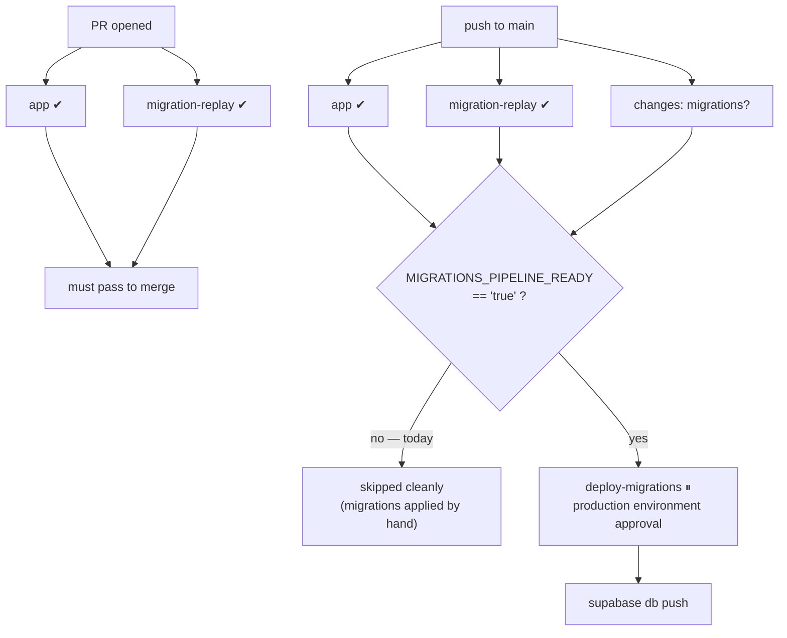

import { Steps, Callout } from 'nextra/components'

# CI/CD pipeline

There are two different mechanisms in play, and it's worth separating them up front:

- **Deployment** is platform-native. Vercel's Git integration builds the three web
  surfaces; Render's `autoDeploy` builds the two backend services. Neither is driven by
  GitHub Actions.
- **Checks** are GitHub Actions — and there is exactly **one** workflow in the whole
  system: `saken/.github/workflows/ci.yml`. The `saken-admin`, `saken-docs`,
  `saken-backend`, and `saken-mobile` repos have **no `.github/workflows/` at all**; their
  gate is the platform build (a failing `next build` / `nest build` fails the deploy).

## Git-Flow, and what each branch deploys

```
feature/* ──▶ develop ──▶ main
```

| Branch | Web (`saken`) | Admin | Docs | Backend | Mobile |
| --- | --- | --- | --- | --- | --- |
| feature/* | no build (Ignored Build Step) | — | — | — | — |
| `develop` (`dev` on the backend) | `dev.saken.com` | `admindev.saken.com` | `docsdev.saken.com` | `saken-api-dev` | — |
| `main` | `saken.com` | `admin.saken.com` | `docs.saken.com` | `saken-api` | — |

Note the branch-name asymmetry: the web repos use `develop`, the backend repo uses **`dev`**
(that's what `render.yaml` tracks). Same role, different name.

<Callout type="warning">
**Mobile has no branch-triggered deploy at all.**

`saken-mobile` ships via **EAS builds**, run on demand. Nothing merges-and-releases it, and
nothing goes red when its branch falls behind. That's exactly how its branch drifted
**11 commits** before being merged — with no deploy pressure, there is no feedback loop
telling you the branch is stale. Treat "merge the mobile branch" as an explicit checklist
item, not something the pipeline will remind you about.
</Callout>

## What actually runs in CI

From `saken/.github/workflows/ci.yml` — triggers are every pull request and every push to
`main`. Concurrency is grouped per ref with `cancel-in-progress`.

| Job | Trigger | What it does |
| --- | --- | --- |
| **changes** | every PR + push to `main` | `dorny/paths-filter` — sets a `migrations` output when `supabase/migrations/**` or `supabase/config.toml` changed. Gates the deploy job. |
| **app** | every PR + push to `main` | Node 22 → `npm ci` → `npm run lint` → `npm run typecheck` → `npm run build`. The build gets dummy `NEXT_PUBLIC_SUPABASE_*` values — pages are dynamic, so no network happens at build time, and the service-role key is runtime-only. |
| **migration-replay** | every PR + push to `main` | `supabase start` on the runner, which applies **every** migration `0001 → latest` to a throwaway Postgres. Any migration that fails to apply fails the job. Then `supabase db lint --level warning` (advisory, `continue-on-error`). |
| **deploy-migrations** | push to `main` **only**, **only when migrations changed**, **only when `vars.MIGRATIONS_PIPELINE_READY == 'true'`** | `supabase link` → `supabase migration list --linked` → `supabase db push --linked --yes`, behind the `production` GitHub Environment's required-reviewer gate. |

The Supabase CLI version is pinned (`SUPABASE_CLI_VERSION: "2.106.0"`) across all jobs so
replays are reproducible; bump it together with `config.toml`.

The workflow also declares least-privilege `permissions: contents: read, pull-requests:
read` — `dorny/paths-filter` needs `pull-requests: read` to query changed files on a PR, and
the default token doesn't have it ("Resource not accessible by integration").



### Why migration-replay matters

The replay job is the antidote to Saken's biggest operational risk: **that the repo can't
reproduce the live database.** By replaying `0001 → latest` from scratch on a fresh
Postgres, it surfaces drift automatically — if a hand-applied migration doesn't cleanly
replay, the job goes red, and that's the feature. This matters more than usual here,
because production migrations *are* applied by hand (below), so the repo and the live DB
are only kept honest by this job plus explicit verification.

It also earns its keep because **Docker is broken on the dev machine**, so
`supabase start` / `db reset` only run in CI. That's an acceptable place for them to live.

## The open leg: production migrations are NOT automated

<Callout type="error">
**`deploy-migrations` is gated off.** The repo variable `MIGRATIONS_PIPELINE_READY` is not
set to `'true'`, so the job **skips cleanly** on every push (no red X). Production
migrations are applied **by hand** — historically via the Supabase Dashboard SQL Editor,
more recently via the Supabase **Management API** (`POST /v1/projects/<ref>/database/query`
with an `sbp_` personal-access token — note: *not* the service-role key). This is GitHub
issue **#19**, the last open leg of the pipeline.
</Callout>

The hand-apply discipline that stands in for the pipeline:

<Steps>

### Back up first

Snapshot production before touching it. Supabase Pro gives daily backups + PITR, but the
snapshot you take deliberately is the one you can reason about.

### ROLLBACK-first inspect

Run the migration wrapped in `BEGIN; … ROLLBACK;` and read the verify block's output.
Only then re-run it with `COMMIT;`. Every migration carries a self-verifying `DO $$ … $$`
block that `RAISE EXCEPTION`s on a wrong post-state — that's the actual gate.

### Verify against `pg_catalog`, not against the file

The migration file is a script log, not a statement of what's live. Confirm post-state with
a direct catalog query (`pg_proc`, `pg_policy`, `has_table_privilege`, …). The database is
ground truth.

### Record it

Update the [migration history](/database/migrations) in the same pass. A migration isn't
shipped until the history says so.

</Steps>

Before the pipeline can be switched on, three one-time steps are still required (documented
in `saken/docs/CI-CD.md`): baseline the CLI migration history (`0001`–`0043` were applied
by hand, so the CLI's tracking table is empty and `db push` would try to re-apply
everything); add the `SUPABASE_ACCESS_TOKEN` / `SUPABASE_DB_PASSWORD` / `SUPABASE_PROJECT_ID`
Actions secrets; and create the `production` environment with required reviewers. Then flip
`MIGRATIONS_PIPELINE_READY`.

See [Database migrations](/operations/migrations-workflow) for the full workflow and house
style.

## Gaps in the checks themselves

Worth naming honestly rather than assuming coverage exists:

| Gap | Detail |
| --- | --- |
| **The test suite doesn't run in CI** | `saken` has a Vitest unit suite (`npm run test`) covering dues math, anchor math, budget diffs, and the formatters — but the `app` job runs `lint` → `typecheck` → `build` only. Nothing invokes `npm run test`. |
| **Backend tests don't run in CI** | `saken-backend` has Jest unit + e2e configs (`npm run test`, `test:e2e`, `test:e2e:roles`). No workflow runs them; the only automated gate is the Docker build on Render. |
| **Admin / docs / mobile have no checks** | No workflows. `saken-admin` and `saken-docs` are gated by the Vercel build (typecheck + build); mobile has no automated gate at all. |
| **Branch protection** | Recorded in `saken/CLAUDE.md` as blocked by the private-repo plan tier — nothing currently prevents a direct push to `main`. Either upgrade the plan or enforce it in CI. |
| **Seeding is disabled** | `supabase/config.toml` keeps `seed.sql` out of the replay; it was stale for a long time. Re-enable deliberately, not by accident. |

## Gotchas

- **`db push` is forward-only.** It never edits or reverts an applied migration — write a
  corrective migration instead. (Migration `0031` superseding `0030` is the canonical
  example.)
- **The CLI version is pinned** in the workflow to match `config.toml`'s expected schema.
  Bump both together or the replay breaks in a way that has nothing to do with your change.
- **Feature branches don't build on Vercel.** If you're waiting for a preview URL on a
  feature branch, you'll wait forever — push to `develop`.
- **A Render env-var change made via the API doesn't redeploy.** Trigger the deploy
  explicitly. See [Deployment](/operations/deployment).
