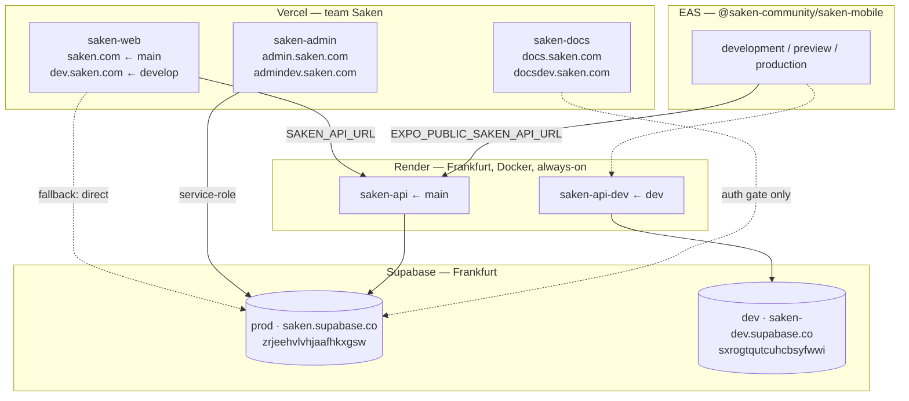

import { Callout } from 'nextra/components'

# Deployment

Saken is five deployed surfaces across three platforms. Everything below reflects the
**production cutover of 2026-07-23/24**, when the NestJS backend went live on Render, the
admin console and docs site got their own domains, and Supabase moved to vanity
subdomains.

| Surface | Platform | Lives at |
| --- | --- | --- |
| Web app (`saken`) | Vercel | `saken.com` · `dev.saken.com` |
| Admin console (`saken-admin`) | Vercel | `admin.saken.com` · `admindev.saken.com` |
| Docs (`saken-docs`) | Vercel | `docs.saken.com` · `docsdev.saken.com` |
| Backend (`saken-backend`) | Render (Docker, Frankfurt) | `saken-api.onrender.com` · `saken-api-dev.onrender.com` |
| Mobile (`saken-mobile`) | EAS Build (no branch deploys) | installed builds / Play Store (not yet published) |
| Database + Auth + Storage | Supabase (Frankfurt) | `saken.supabase.co` · `saken-dev.supabase.co` |

## Topology

## Vercel — three projects

All three live in the **Saken** team. Git-Flow drives them: `main` → production domain,
`develop` → the `dev*` domain, feature branches don't build (Ignored Build Step).

| Project | Repo | Production | Dev |
| --- | --- | --- | --- |
| `saken-web` | `saken` | `saken.com`, `www.saken.com` ← `main` | `dev.saken.com` ← `develop` |
| `saken-admin` | `saken-admin` | `admin.saken.com` ← `main` | `admindev.saken.com` |
| `saken-docs` | `saken-docs` | `docs.saken.com` ← `main` | `docsdev.saken.com` |

`www.saken.com` 308-redirects to the apex — `saken.com` is the canonical production domain,
configured in the Vercel domains panel, not in code.

The web app pins its functions to **`fra1` (Frankfurt)** via `vercel.json`
(`{"regions": ["fra1"]}`) to sit next to Supabase and the Render services. The admin and
docs projects have no region pin.

<Callout type="info">
**Project naming**

The repo-local `saken/.vercel/project.json` still records the older project name `saken`
(project ids survive renames). The dashboard name is what's in the table above.
</Callout>

### A fourth project was deleted

A `saken-api` **Vercel** project existed and was **deleted on 2026-07-24**. It was a
leftover from an early plan to host the API on Vercel; the backend runs on Render instead.
Nothing referenced it and it was serving 500s. Deleting it removed a live-looking endpoint
that was neither monitored nor correct — the kind of thing someone eventually pastes into
an env var. Note the name collision: `saken-api` today means the **Render** service.

## Render — the backend

Two always-on **Docker** web services in **Frankfurt**, declared in
`saken-backend/render.yaml` and created from one Blueprint apply.

| Service | Branch | Supabase | URL |
| --- | --- | --- | --- |
| `saken-api` | `main` | prod | `https://saken-api.onrender.com` |
| `saken-api-dev` | `dev` | dev | `https://saken-api-dev.onrender.com` |

- **Health check** — `GET /health` returns `{"status":"ok","service":"saken-backend"}`.
  It sits at the **root**, deliberately outside the version prefix: `main.ts` sets a global
  prefix of `v1` with `exclude: ['health']`, so infra probes never depend on an API version.
- **API surface** — everything else is under `/v1`. Clients are pointed at the *versioned*
  base (`https://saken-api.onrender.com/v1`), not the host root.
- **Plan** — `starter`, not `free`: free services cold-start after idle, and a per-request
  auth round-trip behind a cold start is a bad first impression.
- **Auto-deploy** — `autoDeploy: true` on both, so a push to `main`/`dev` redeploys the
  matching service. Feature branches → `dev` → `main` mirrors the web app's Git-Flow.
- **Region** — Frankfurt because the backend does a network auth verification and DB
  round-trips per request; co-location with Supabase is the single biggest latency lever.
- **`PORT` is never set.** Render injects it; the app reads it (Nest binds `0.0.0.0`). The
  Dockerfile's `ENV PORT=4000` is only a local fallback.

<Callout type="warning">
**The Dockerfile must be Node 22+**

`saken-backend/Dockerfile` builds and runs on `node:22-slim`. **Node 20 crashes on boot**:
`@supabase/supabase-js`'s realtime client needs a **native `WebSocket`**, which Node 20
doesn't provide. If a future base-image bump lands on 20, the service will fail its health
check immediately with a boot-time error that looks nothing like "wrong Node version."
Debian slim (not alpine) is also deliberate — `sharp`'s prebuilt glibc binaries install
cleanly there.
</Callout>

### Three Render gotchas worth knowing before you touch it

1. **The `onrender.com` subdomain is fixed at creation.** Renaming a service does **not**
   change its URL. The production service had to be **deleted and recreated** to get the
   clean `saken-api` name. Pick the final name the first time.
2. **Region is immutable at creation.** A first attempt landed in Virginia and had to be
   recreated in Frankfurt. There is no "move region" button.
3. **Setting an env var through the Render API does not trigger a redeploy.** The
   dashboard does; the API doesn't. After a scripted env change you must trigger a deploy
   explicitly, or you'll be reading the old value while the dashboard shows the new one.

Secrets (`sync: false` in `render.yaml`) are set per service in the dashboard and never in
git. The non-secret, environment-specific values (`CORS_ORIGINS`, `PUBLIC_WEB_URL`) *are*
in git so the two environments visibly differ. See
[Secrets & environment](/operations/secrets).

## Supabase — two projects, both Frankfurt

| Environment | Project ref | Hostname |
| --- | --- | --- |
| Production | `zrjeehvlvhjaafhkxgsw` | `saken.supabase.co` |
| Dev | `sxrogtqutcuhcbsyfwwi` | `saken-dev.supabase.co` |

**Vanity subdomains are additive.** Activating `saken.supabase.co` does not retire
`zrjeehvlvhjaafhkxgsw.supabase.co` — the original ref URL keeps serving. That's what made
the switch zero-downtime: every client could be moved over at its own pace, and any client
still on the ref URL kept working.

The backend's token verification is the part that could plausibly have broken on such a
switch, and didn't. `SupabaseService.verifyAccessToken` verifies the caller's JWT
**locally against the project JWKS** (`/auth/v1/.well-known/jwks.json`), pinning issuer,
audience `authenticated`, and asymmetric algorithms — and on *any* local failure falls
through to an authoritative `auth.getUser(token)` network check. So a token whose issuer
doesn't match the configured `SUPABASE_URL` still validates over the network path rather
than being rejected. Signature, not hostname, is the trust anchor.

## How the web app reaches the backend

The web app talks to the backend **only when `SAKEN_API_URL` is set**, per Vercel
environment:

| Vercel environment | `SAKEN_API_URL` |
| --- | --- |
| Production | `https://saken-api.onrender.com/v1` |
| Preview / develop | `https://saken-api-dev.onrender.com/v1` |

This is a **strangler migration**, and the guards are the interesting part:

- **Unset is safe.** `isBackendEnabled()` is false when `SAKEN_API_URL` is empty, and every
  wired call falls back to its original direct-Supabase path. Flipping the env var *is* the
  cutover switch; unsetting it is the rollback.
- **Read adapters return `null` on ANY backend error** — network, 4xx, 5xx — and the caller
  falls back to direct Supabase. A legitimate empty result (`[]`, `{}`) is passed through
  as-is; only the error envelope triggers the fallback. Writes, by contrast, surface the
  error to the form.
- **A hung backend still falls back.** `backendFetch` sets
  `signal: AbortSignal.timeout(6000)`; the `AbortError` lands in the same catch as a
  connection error, so a wedged service degrades in six seconds instead of hanging a page
  render.

Net effect: a broken or missing backend **degrades**, it doesn't break. Point the env var
at dev, soak `dev.saken.com`, then cut production.

Mobile has no such fallback — `EXPO_PUBLIC_SAKEN_API_URL` is baked into the build per EAS
profile (see below) and the app is backend-only.

## Mobile — EAS

Expo project **`@saken-community/saken-mobile`** on the **Free** plan, which means a
shared, low-priority build queue: **30-minute to 2-hour waits are normal**. Plan releases
around that, not against it.

Three build profiles in `eas.json`, each mapped to an EAS environment of the same name and
carrying its own inlined `EXPO_PUBLIC_*` values:

| Profile | EAS environment | Backend | Supabase | Web origin |
| --- | --- | --- | --- | --- |
| `development` | development | `saken-api-dev` | `saken-dev.supabase.co` | `dev.saken.com` |
| `preview` | preview | `saken-api-dev` | `saken-dev.supabase.co` | `dev.saken.com` |
| `production` | production | `saken-api` | `saken.supabase.co` | `saken.com` |

`production` builds an **AAB** (`android.buildType: "app-bundle"`) with
`autoIncrement: true`. The app is **not yet on the Play Store**; builds are installed
directly. `app.config.js` gives each variant a distinct `applicationId`/bundle id, name,
and URL scheme so a dev build and a production build can coexist on one device without
sharing SecureStore, the offline outbox, or the push registration — and so only the
production build claims `saken.com` deep links.

<Callout type="info">
**`com.saken.mobile` is permanent**

The production `applicationId` / bundle identifier is fixed once the app is published to
Google Play. Don't rename it.
</Callout>

## Ordering: app, backend, and migrations

The three deploy on **independent tracks**. That's tolerable because:

- **Migrations are forward-compatible** (expand/contract), so a schema change landing
  slightly before or after the code that uses it is safe.
- **Web ↔ backend is fallback-guarded** (above), so a backend deploying a few minutes
  after the web app doesn't produce an outage.
- **Prod migrations are still hand-applied** — they are *not* part of any deploy. See
  [CI/CD](/operations/ci-cd) and [Database migrations](/operations/migrations-workflow).

Recommended order for anything non-trivial: migration → backend (`dev`, then `main`) →
web (`develop`, then `main`) → mobile build.

## Custom domain for the API (deferred)

The backend is still on `*.onrender.com`. Moving to `api.saken.com` is a
Render → Custom Domains → CNAME-at-GoDaddy change plus re-pointing `SAKEN_API_URL` /
`EXPO_PUBLIC_SAKEN_API_URL` — **no code change**. Mobile is the constraint: its API base is
baked in at build time, so a domain move means a new build, not an env flip.
