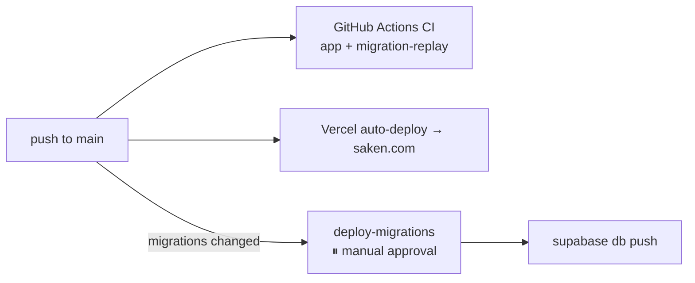

# Deployment

Saken's web app deploys to **Vercel**; its database is **Supabase**. The two deploy on
independent tracks.

## Web app → Vercel

- The `saken` app **auto-deploys to Vercel on push to `main`** (the production site is
  `saken.com`). Pull requests get preview URLs.
- Functions are pinned to **`fra1` (Frankfurt)** to co-locate with the Supabase project in
  `eu-central-1` (commit `84a98b1`), minimising round-trip latency.
- Build command: `next build` (this is also the typecheck gate the CI uses).
- Required environment variables (set in Vercel → Settings → Environment Variables, applied
  to Production, Preview, and Development): `NEXT_PUBLIC_SUPABASE_URL`,
  `NEXT_PUBLIC_SUPABASE_ANON_KEY`, `SUPABASE_SERVICE_ROLE_KEY`, and optionally
  `NEXT_PUBLIC_PHONE_AUTH_ENABLED`. See [Secrets & environment](/operations/secrets).

## Database → Supabase

- The production project is `zrjeehvlvhjaafhkxgsw` in `eu-central-1`.
- Schema changes ship as **migration files** applied through CI behind a manual-approval
  gate — **not** by hand in the Dashboard (the historical practice that caused drift). See
  [CI/CD](/operations/ci-cd) and [Migrations workflow](/operations/migrations-workflow).

## Ordering: app vs. migrations

App deploys (Vercel) and migration deploys (the GitHub Actions pipeline) run
**independently**. Migrations are kept **forward-compatible** (expand/contract), so a schema
change landing slightly before or after the code that uses it is safe.

## Pre-pilot checklist

From the build plan's *"Ship to pilot"* section — do these before a real building uses it:

- **Supabase backups** — upgrade to Pro ($25/mo) for daily backups, or script manual
  backups. *Real residents' money is being tracked; don't pilot without backups.*
- **Error tracking** — add Sentry (the audit's L-C1: `console.error` is currently the only
  logging strategy). See [Monitoring & logs](/operations/monitoring).
- **Real-device testing** — especially older Android phones common in Lebanon; the PWA
  install flow varies by browser. (Note: there is **no PWA manifest** yet.)
- **RLS complete** — every table needs real policies (largely done; see
  [RLS policies](/database/rls)).
- **Onboarding one-pager + a support channel** for pilot admins.

## This documentation site

This docs site deploys separately to **GitHub Pages** via a GitHub Actions workflow. See
[About this site](/about).
