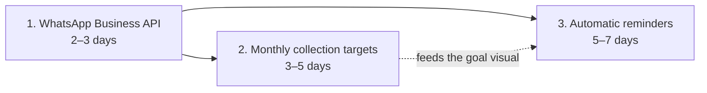

import { Callout } from 'nextra/components'

# Recommended build order

The Feature Audit proposes a concrete order for the three headline gaps, chosen so each
step unblocks the next. This is the recommended path after the pilot.

## 1. WhatsApp Business API integration — 2–3 days

A **drop-in replacement** for the stubbed `deliverByWhatsApp`, plus a "link account" flow.
The orchestrator is already built to accept it ([delivery](/api/delivery)). This is first
because it **unblocks both invitations and reminders** downstream — every later messaging
feature depends on a real channel.

## 2. Monthly collection targets — 3–5 days

Add a per-month rollup to the dashboard plus a monthly-goal visual. **No schema change** if
done as UI-side aggregation; a schema change is only needed if admins customise targets
per month. (Open question for the client: auto-derive annual ÷ 12, or admin-configurable?)

## 3. Automatic payment reminders — 5–7 days

A daily scheduled job (Vercel cron or a Supabase scheduled job) that checks each
apartment's remaining balance and triggers a WhatsApp reminder. Needs an **opt-in per
resident** — a new `resident_preferences` table or a JSON column on `users`. Depends on
step 1. (Open question: cadence — monthly, N days before due, or per-resident?)

## Sequencing rationale

- **Messaging channel first.** Invitations and reminders are both blocked on it; building
  it once pays off twice.
- **Targets before reminders.** A reminder is more useful when it can reference a concrete
  monthly target, so the goal data should exist first.
- **Each step ships independently.** None of the three requires the others to be *complete*
  to deliver value — they just compound.

## After the headline three

Once the messaging trio lands, the audit's engineering-debt list
([Missing features](/roadmap/missing-features)) is the natural next tranche — typed-query
SQL aggregates (H-P1), pagination (M-P1), de-cloning admin/resident pages (M-C1), and the
dead-column cleanup migration — in roughly that priority. The role-transfer / hand-off
flow (feature-audit item 4) should also land before the pilot widens, since the real-world
case of an admin moving out currently has no clean answer.

<Callout type="info">
**Don't ship phone auth without two fixes**

If phone/WhatsApp **sign-in** is turned on for real users, the audit is firm: ship
**`uniq_authenticated_phone`** (already done, migration `0044`) and make the **`send-otp`
function fail closed** (audit L-S1) first. The uniqueness guard is in; the fail-closed fix
should be verified before flipping `NEXT_PUBLIC_PHONE_AUTH_ENABLED` on in production.
</Callout>
