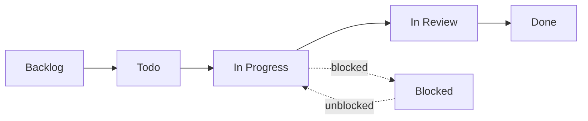

import { Callout } from 'nextra/components'

# Project board

Work is tracked on the GitHub project board for the **Saken-Community-Management** org.

<Callout type="info">
**Open the board**

**[github.com/orgs/Saken-Community-Management/projects/1 →](https://github.com/orgs/Saken-Community-Management/projects/1)**
</Callout>

## Two sides, one board

The board carries two streams:

| Side | What lands there |
| --- | --- |
| **Engineering** | Internal work — features, bugs, security findings, tech debt, chores. Issues live in the `saken` repo and are labelled by work type and priority. |
| **Business** | Community intake — feedback and ideas from pilot admins, usually as draft items that graduate into engineering issues once scoped. Every business item currently on the board is **Done**, each having spawned a numbered issue (WhatsApp report sharing → #31, monthly collections → #29/#32, superuser dashboard → #38, email reminders). |

## The workflow

Issues move through a standard column flow:

| Column | Meaning |
| --- | --- |
| **Backlog** | Captured but not yet scheduled — ideas, audit findings, v2 backlog items |
| **Todo** | Scheduled for the current push; ready to pick up |
| **In Progress** | Actively being worked |
| **In Review** | PR open, awaiting review/approval |
| **Blocked** | Stuck on a dependency, a decision, or an external service |
| **Done** | Merged and verified |

## Where things stand

A snapshot of the engineering side, not a live mirror — check the board for truth.

### Todo — the two things actually queued

| # | Item | Why it matters |
| --- | --- | --- |
| **#46** | Native-Lebanese review of Arabic UI strings | Arabic is **live in production** and every string is AI-generated. Highest-value open item. |
| **#19** | Finish the CI prod-migration leg — baseline history, secrets, enable the gate | The 2026-07-23 audit's explicit *"recommended next"*: prod migrations are hand-applied and the CLI history is out of sync, which is the last structural risk left. |

### In flight

| # | Item | Column |
| --- | --- | --- |
| **#30** | Fix flows + UI/UX polish pass | In Review |
| **#3** | React Native mobile app (`saken-mobile`) | In Review |
| **#4** | MCP server (`saken-mcp`) | In Progress — the server has full `/v1` coverage (57 tools); the issue tracks the remaining packaging/deploy work |

### Recently closed — the 2026-06-18 → 2026-07-24 arc

The shape of the last six weeks, in board terms:

- **#6 backend API** and **#81 production launch** — `saken-api` on Render, web + admin cut
  over.
- **#38 superuser dashboard** and **#52 superuser email+password sign-in** — the admin
  console.
- **#42 permissions redesign**, **#22 permissioning review** — stackable roles + capability
  matrix + `/dashboard/team`.
- **#36 full Arabic translation**, **#49 email+password auth**, **#45 real auth on dev**.
- **#29 / #32 monthly collections**, **#31 WhatsApp PDF sharing**, **#12 receipt PDF**,
  **#65 dedicated community page**.
- **#41 invitation-token binding**, **#1 `roles_readable` leak**, **#17 empty-string-phone
  identity collision** — the security line.
- **#71–#75** — the five-part UI/UX bug sweep (bugs, WCAG, silent-disable traps,
  consistency, i18n copy).
- **#48 internal docs site** — this site.

### Blocked, quietly

**Branch protection on `main` / `develop`** is blocked by the repository plan tier, so
nothing gates a direct push to `main`. It has no issue number of its own and is easy to
forget; it is tracked in the deferred-items section of the architecture reference and in
[Missing features](/roadmap/missing-features).

### Backlog worth knowing about

The WhatsApp bot cluster (**#5** bot, **#23** auth, **#24** invitations, **#25** reminders),
**#26** role transfer, **#33** voting, **#34** data export, **#39** utility metering,
**#7** a full end-to-end functionality test across all roles, and **#21** post-incident
housekeeping.

## Audit findings as issues

The 2026-07-23 cross-repo audit filed each of its twelve findings as a GitHub issue
(**#82–#93**) rather than a document appendix, so remediation was visible on the board and
gated by the usual review flow. **All twelve are closed**, shipped across four
repositories — with one closed as a *documented correction* rather than a fix, because the
finding turned out to be wrong. The residual low-severity items from #93 are listed in
[Missing features](/roadmap/missing-features).

## How issues map to this documentation

- **Missing features** ([roadmap](/roadmap/missing-features)) → Backlog / Todo items.
- **Audit findings** (`docs/AUDIT-2026-06-14.md`, `docs/AUDIT-2026-07-23.md`) → issues by
  severity.
- **The build order** ([build order](/roadmap/build-order)) → the next few Todo →
  In Progress items.

## Filing work

See [Contributing](/contributing) for how to file an issue and open a PR. In short: file an
issue describing the problem (link the relevant docs page or audit finding), let it land in
Backlog, and it gets pulled into Todo when scheduled.

<Callout type="info">
**Board access**

The board lives under the `Saken-Community-Management` org; you'll need to be a member to
view or edit it. The repositories — `saken` (web), `saken-api` (backend), `saken-admin`,
`saken-mobile`, `saken-mcp`, `saken-cli`, and `saken-feedback` — are private. `saken-docs`
is the exception: it is public.
</Callout>
