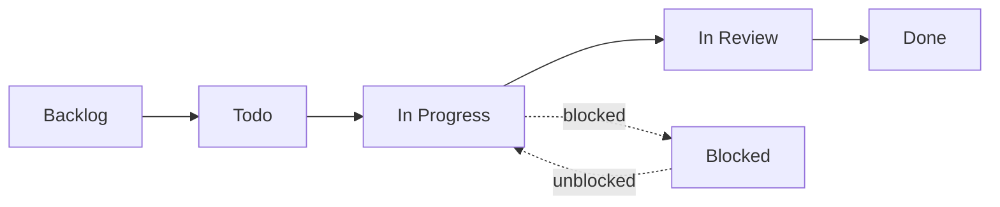

import { Callout } from 'nextra/components'

# Project board

Work is tracked on the GitHub project board for the **Saken-Community-Management** org.

<Callout type="info">
**Open the board**

**[github.com/orgs/Saken-Community-Management/projects/1 →](https://github.com/orgs/Saken-Community-Management/projects/1)**
</Callout>

## The workflow

Issues move through a standard column flow:

| Column | Meaning |
| --- | --- |
| **Backlog** | Captured but not yet scheduled — ideas, audit findings, v2 backlog items |
| **Todo** | Scheduled for the current push; ready to pick up |
| **In Progress** | Actively being worked |
| **In Review** | PR open, awaiting review/approval |
| **Blocked** | Stuck on a dependency, a decision, or an external service |
| **Done** | Merged and verified |

## How issues map to this documentation

- **Missing features** ([roadmap](/roadmap/missing-features)) → Backlog / Todo items.
- **Audit findings** (from `docs/AUDIT-2026-06-14.md`) → tracked as issues by severity.
- **The headline build order** ([build order](/roadmap/build-order)) → the next few Todo →
  In Progress items.

## Filing work

See [Contributing](/contributing) for how to file an issue and open a PR. In short: file an
issue describing the problem (link the relevant docs page or audit finding), let it land in
Backlog, and it gets pulled into Todo when scheduled.

<Callout type="info">
**Board access**

The board lives under the private `Saken-Community-Management` org; you'll need to be a
member to view or edit it. The repositories (`saken`, `saken-server`, `saken-mcp`) are
currently private as well.
</Callout>
