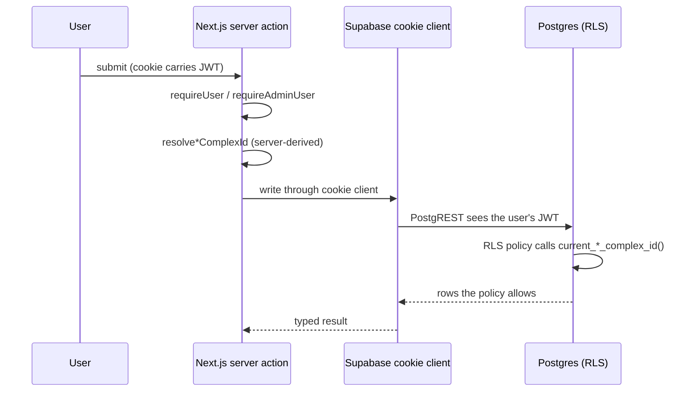

# Auth & RLS wiring

Saken's authorization lives in **two layers that agree**: Postgres Row-Level Security at
the bottom, and server-side role resolution on top. This page shows how a request binds to
an identity and a complex.

## The chain

## Layer 1 — RLS policies

Every table has RLS **enabled**. Production runs **52 policies across 15 tables** (plus 3
deny-by-default tables with RLS on and zero policies — reads there go only through
service-role). Policies are keyed off the authenticated identity via a set of SQL helper
functions:

| Helper | Returns |
| --- | --- |
| `current_user_id()` | the app `users.id` for the caller |
| `current_admin_complex_id()` | the complex where the caller is admin (active-aware) |
| `current_treasurer_complex_id()` | …treasurer |
| `current_concierge_complex_id()` | …concierge |
| `current_resident_complex_id()` | …resident (matched via apartment → building) |

All five are **`SECURITY DEFINER`, `STABLE`, `search_path=''`, owned by `service_role`**,
and resolve identity from **email OR phone**, dual-row-safe and `deleted_at`-aware
(final bodies set by migration `0043`, refined by `0046`). They are also **active-aware**
(migration `0034`) — they resolve against `users.active_complex_id` so a multi-community
user is scoped to the community they're acting in.

## Layer 2 — server-side resolution

The same logic exists in TypeScript (`src/lib/auth/`) so server actions can resolve the
caller *before* touching the DB, and scope-check client-supplied IDs:

- `require-user.ts` / `require-admin-user.ts` — authenticate and return `{ userId,
  complexId }` (or a typed error), optionally constrained to a role list, e.g.
  `requireUser(supabase, ['admin', 'treasurer'])`.
- `resolve-admin-complex-id.ts`, `resolve-treasurer-complex-id.ts`, etc. — the per-role
  resolvers.
- Scope checks like `verifyApartmentInComplex` ensure a client-passed `apartmentId`
  belongs to the caller's complex.

The two layers are belt-and-braces: even if a server action forgot a scope check, RLS would
still refuse cross-complex rows.

## Auth providers

Supabase Auth backs sign-in: **Google OAuth**, **email magic-link**, and **phone OTP** (via
an SMS provider, with a `send-otp` edge function). After sign-in, the route handler matches
the authenticated email/phone to a `public.users` row to route new-vs-returning (see
[First admin account](/getting-started/first-admin)).

:::tip[`getUser()` vs `getClaims()`]
Auth resolvers use `getUser()` (a server-validated JWT round-trip). Two mutating actions
(`setActiveComplex`, `updateMyLanguage`) use the locally-decoded `getClaims()` (audit
M-A1). Impact is currently bounded by membership prechecks, but the audit recommends
standardising on `getUser()` (or confirming `getClaims()` verifies signatures via JWKS).
:::

## The hard-won lesson

Saken's RLS journey included an incident where policies ran as permissive stubs in
production for ~2 days, and a critical `roles_readable` view (created by hand in the
Dashboard, in no migration) leaked every user's email to the anon key until it was found
by **introspecting the live DB** and dropped (migration `0047`). The operating rule that
emerged: **the live database is ground truth, not the migration files or the docs.** See
[Migration history](/database/migrations).
