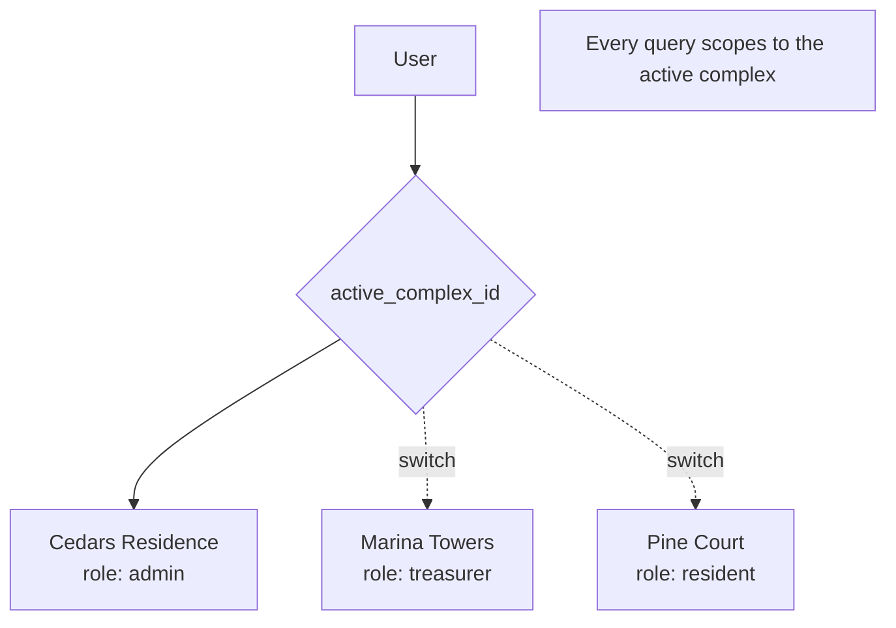

# Multi-community awareness

The original v1 scope said *"a single user belongs to one community."* That limit was
**lifted during the build** — a user can now belong to several communities and switch
between them. This page explains the "active complex" mechanism that makes it work.

## What changed

The locked spec listed *"A single user belonging to multiple communities"* under **What
v1 does not do**. But a June run of work (commits tagged `multi-community F1`–`F7`,
2026-06-05 to 06-06) added it. The enabling pieces:

- **`users.active_complex_id`** (migration `0033`) — a pointer to the community the user
  is currently acting in (`FK → complexes`, `ON DELETE SET NULL`).
- **Active-aware RLS helpers** (migration `0034`) — the `current_*_complex_id()`
  functions resolve against the active pointer.
- **`create_complex_with_admin`** (migration `0035`) — creating a second community is
  atomic and stamps the new active pointer.
- **Dual-row-safe user lookup** (migration `0036`) — see [Identity model](/concepts/identity).
- A **community switcher** in the header and the gear menu
  (`src/lib/membership/fetch-switcher-data.ts`,
  `set-active-complex-action.ts`).

## The "active complex" mechanism

A user may hold different roles in different communities — admin of one, treasurer of
another, resident of a third. At any moment, exactly one community is **active**, and
**every read and write scopes to it**:

1. The user picks a community in the switcher → `setActiveComplex` updates
   `users.active_complex_id`.
2. The role resolvers (`resolve*ComplexId`) and their SQL counterparts read the active
   pointer to decide *which* complex the caller is acting in and *what* they can do there.
3. Post-sign-in routing (`route-after-signin.ts`) is **active-aware**: it sends the user
   to `/dashboard`, the resident surface, or `/no-community` based on their role in the
   active community.

## Leaving and deleting communities

Membership also became managed:

- **`exit_community(p_complex_id)`** (migration `0039`) — a non-admin self-exit.
- **`delete_community(p_complex_id)`** (migration `0041`) — an active admin soft-deletes
  the community (sets `complexes.deleted_at`, cascades deactivation in-app). A
  `/community-removed` page handles the one-time message for affected members, and
  `/no-community` is the landing for a user with no active community.

:::warning[Single-admin operational model]
Any admin can unilaterally soft-delete a community for all its members, and recovery is
direct-DB-only (audit M-OPS1). Complexes are **soft**-deleted, but their children
(`buildings`, `fiscal_years`, `payments`, …) cascade on a **hard** delete — so a complex
must *never* be hard-deleted. Every read filters `deleted_at IS NULL`; that filter is the
only thing keeping a soft-deleted community invisible. See
[Multi-tenant isolation](/architecture/multi-tenant).
:::
