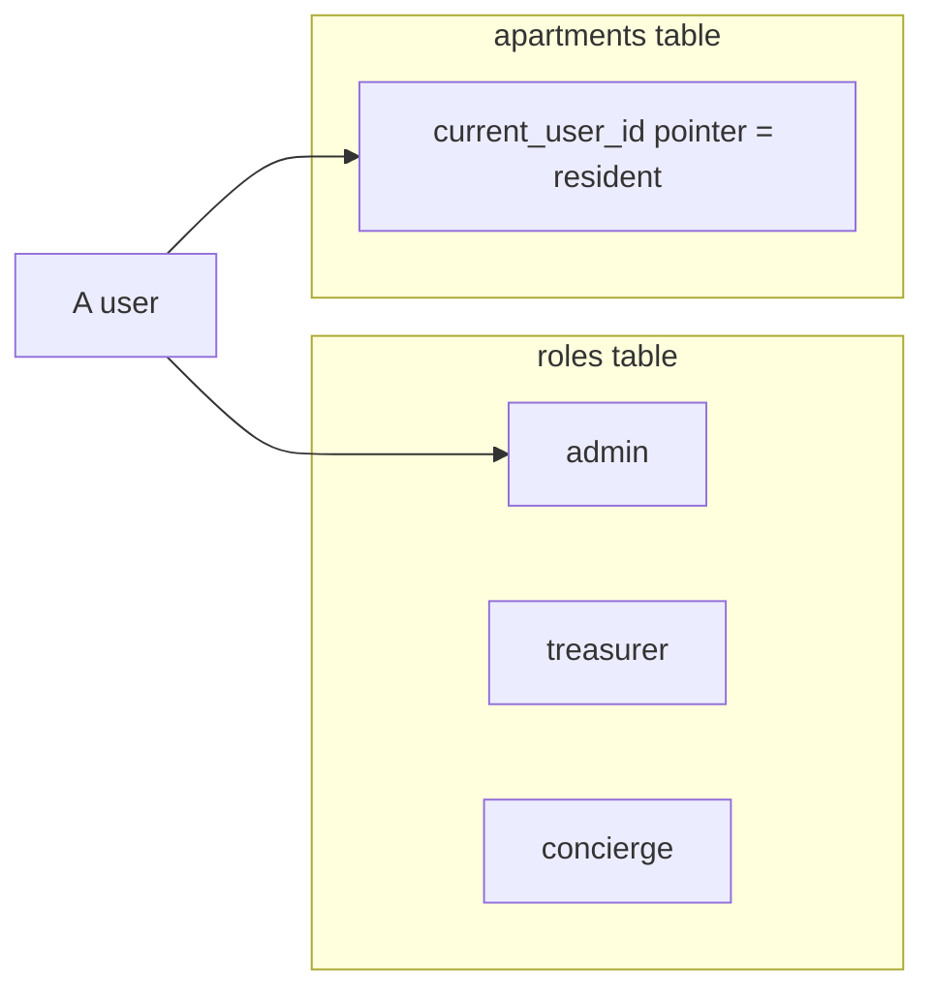

# Roles & role stacking

Saken began with **three roles** (admin, resident, concierge) and grew a fourth
(**treasurer**) during the build. This page explains each, and how one person can hold
several at once.

## The four roles

| Role | Signs in with | Sees | Can do |
| --- | --- | --- | --- |
| **Admin** | Google · email · phone OTP | everything in their complex | Full control: set up the community, set/amend the budget, record payments, log expenses, approve concierge submissions, create special collections, run year-end rollover, reset the FY — and pay their own dues like anyone else. |
| **Treasurer** | Google · email · phone OTP (after accepting an invite) | the complex's financials | Record payments + log expenses, approve/reject concierge submissions. A financial deputy without ownership. Cannot delete the community. |
| **Resident** | a magic link from the admin (no signup) | their apartment, the dashboard summary, and every other apartment's status (label + name + paid/owes/ahead) | **Read-only.** |
| **Concierge** | a magic link from the admin (no signup) | an **Arabic RTL** surface; only their own submitted expenses | Submit expenses (status `pending` until an admin/treasurer approves); edit while pending; locked after approval/rejection. Cannot see balances, payments, or the dashboard. |

## Two different mechanisms

Roles are stored two different ways, and the distinction matters:

- **Admin, treasurer, concierge** live as rows in `public.roles`
  (`UNIQUE(user_id, complex_id)` — one role row per user per community).
- **Resident** is *not* a role row. A user is a resident of a complex because some
  apartment's `current_user_id` points at them.

## Role stacking

Because residency and roles are separate mechanisms, **a single person can be both**. The
canonical case: a resident who also runs the books is an `admin` row *and* the
`current_user_id` of their own apartment. They pay their own dues like everyone else and
manage everyone's.

This was a deliberate, shipped capability (Feature Audit item 5, *Done*). The data
foundation was laid by migrations `0018`–`0020`, which split residency out of the old
`users.role` column into the `roles` table, and the `accept_invitation` RPC handles
**escalation** — accepting a treasurer invite while already a resident simply adds the
`treasurer` role row.

:::tip[Non-resident staff]
Treasurer and concierge **do not require an apartment** (Feature Audit item 6, *Done*).
The RLS helpers read `roles.role` without an apartment match, and the invitation flow
forbids attaching an apartment to a non-resident invite. So a hired bookkeeper or a
building concierge who doesn't live there fits the model cleanly.
:::

## What's missing

:::warning[No role transfer / hand-off]
There is **no UI to transfer or hand off** the admin or treasurer role (Feature Audit
item 4, *Missing*). You can revoke a role and re-invite, but there is no
"promote/demote" or "hand the books to someone else" affordance. This matters for the
real-world case of an admin moving out. It is on the [roadmap](/roadmap/missing-features).
:::

## How a role is resolved at request time

Every server action re-derives the caller's role and complex **server-side** — client-
supplied `complexId`/`userId` are never trusted for authorization. The resolvers live in
`src/lib/auth/`:

- `resolve-admin-complex-id.ts`, `resolve-treasurer-complex-id.ts`,
  `resolve-concierge-complex-id.ts`, `resolve-resident-complex-id.ts`

and are backed by matching SQL `SECURITY DEFINER` helpers
(`current_admin_complex_id()`, etc.) used inside RLS policies. See
[Auth & RLS wiring](/architecture/auth-rls).
