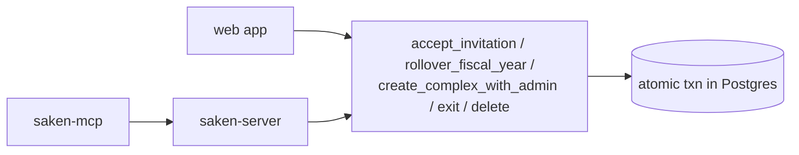

# Views & RPCs

Saken's multi-step, must-be-atomic operations are **Postgres `SECURITY DEFINER` RPCs**, not
application transactions. This keeps the critical money/identity flows atomic and lets every
client (web, backend, MCP) reuse the exact same battle-tested logic.

## The RPCs

All are `service_role`-owned, `SECURITY DEFINER`, `search_path=''`, with `EXECUTE` granted
to `authenticated`. They resolve identity from `auth.email()` / `auth.jwt()->>'phone'`
internally, so calling them through a user-scoped client makes `auth.email()` the caller.

| RPC | Purpose |
| --- | --- |
| **`accept_invitation(p_token text) → jsonb`** | Atomic invite accept — resident reuse/convert/split/fresh, plus concierge/treasurer role UPSERT (escalation-safe). Identity from email OR phone. |
| **`rollover_fiscal_year(p_complex_id uuid) → jsonb`** | Atomic FY close + open: archives the active year, opens the next (Path C dates), snapshots apartment carries, copies the budget forward. Blocked while submissions are pending. |
| **`create_complex_with_admin(p_name text, p_fiscal_year_start_month int) → uuid`** | Atomic complex creation + the admin's `roles` row + active pointer. |
| **`exit_community(p_complex_id uuid) → jsonb`** | A non-admin's self-exit from a community. |
| **`delete_community(p_complex_id uuid) → jsonb`** | An active admin's soft-delete: sets `complexes.deleted_at` and cascades deactivation in-app. |

## Trigger helpers

| Function | Role |
| --- | --- |
| `set_updated_at()` | bumps `updated_at` on update (most tables) |
| `assign_payment_receipt_number()` | BEFORE INSERT on `payments` — advisory-lock-serialized sequential `receipt_number` per complex |

## RLS helper functions

Five identity/scope resolvers used inside policies — `current_user_id()`,
`current_admin_complex_id()`, `current_treasurer_complex_id()`,
`current_concierge_complex_id()`, `current_resident_complex_id()`. Same `SECURITY DEFINER`
discipline; final bodies set by migration `0043` (email-or-phone, dual-row-safe,
`deleted_at`-aware, active-aware), refined by `0046`. See
[Auth & RLS wiring](/architecture/auth-rls).

## Why RPCs instead of app transactions

- **Atomicity** — multi-table writes (create a complex *and* its admin role; close one FY
  *and* open the next *and* snapshot carries *and* copy the budget) can't half-complete.
- **One implementation** — the web app, the NestJS backend, and the MCP server all call
  the same RPC; there is no second copy of the rules to drift.
- **Identity inside the boundary** — the RPC re-derives the caller from the JWT, so it
  can't be tricked by a client-supplied id.

## Views

:::info[No application views should exist]
By design, the only view that ever lived in `public` was the rogue `roles_readable` leak,
now **dropped** (migration `0047`). A periodic sweep (in the live-DB reconciliation doc)
checks `information_schema.views` for anything not created by a migration — part of the
"live DB is ground truth" hygiene. See [Migration history](/database/migrations).
:::

An ownership note from the reconciliation: `accept_invitation` originally ran as
`postgres` (bypassing grants) until migration `0041` flipped its owner to `service_role` —
a reminder that function *ownership* lives outside the migration text unless an explicit
`ALTER FUNCTION … OWNER TO` runs.
