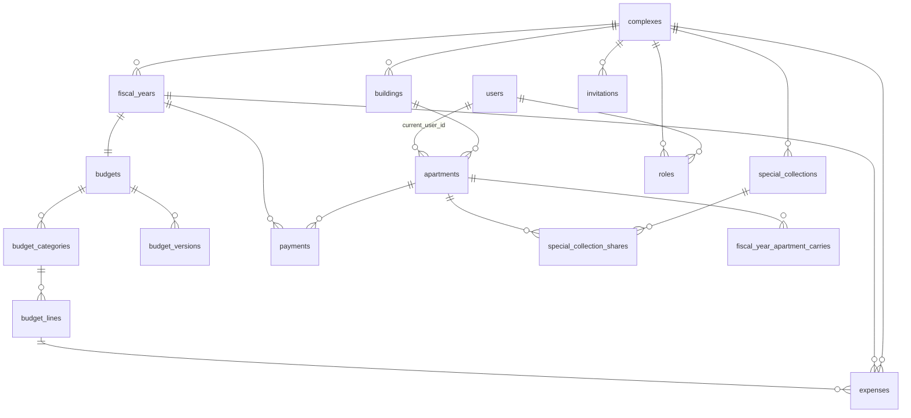

# Schema overview

The database is the heart of Saken. This overview groups the tables by domain and links out
to the migration history. It reflects `docs/SCHEMA-current-state.md`, which was
**verified against the live production DB on 2026-06-14** (introspected via the Supabase
Management API) — tables, columns, types, CHECKs, FK delete-rules, ENUMs, and all
`SECURITY DEFINER` functions match production.

## Entity-relationship map

## Tables by domain

### Structure
- **`complexes`** — `name`, `created_by`, `opening_cash`, `fiscal_year_start_month`
  (`CHECK 1–12`), `opening_cash_date`, `setup_completed_at`, `budget_setup_done_at`,
  `deleted_at` (soft-delete).
- **`buildings`** — `complex_id` (CASCADE), `name`, `kind` (`building` | `villa`).
- **`apartments`** — `building_id` (CASCADE), `label` (`UNIQUE(building_id,label)`),
  `share` `NUMERIC(10,2)` (`CHECK 0–1000`), `opening_carryover_balance`, `current_user_id`
  (SET NULL), `view_token` `UUID`.

### Identity
- **`users`** — identity-only after migration `0020`: `name`, `phone`, `email`,
  `auth_provider` (`NULL` = placeholder; set = authenticated), `language` (`en`/`ar`),
  `active_complex_id` (SET NULL).
- **`roles`** — `user_id` (CASCADE), `complex_id` (CASCADE), `role`
  (`admin`/`concierge`/`treasurer`), `deactivated_at`. `UNIQUE(user_id, complex_id)`.
- **`invitations`** — see [Invitations](/features/invitations).

### Fiscal & budget
- **`fiscal_years`** — `complex_id` (CASCADE), `start_date`/`end_date`
  (`CHECK end > start`), `status` (`active`/`archived`), `closure_reason`
  (`rolled_over`/`reset`), `surplus_applied_from_prior_year`, frozen `opening_cash` /
  `closing_cash`. Partial unique: **one active FY per complex**.
- **`budgets`** — `fiscal_year_id` (**`UNIQUE`**, CASCADE), `last_amended_at`.
- **`budget_categories`** — `budget_id`, `category_key` (10-key `CHECK`),
  `UNIQUE(budget_id, category_key)`.
- **`budget_lines`** — `budget_category_id`, `rate`, `quantity`, `description`.
- **`budget_versions`** — append-only `snapshot` `JSONB` + `note`.
- **`fiscal_year_apartment_carries`** — PK `(fiscal_year_id, apartment_id)`,
  `opening_carryover` (signed). Rollover snapshot.

### Money
- **`payments`** — `apartment_id` (RESTRICT), `fiscal_year_id` (RESTRICT), `amount`
  (`CHECK > 0`), `received_on`, `purpose` (`annual_dues`/`special_collection`),
  `special_collection_id`, `recorded_by`, `receipt_number` (trigger-assigned, per complex),
  `payment_method`, `deleted_at`, `is_prior_period`. *No `complex_id` column.*
- **`expenses`** — `complex_id` (RESTRICT), `fiscal_year_id`, `vendor` (nullable since
  `0015`), `category_key` (10-key `CHECK`), `amount` (`CHECK > 0`), `invoice_period_month`
  (`DATE`, `CHECK day = 1`), `spent_on`, `attachment_path`, `status`
  (`pending`/`approved`/`rejected`), `approved_by`/`approved_at`, `rejection_reason`,
  `deleted_at`, `is_prior_period`, `line_id` (NOT NULL, RESTRICT).
- **`special_collections`** / **`special_collection_shares`** — see
  [Special projects](/features/special-projects).

## ENUM types

| ENUM | Values |
| --- | --- |
| `building_kind` | `building`, `villa` |
| `user_role` | `admin`, `resident`, `concierge`, `treasurer` |
| `auth_provider` | `google`, `email`, `phone` |
| `language_code` | `en`, `ar` |
| `fiscal_year_status` | `active`, `archived` |
| `fiscal_year_closure_reason` | `rolled_over`, `reset` |
| `payment_purpose` | `annual_dues`, `special_collection` |
| `expense_status` | `pending`, `approved`, `rejected` |
| `special_collection_status` | `active`, `closed` |
| category keys (TEXT + CHECK) | `concierge`, `utilities`, `maintenance_repair`, `facility_services`, `property_insurance`, `property_tax`, `security`, `administrative`, `contingency`, `miscellaneous` |

> The old `budget_category_key` ENUM was dropped in migration `0009` in favour of
> `TEXT + CHECK` for the 10 keys above.

## Foreign-key delete rules

- **CASCADE** (child dies with parent): all structure/budget children, `roles`,
  `invitations`, `special_collection_shares`, `fiscal_year_apartment_carries`.
- **RESTRICT** (block parent delete): `payments.*`, `expenses.*`,
  `special_collections.created_by`, `budget_versions.created_by`, `complexes.created_by`.
- **SET NULL**: `users.active_complex_id`, `apartments.current_user_id`,
  `invitations.accepted_user_id`.

## Dead tables & legacy columns

:::info[Cruft to know about]
**Dead tables** (RLS-enabled, zero policies = deny-by-default): `magic_links` (superseded
by `apartments.view_token`), `apartment_closing_balances` (superseded by
`fiscal_year_apartment_carries`).

**Dead/zeroed columns**: `apartments.opening_paid_amount` (zeroed since `0012`),
`budget_categories.ytd_spent_amount` (zeroed since `0010`),
`complexes.closing_cash_setup_input`, `budget_lines.period_note`,
`expenses.category_specify`. A single cleanup migration to drop these is on the audit's
post-pilot list.
:::

For the full column-by-column reference, see `docs/SCHEMA-current-state.md` in the
`saken` repo. For how the schema got here, see [Migration history](/database/migrations).
