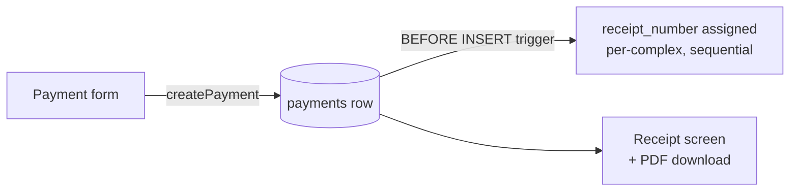

# Collections & cash flow

"Collections" is the user-facing name for money coming **in** — payments residents make
against their dues. In the code and database these are `payments`.

:::info[Payments vs. Collections]
The UI says **Collections**; the routes, tables, and code say **payments**
(`/payments/*`, `public.payments`, `createPayment`). This naming split (audit M-C4) is a
known piece of debt — ~535 "payment" references under "Collections"-titled pages. When
reading the code, treat the two words as synonyms.
:::

## Recording a payment

`createPayment` (`src/lib/payments/actions.ts`) is an **admin or treasurer** action:

```ts
createPayment(input: PaymentFormValues): Promise<PaymentFormSaveResult>
// requireUser(supabase, ['admin', 'treasurer'])
// → verifyApartmentInComplex(...) scope check
```

The flow (`/payments/new`): pick an apartment (search-as-you-type, showing its current
balance), choose a **purpose** (annual dues, or any active special collection), enter the
amount and date, add optional notes. Saving:

1. Inserts the `payments` row.
2. A **BEFORE INSERT trigger** assigns the next sequential `receipt_number`, scoped per
   complex and **never reset across years**.
3. Opens the **digital receipt** (`/payments/[id]`) with *Share* and *Done*.

## The receipt

Each receipt shows the complex name, apartment label, payer name, amount, date received,
the sequential receipt number, the admin who recorded it, and the **running balance after
the payment**. It can be downloaded as an **official PDF** (commit `00ac522`,
2026-06-15) via `/api/payments/[id]/receipt`.



## Payments are editable (soft-delete)

The `payments` table was relaxed from append-only (DECISIONS log, 2026-05-19): migration
`0005` added `payment_method`, `updated_at`, and `deleted_at`. Admins can edit or delete a
payment in place (delete = soft-delete). Trade-offs accepted: no version history,
last-edit-wins, and `receipt_number` gaps where rows were soft-deleted (gaps are
preserved, not back-filled). Every read filters `deleted_at IS NULL`, and mutations use a
race guard.

## Cash on hand

The complex's cash is **derived, not stored**:

```
cash_on_hand = opening_cash + Σ approved payments − Σ approved expenses
```

across all fiscal years, anchored at `opening_cash_date`. It surfaces on the dashboard
tile and `/dashboard/cash`. See [The money model](/concepts/money-model) for the full set
of formulas.

## What's partial

:::warning[No monthly collection targets]
Saken tracks **annual** collection progress (Collected YTD, % of annual) but has **no
monthly targets, no per-month rollup, and no calendar view** (Feature Audit item 8,
*Partial*). Adding monthly targets is item 2 on the [recommended build order](/roadmap/build-order)
— estimated 3–5 days, with no schema change if done as UI-side aggregation.
:::

:::warning[No automatic reminders]
There is **no payment-reminder system** at all (Feature Audit item 3, *Missing*) — no
scheduler, no due-date tracking, no opt-in. It needs a whole new subsystem (cron +
delivery + per-resident opt-in). See the [roadmap](/roadmap/missing-features).
:::
