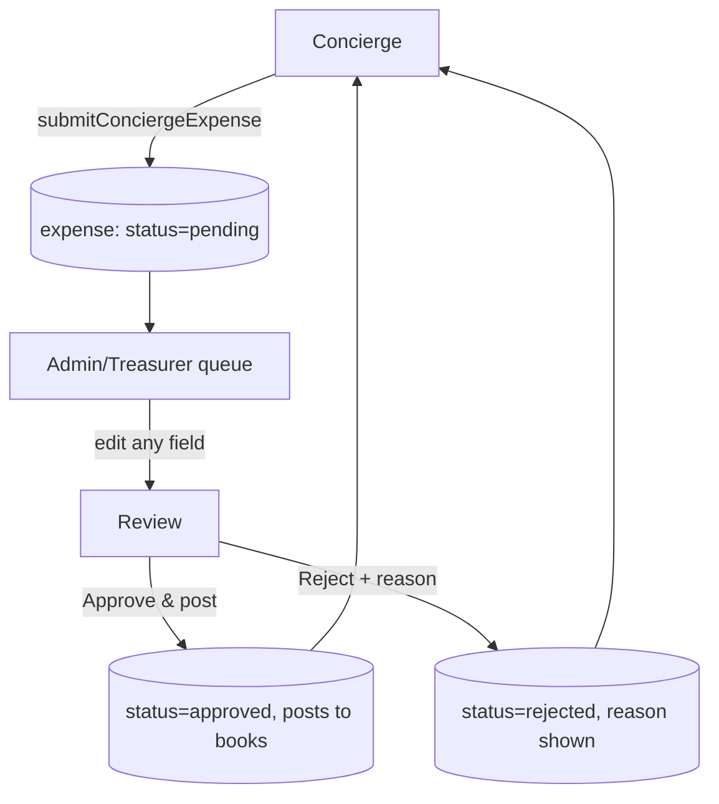

# Concierge submissions

The **concierge** is a deliberately tiny, locked-down surface: a building's concierge can
**only submit expenses for approval**, on an **Arabic, right-to-left** UI. They never see
balances, payments, or the dashboard.

## The concierge surface

The concierge signs in via a magic link (no signup) and lands on `/concierge` — a single
big *"إضافة مصروف جديد"* (add a new expense) button and a list of recent submissions with
status pills (*قيد المراجعة* = under review, *مقبول* = approved). A settings gear offers an
EN/AR language toggle and sign-out.



## Submitting an expense

`submitConciergeExpense` (`src/lib/concierge/actions.ts`) requires the `concierge` role:

```ts
submitConciergeExpense(input: ExpenseFormValues): Promise<ExpenseFormSaveResult>
// requireUser(supabase, 'concierge')
```

The submit form (`/concierge/submit`) has six fields — vendor, category (in Arabic),
amount, invoice month, photo, notes — with the complex auto-populated. Submitting creates
an `expenses` row with `status = pending`. The concierge can **edit while pending**
(`updateConciergeExpense`); the row **locks** after approval or rejection.

:::info[One shared expense form]
The admin and concierge render the **same** underlying form component (`ExpenseFormCore`,
commit `34d433b`) so the two can't drift. The concierge variant is wrapped in Arabic
strings and RTL layout.
:::

## The approval queue (admin / treasurer)

A dashboard banner shows the pending count. `/dashboard/concierge-submissions` lists
submissions; `/dashboard/concierge-submissions/[id]` is the review screen where **every
field is editable** before posting. Two outcomes:

- **`approveConciergeSubmission`** — posts the expense to the books with the
  admin-edited values (`status = approved`).
- **`rejectConciergeSubmission`** — requires a rejection reason, which the concierge then
  sees.

Both are `requireUser(['admin', 'treasurer'])`. Approving is also exposed as an
[MCP tool](/api/mcp-tools).

## Arabic localisation

The concierge surface is **single-locale by design** — Arabic strings are a typed
dictionary (`src/lib/i18n/concierge-strings.ts`), not a full i18n framework, because the
surface is small enough for bilingual delivery in v1. RTL is applied with `dir="rtl"`; the
rest of the app stays `dir="ltr"` English.

:::warning[Arabic strings are AI-generated, pending native review]
~110 Arabic fields are AI-generated and *"pending native Lebanese review"* (audit M-C5).
One semantic error (vacation- vs. license-renewal) already slipped through, and a stray
Arabic literal once escaped the dictionary into a component. TypeScript enforces that keys
*exist*, not that their content is *correct*. The Arabic-locale concierge onboarding is
gated on a native review (commit `22636dc`, *"native-review gate"*).
:::
