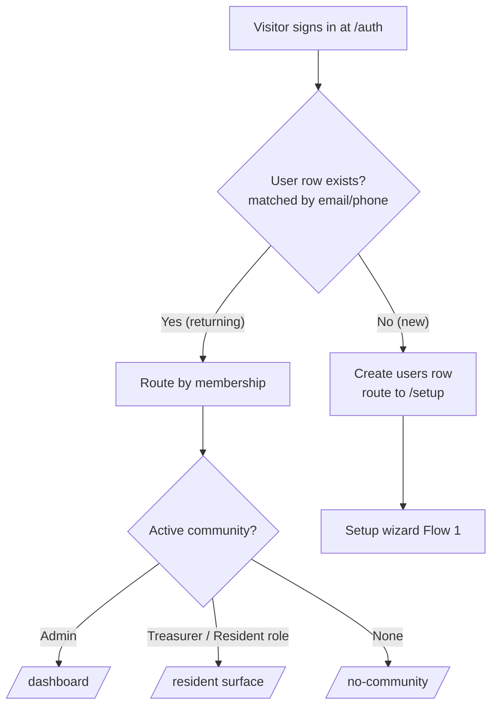

# First admin account

Saken has no "create admin" button. The **first person to authenticate** becomes the
admin of a brand-new community by walking through the setup wizard. This page traces what
happens under the hood.

## New-vs-returning routing

After any successful sign-in (Google, email, or phone), a route handler looks up the
authenticated identity in the app's `users` table:

The logic lives in `src/lib/auth/route-after-signin.ts`. **Residents and concierges never
sign up** — they receive a magic link from an admin and never see this screen.

## Becoming an admin (the setup wizard)

A new authenticated user is routed to `/setup` and creates a community:

::::steps

### Basics — `/setup/basics`

Community name, your name, fiscal-year start month, and opening cash on hand. Submitting
calls the `create_complex_with_admin` RPC, which atomically inserts the `complexes` row
**and** the admin's `roles` row in one transaction.

### Structure — `/setup/structure`

Choose **single building** or **complex** (a complex can hold multiple buildings plus
villas).

### Apartments — `/setup/apartments`

The grid auto-generates from your building structure. Fill each apartment inline: label,
resident name, phone, email, share, and opening balances. Your own apartment is marked
*"This is me."* Non-admin apartments create placeholder `users` rows for residents.

### Budget — `/setup/budget`

Add `rate × quantity` lines under each category. The annual total computes live.

### Review & finish — `/setup/review`

Confirms the setup and lands you on `/dashboard`. From now on, signing in with the same
identity routes you straight there.

::::

## Identity anchoring

All three sign-in methods anchor to a **single account** keyed by email. Phone-first
signup also captures an email at first use, so an admin can switch sign-in methods later
without orphaning their account. A user's app identity is **not** the Supabase auth UID —
it is resolved server-side by email (and, for phone logins, by phone). See the
[Identity model](/concepts/identity) for the full story, including the "dual-row"
hazard the team hit and fixed.

:::tip[Promoting more admins / treasurers]
There is **no role-transfer UI yet** (see [Status](/introduction/status), item 4). To add
a treasurer or a second admin-like helper, the existing admin sends a **treasurer
invitation** ([Invitations](/features/invitations)); the invitee accepts and gains a
`treasurer` role on the community via the `accept_invitation` RPC.
:::

Next: [Project tour](/getting-started/project-tour).
