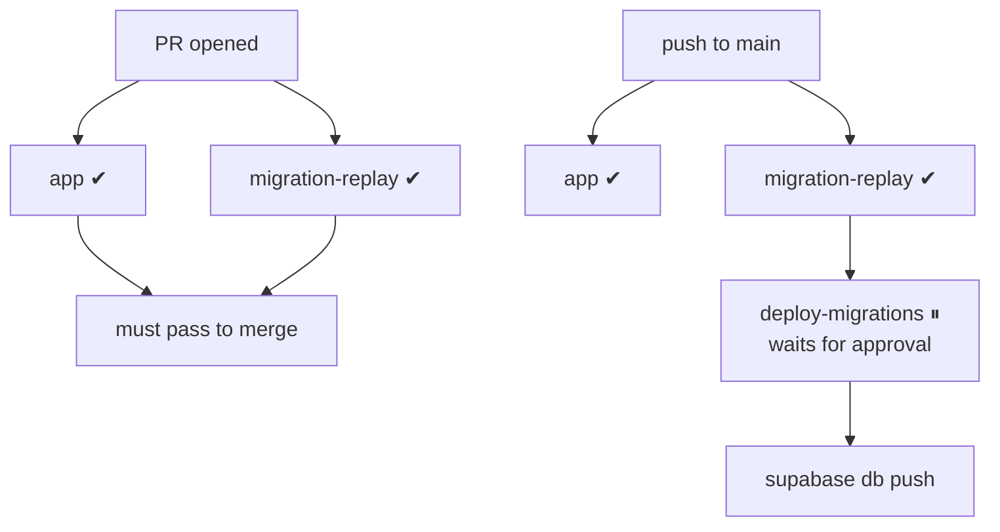

# CI/CD pipeline

Saken runs automated checks on every PR and push, and — crucially — applies **database
migrations to production through CI behind a manual-approval gate**, instead of by hand in
the Dashboard SQL Editor. The workflow is `saken/.github/workflows/ci.yml`.

## What runs

| Job | Trigger | What it does |
| --- | --- | --- |
| **app** | every PR + push to `main` | `npm ci` → `npm run lint` → `npm run typecheck` → `npm run build` |
| **migration-replay** | every PR + push to `main` | spins up a throwaway Supabase Postgres on the runner and replays **all** migrations `0001 → latest` from scratch (`supabase start`). Any migration that fails to apply fails the job. |
| **deploy-migrations** | push to `main` **only**, **only when `supabase/migrations/**` changed** | `supabase db push` to production — **behind a manual-approval gate** (the `production` GitHub Environment). |

App deploys remain **Vercel's** job (auto-deploy on push); this pipeline touches only
migrations + checks.

## Why migration-replay matters

The replay job is the antidote to Saken's biggest operational risk: that the repo couldn't
reproduce the live DB. By replaying `0001`→latest from scratch on a fresh Postgres, it
**surfaces drift automatically** — if a hand-applied migration doesn't cleanly replay, the
job goes red, and that's a feature, not a bug. The migration-replay + typed-data-layer work
landed together in PRs #9 / #11 (2026-06-15).

## One-time setup

Documented in `docs/CI-CD.md`. Done once:

1. **Baseline the migration history** (`scripts/baseline-migration-history.sh`) — because
   `0001`–`0043` were applied by hand, the CLI tracking table was empty; the baseline marks
   them applied so `db push` only applies *new* migrations. *Run exactly once.*
2. **Add GitHub repo secrets:** `SUPABASE_ACCESS_TOKEN`, `SUPABASE_DB_PASSWORD`,
   `SUPABASE_PROJECT_ID` (`zrjeehvlvhjaafhkxgsw`).
3. **Create the `production` environment** with **Required reviewers** — this is the gate
   that pauses `deploy-migrations` until someone clicks **Approve**.

A repository variable `MIGRATIONS_PIPELINE_READY` gates the deploy step (commit `31ec48a`),
so the pipeline can be enabled deliberately.

## Day-to-day: shipping a migration

::::steps

### Add the migration

Create `supabase/migrations/00NN_description.sql` in house style (`BEGIN; … COMMIT;` + a
self-verifying block).

### Open a PR

CI runs **app** + **migration-replay** — the replay proves your migration applies cleanly
from scratch.

### Merge to `main`

**deploy-migrations** starts and **pauses for approval** (you'll see *"Waiting"* in the
Actions tab and get an email).

### Approve

Review, click **Approve**. `supabase db push` applies only the new migration(s) to
production. Confirm in the run logs.

::::

## Gotchas

- **Local Docker was broken** on the dev laptop, so `supabase start` / `db reset` run only
  in CI (GitHub runners have Docker). That's fine — the replay job is exactly where you want
  it.
- **Seeding is disabled** (`config.toml`): `seed.sql` is stale (it inserts a `users.role`
  column dropped in `0020`). Refresh before re-enabling.
- **`db push` is forward-only** — never edits or reverts an applied migration; write a
  corrective migration instead.
- **The CLI version is pinned** in the workflow to match `config.toml`'s expected schema;
  bump both together.

## Test suite

Beyond the build/typecheck gate, the web app has a **Vitest unit suite** (added
2026-06-15, PR #11) run by `npm run test`. It covers the pure functions — dues math
(`money/apartment-rows.test.ts`), anchor math (`pre-saken/anchor-math.test.ts`), budget
diff (`budget-versions/compute-diff.test.ts`), and the currency/date/Arabic formatters.
This directly closed the audit's H-C1 *"no automated tests"* finding.
